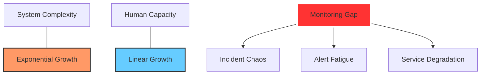

# Why AIOps? The Case for Intelligent Operations

> **"Traditional operations are breaking under the weight of modern data."**

This document outlines the philosophical and technical background of the AIOps Bootcamp, explaining why this transition is the most critical career move for any DevOps or Software Engineer in 2026.

---

## 1. The Context: The Collapse of "Manual" SRE

For decades, we relied on static thresholds: *If CPU > 80%, send alert.* This worked for monolithic apps running on five servers.

In 2026, a standard enterprise runs:
- **Thousands of Microservices** in ephemeral containers.
- **Terabytes of Telemetry** (logs, metrics, traces) generated every second.
- **Cascading Failures** that move faster than a human can type `kubectl logs`.

### The Result: The "Monitoring Gap"
As system complexity grows exponentially, human capacity to monitor them grows only linearly. This gap is where outages happen, burnout occurs, and businesses lose millions.



---

## 2. Why This Bootcamp? Why Now?

### The Shift from Reactive to Predictive
Most "AIOps" in the industry today is just fancy dashboards. This bootcamp is different. We focus on **Actionable Intelligence**.

| Feature | Traditional DevOps/SRE | AIOps (This Bootcamp) |
|---------|-----------------------|-----------------------|
| **Detection** | Threshold-based (Reactive) | Anomaly-based (Predictive) |
| **Analysis** | Manual Root Cause Search | Auto-Correlation & Causality |
| **Alerting** | Noisy, duplicate notifications | Clustered, intelligent insights |
| **Response** | Manual Runbooks | Auto-Remediation & Self-Healing |
| **Capacity** | Historical Guesswork | ML-driven Forecasting |

### Industry Relevance: The GenAI Explosion
The rise of LLMs and generative AI hasn't just replaced tasks; it has increased the *velocity* of deployments. Systems are now built and deployed faster than ever. If your operations aren't as fast as your deployments, you are an architectural bottleneck.

---

## 3. Career Oriented Goal: The $200k+ Engineer

The industry is moving toward a new role: **The AIOps Platform Engineer**.

Companies like Google, Netflix, and Uber aren't looking for people who can "monitor" systems; they want engineers who can **build systems that monitor themselves**.

### Salary & Opportunity Impact
- **Standard SRE/DevOps**: $120k - $160k
- **AIOps Specialist**: $180k - $250k+
- **Market Demand**: 40% YoY growth in AIOps job listings.

---

## 4. The 8-Week Roadmap to Expertise

This is not a theoretical course. It is an execution-driven transition.

```mermaid
timeline
    title AIOps Master Roadmap
    section Phase 1: Foundation
        Week 1 : Observability Pillars : OTel, Prometheus, Jaeger
        Week 2 : Data Engineering : Log Pipelines, InfluxDB, Feature Engineering
    section Phase 2: Core ML
        Week 3 : Operational ML : Scikit-learn, Time-Series Analysis
        Week 4 : Anomaly Detection : Isolation Forest, Pattern Mining
    section Phase 3: Advanced AIOps
        Week 5 : Predictive Analytics : Prophet, Failure Forecasting
        Week 6 : Intelligent Alerting : RCA, Dynamic Thresholds
    section Phase 4: Full Automation
        Week 7 : Auto-Remediation : LLM integration, K8s Self-Healing
        Week 8 : Capstone Delivery : End-to-End AIOps Platform
```

---

## 5. Execution Plan: How You Succeed

To become an AIOps expert in 8 weeks, you must follow the **Build-Analyze-Automate** cycle:

### Steps to Success:

1.  **Build the Signal (Week 1-2)**: You cannot detect anomalies in noisy or missing data. Your first goal is "clean signal" telemetry.
2.  **Learn the Math (Week 3-4)**: You don't need a PhD, but you need an intuition for *variance, distribution, and correlation*.
3.  **Detect & Predict (Week 5-6)**: Transition from "telling me what happened" to "telling me what is *going* to happen."
4.  **Close the Loop (Week 7-8)**: An insight is useless without action. You will build the logic that *fixes* the problem.

### The "AIOps Fluent" Proof
By the end, your GitHub repository won't just have "Hello World" scripts. It will contain:
- A **Real-time Anomaly Detection Engine**.
- An **LLM-powered Incident Summarization Bot**.
- A **Self-Healing Kubernetes Controller**.

---

## 6. Closing the Gap: Are You Ready?

The choice is simple. You can continue chasing alerts and fighting fires, or you can build the AI that does it for you. This bootcamp provides the blueprints, the infrastructure, and the mentor-driven guidance to make that shift.

**The future of operations is AI-driven. Don't get left behind.**

[👉 Start your journey with Week 1 Foundation](week-01-fundamentals/README.md)
