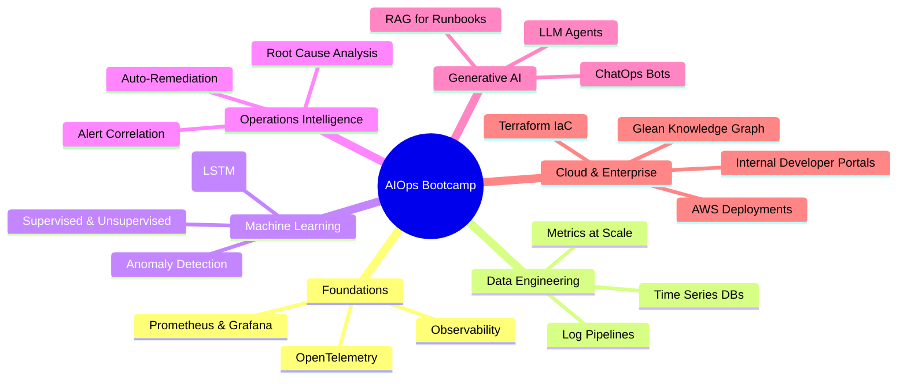
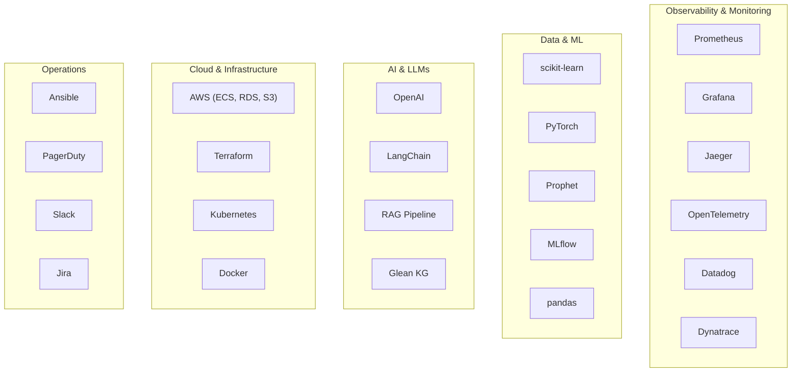
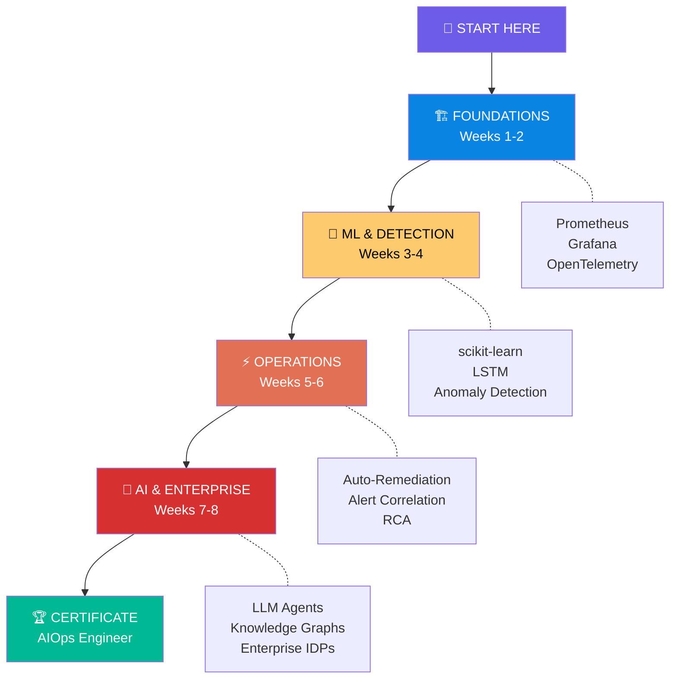

<p align="center">
  
</p>

<h1 align="center">🧠 AIOps Bootcamp</h1>

<p align="center">
  <strong>Transform from DevOps/SWE to Job-Ready AIOps Engineer in 8 Weeks</strong><br/>
  <em>The most comprehensive open-source AIOps curriculum on the internet.</em>
</p>

<p align="center">
  <a href="LICENSE"></a>
  <a href="CONTRIBUTING.md"></a>
  
  
  
  
</p>

<p align="center">
  
  
  
  
</p>

---

<p align="center">
  <a href="#-quick-start">Quick Start</a> •
  <a href="#-the-8-week-roadmap">Roadmap</a> •
  <a href="#-what-makes-this-bootcamp-different">Why This?</a> •
  <a href="#-technology-universe">Tech Stack</a> •
  <a href="#-capstone-projects">Capstones</a> •
  <a href="#-career-outcomes">Careers</a>
</p>

---

## 💡 Why AIOps? Why Now?

> _"By 2026, **70% of enterprises** will have adopted AIOps to automate IT operations, up from 10% in 2020."_ — **Gartner**

The operations landscape is shifting. Manual monitoring, alert-per-metric runbooks, and 3 AM on-call fire drills are being replaced by **intelligent systems** that detect anomalies before users notice, correlate 10,000 alerts into 1 actionable insight, and self-heal without human intervention.

**This bootcamp is your bridge from traditional DevOps to the AI-powered future of operations.**

📖 [Read the full background story →](BACKGROUND.md)

---

## 📊 Bootcamp at a Glance



### 📈 By the Numbers

| Metric | Value |
|--------|-------|
| 📅 **Duration** | 8 weeks (320+ hours of content) |
| 📆 **Daily sessions** | 47+ structured learning days |
| 📁 **Total files** | 6,795 files across the repository |
| 💻 **Lines of code** | 1,980,000+ lines (Python, Terraform, Shell, YAML) |
| 🐍 **Python scripts** | 2,957 files |
| 📝 **Documentation** | 279 Markdown files (32,800+ lines) |
| 📊 **Mermaid diagrams** | 104 architecture & flow diagrams |
| ☁️ **Terraform configs** | 5 production-ready IaC modules |
| 🐳 **Docker configs** | 3 containerized environments |
| 🧪 **Hands-on projects** | 15+ end-to-end projects |
| 🏗️ **Capstone projects** | 6 enterprise-grade capstones |

---

## 🚀 Quick Start

```bash
# 1. Clone the repository
git clone https://github.com/pxkundu/AIOps-Bootcamp.git
cd AIOps-Bootcamp

# 2. Check prerequisites
cat PREREQUISITES.md

# 3. Start your journey
cd week-01-fundamentals
cat README.md
```

### 📋 Prerequisites

| Skill | Level | What You Need |
|-------|-------|---------------|
| 🐍 **Python** | Intermediate | Functions, classes, pandas, numpy |
| 🖥️ **Linux/CLI** | Basic | Terminal navigation, shell scripts |
| 📦 **Git/GitHub** | Basic | Clone, commit, push, branches |
| ☁️ **Cloud** | Foundational | VMs, containers, networking concepts |
| 🔧 **DevOps** | Foundational | CI/CD concepts, basic monitoring |

👉 [Detailed Prerequisites Guide](PREREQUISITES.md)

---

## 🗺️ The 8-Week Roadmap

```mermaid
graph LR
    W1["🏗️ Week 1<br/>Foundations"]
    W2["📊 Week 2<br/>Data Eng"]
    W3["🧠 Week 3<br/>ML Basics"]
    W4["🔍 Week 4<br/>Anomaly Detection"]
    W5["⚡ Week 5<br/>Remediation"]
    W6["🔔 Week 6<br/>Alerting"]
    W7["🤖 Week 7<br/>Gen AI + LLMs"]
    W8["🏆 Week 8<br/>Capstones"]

    W1 --> W2 --> W3 --> W4 --> W5 --> W6 --> W7 --> W8

    style W1 fill:#6c5ce7,color:#fff
    style W2 fill:#0984e3,color:#fff
    style W3 fill:#00b894,color:#fff
    style W4 fill:#fdcb6e,color:#000
    style W5 fill:#e17055,color:#fff
    style W6 fill:#d63031,color:#fff
    style W7 fill:#6c5ce7,color:#fff
    style W8 fill:#2d3436,color:#fff
```



### Week-by-Week Breakdown

<table>
<tr>
<td width="50%">

#### 🏗️ Week 1: Observability Fundamentals
> *"You can't fix what you can't see."*

**5 days** covering the AIOps landscape, the 3 pillars of observability (metrics, logs, traces), tool evaluation, and hands-on instrumentation.

| Day | Topic |
|-----|-------|
| 1 | Introduction to AIOps & Industry Landscape |
| 2 | Three Pillars: Metrics, Logs, Traces |
| 3 | The Observability Stack |
| 4 | Instrumentation & OpenTelemetry |
| 5 | Tool Evaluation & Comparison |

**🔧 Tools:** Prometheus, Grafana, Jaeger, OpenTelemetry
**📦 [Start Week 1 →](week-01-fundamentals/)**

</td>
<td width="50%">

#### 📊 Week 2: Data Engineering for AIOps
> *"Data is the fuel for intelligent operations."*

**6 days** mastering log pipelines, metrics processing, feature engineering, and time-series database architecture.

| Day | Topic |
|-----|-------|
| 1 | Log Collection & Parsing |
| 2 | Storage & Analytics |
| 3–4 | Metrics Processing & Feature Engineering |
| 5–6 | Time Series Databases (Prometheus, InfluxDB) |

**🔧 Tools:** ELK Stack, Fluentd, InfluxDB, Loki
**📦 [Start Week 2 →](week-02-data-engineering/)**

</td>
</tr>
<tr>
<td>

#### 🧠 Week 3: ML Fundamentals for Operations
> *"Teaching machines to understand your infrastructure."*

**5 days** from statistical foundations to supervised/unsupervised learning, model evaluation, and AutoML — all with real ops data.

| Day | Topic |
|-----|-------|
| 1 | Statistics & Probability for Ops |
| 2 | Exploratory Data Analysis (EDA) |
| 3 | Supervised Learning (Classification, Regression) |
| 4 | Unsupervised Learning (Clustering, PCA) |
| 5 | Model Evaluation & AutoML |

**🔧 Tools:** scikit-learn, pandas, matplotlib, MLflow
**📦 [Start Week 3 →](week-03-ml-fundamentals/)**

</td>
<td>

#### 🔍 Week 4: Anomaly Detection & Forecasting
> *"Detecting the unknown unknowns in your systems."*

**5 days** covering time-series analysis, forecasting with ARIMA/Prophet, detection algorithms (Isolation Forest, DBSCAN), and deep learning with LSTM.

| Day | Topic |
|-----|-------|
| 1 | Time Series Fundamentals |
| 2 | Forecasting (ARIMA, Prophet) |
| 3 | Detection Algorithms |
| 4 | Deep Learning (LSTM, Autoencoders) |
| 5 | Anomaly Detection Capstone |

**🔧 Tools:** Prophet, PyTorch, LSTM, Isolation Forest
**📦 [Start Week 4 →](week-04-anomaly-detection/)**

</td>
</tr>
<tr>
<td>

#### ⚡ Week 5: Auto-Remediation & Self-Healing
> *"From 'knowing' to 'acting' — building the self-healing cloud."*

**5 days** progressing from rule-based to context-aware to event-driven remediation, including reinforcement learning for control systems.

| Day | Topic |
|-----|-------|
| 1 | Rule-Based Remediation |
| 2 | Context-Aware Decisions |
| 3 | Event-Driven Automation |
| 4 | RL for Control Systems |
| 5 | Self-Healing Capstone |

**🔧 Tools:** Ansible, Kubernetes, Python, RL Agents
**📦 [Start Week 5 →](week-05-auto-healing/)**

</td>
<td>

#### 🔔 Week 6: Intelligent Alerting & RCA
> *"From alert fatigue to actionable insights."*

**5 days + master project** covering commercial tools (Datadog, Dynatrace), Grafana/Prometheus alerting, topology-aware RCA, and causal inference.

| Day | Topic |
|-----|-------|
| 1 | Datadog Intelligent Monitoring |
| 2 | Dynatrace AI-Powered Ops |
| 3 | Grafana & Prometheus Alerting |
| 4 | Topology-Aware RCA |
| 5 | Causal Inference for RCA |

**🔧 Tools:** Datadog, Dynatrace, Grafana, NetworkX
**📦 [Start Week 6 →](week-06-alerting/)**

</td>
</tr>
<tr>
<td>

#### 🤖 Week 7: Generative AI for AIOps
> *"LLMs meet infrastructure — the future is here."*

**7 days** covering RAG for runbooks, LLM agents, ChatOps bots, and a complete game-based learning experience.

| Day | Topic |
|-----|-------|
| 1 | AI-Powered Runbooks |
| 2 | Feedback Loops & Continuous Learning |
| 3 | LLM Integration for Ops |
| 4 | Autonomous LLM Agents |
| 5 | ChatOps & Slack Bots |
| 6 | AIOps Game-Based Learning |
| 7 | Gen AI Capstone |

**🔧 Tools:** OpenAI, LangChain, RAG, ChromaDB
**📦 [Start Week 7 →](week-07-genai-ops/)**

</td>
<td>

#### 🏆 Week 8: Enterprise Capstone Projects
> *"Prove your skills with real-world enterprise solutions."*

**6 capstone projects** deploying production-ready platforms on AWS using Glean, OpenClaw, Terraform, and Knowledge Graphs.

| Day | Capstone |
|-----|----------|
| 1 | Glean Analytics & Pipeline Security |
| 2 | AWS Lightsail & OpenClaw AI |
| 3 | IDP: OpenWebUI + Bedrock on EC2 |
| 4 | Enterprise Observability Hub |
| 5 | Knowledge Graph IDP on AWS |
| 6 | AI Transformation Platform |

**🔧 Tools:** Glean, AWS, Terraform, ECS Fargate, RDS
**📦 [Start Week 8 →](week-08-capstone/)**

</td>
</tr>
</table>

---

## 🌟 What Makes This Bootcamp Different?

<table>
<tr>
<td align="center" width="25%">
<h3>🏗️</h3>
<h4>Production-Ready</h4>
<p>Not toy examples. Every project deploys on AWS with Terraform, Docker, and CI/CD — the way real companies do it.</p>
</td>
<td align="center" width="25%">
<h3>🧠</h3>
<h4>AI-Native</h4>
<p>From scikit-learn to LLM agents. This isn't just monitoring with dashboards — it's <strong>intelligence</strong>.</p>
</td>
<td align="center" width="25%">
<h3>🎮</h3>
<h4>Gamified Learning</h4>
<p>Quests, arena challenges, and interactive games keep you engaged. Learning AIOps should be fun.</p>
</td>
<td align="center" width="25%">
<h3>💰</h3>
<h4>Enterprise-Grade</h4>
<p>Week 8 capstones build real enterprise platforms — IDPs, observability hubs, and knowledge graphs worth $48M+/year.</p>
</td>
</tr>
</table>

---

## 🛠️ Technology Universe



<details>
<summary><strong>📋 Full Technology Stack (Click to expand)</strong></summary>

| Category | Technologies |
|----------|-------------|
| **Observability** | Prometheus, Grafana, Jaeger, OpenTelemetry, Loki |
| **Commercial APM** | Datadog, Dynatrace |
| **Logging** | Elasticsearch, Fluentd, Kibana, Loki |
| **ML/AI** | scikit-learn, PyTorch, Prophet, ARIMA, Isolation Forest, LSTM |
| **LLM/GenAI** | OpenAI API, LangChain, RAG, ChromaDB, AWS Bedrock |
| **Enterprise AI** | Glean Knowledge Graph, Glean Connectors, MCP Protocol |
| **Automation** | Ansible, Python, Kubernetes Operators |
| **IaC** | Terraform, CloudFormation |
| **Containers** | Docker, Docker Compose, ECS Fargate |
| **Cloud** | AWS (EC2, ECS, RDS, S3, ALB, IAM, Bedrock, Lightsail) |
| **Databases** | PostgreSQL, InfluxDB, Redis, ChromaDB |
| **CI/CD** | GitHub Actions |
| **Incident Mgmt** | PagerDuty, Slack, Jira |

</details>

---

## 🏆 Capstone Projects

Week 8 features **6 enterprise-grade capstone projects** that deploy real platforms:

| # | Project | Tech Stack | What You Build |
|---|---------|------------|----------------|
| 1 | **[Glean-SEC Analytics](week-08-capstone/day-01-glean-analytics/)** | Glean, Python, Flask | Security-focused data analytics with Glean connectors and MCP tools |
| 2 | **[Cloud AI with OpenClaw](week-08-capstone/day-02-openclaw-aws/)** | AWS Lightsail, Bedrock | AI-powered operations platform on AWS with 3 AIOps use cases |
| 3 | **[IDP on EC2](week-08-capstone/day-03-idp-platform/)** | OpenWebUI, Terraform, RDS | Internal Developer Platform with dual LLM support (OpenAI + Bedrock) |
| 4 | **[Observability Hub](week-08-capstone/day-04-observability/)** | Glean Connectors, Flask | Multi-source monitoring with alert correlation and MCP action server |
| 5 | **[Knowledge Graph IDP](week-08-capstone/day-05-knowledge-graph-idp/)** | Glean KG, ECS Fargate, RDS | Enterprise IDP on AWS implementing all 4 Knowledge Graph pillars |
| 6 | **[AI Transformation Platform](week-08-capstone/day-06-ai-transformation/)** | Glean WAI, Flask, Python | 10-pillar maturity assessment with AI agents for sludge detection and ROI |

---

## 🤯 Things You Probably Didn't Know

> Facts about the AIOps industry and this bootcamp that might surprise you.

| 💡 | Fact |
|----|------|
| 🔔 | The average enterprise SRE team receives **4,000+ alerts per week** — 95% of which are noise. Week 6 teaches you to fix that. |
| 💸 | A single hour of downtime costs Fortune 500 companies **$300,000 on average** (Gartner). AIOps reduces MTTR by 70%. |
| 🔍 | Engineers spend **1.7 hours every day** searching for information across 80–200 SaaS tools. The Knowledge Graph IDP in Week 8 Day 5 solves this. |
| 🧠 | This bootcamp contains **1.98 million lines of code** — more than the Linux kernel 1.0 release (176K lines). |
| 📝 | The **279 Markdown documentation files** in this repo contain 32,800+ lines — equivalent to a 500-page technical book. |
| 📊 | There are **104 Mermaid architecture diagrams** embedded in the docs — you could print a wall-sized architecture gallery. |
| 🤖 | Week 7's LLM agents can **autonomously diagnose and remediate** infrastructure incidents — no human in the loop. |
| 🏗️ | The Week 8 Knowledge Graph IDP demonstrates a platform that can save an enterprise **$48.6 million/year** in recovered productivity. |
| 🎮 | This bootcamp includes **game-based learning** — arena challenges, quests, and interactive scenarios to make learning AIOps fun. |
| ⏱️ | The entire bootcamp represents **320+ hours of structured learning** — equivalent to a full semester university course. |

---

## 📁 Repository Structure

```
AIOps-Bootcamp/
│
├── 📖 README.md                    ← You are here
├── 📖 BACKGROUND.md                ← Why AIOps matters
├── 📖 PREREQUISITES.md             ← What you need to start
├── 📖 CONTRIBUTING.md              ← How to contribute
│
├── 🏗️ week-01-fundamentals/        ← Observability & AIOps basics
│   ├── day-01-intro/               ← AIOps landscape
│   ├── day-02-pillars/             ← Metrics, Logs, Traces
│   ├── day-03-stack/               ← The observability stack
│   ├── day-04-instrumentation/     ← OpenTelemetry hands-on
│   ├── day-05-tools/               ← Tool evaluation
│   └── final-assessment/           ← Week 1 assessment
│
├── 📊 week-02-data-engineering/     ← Data pipelines for ops
│   ├── day-01-logs/                ← Log collection & parsing
│   ├── day-02-storage-analytics/   ← Storage solutions
│   ├── day-03-metrics/             ← Metrics processing
│   └── day-05-06-tsdb/             ← Time series databases
│
├── 🧠 week-03-ml-fundamentals/     ← ML for operations
│   ├── day-01-stats/               ← Statistics & probability
│   ├── day-02-eda/                 ← Exploratory data analysis
│   ├── day-03-supervised/          ← Classification & regression
│   ├── day-04-unsupervised/        ← Clustering & PCA
│   └── day-05-evaluation-automl/   ← Model eval & AutoML
│
├── 🔍 week-04-anomaly-detection/   ← Detecting the unknown unknowns
│   ├── day-01-time-series/         ← Time series fundamentals
│   ├── day-02-forecasting/         ← ARIMA & Prophet
│   ├── day-03-algorithms/          ← Isolation Forest, DBSCAN
│   ├── day-04-deep-learning/       ← LSTM & Autoencoders
│   └── day-05-capstone/            ← Detection capstone
│
├── ⚡ week-05-auto-healing/          ← Self-healing systems
│   ├── day-01-rule-based/          ← Rule-based remediation
│   ├── day-02-context/             ← Context-aware decisions
│   ├── day-03-event-driven/        ← Event-driven automation
│   ├── day-04-rl-control/          ← Reinforcement learning
│   └── day-05-capstone/            ← Remediation capstone
│
├── 🔔 week-06-alerting/            ← Intelligent alerting & RCA
│   ├── day-01-datadog/             ← Datadog monitoring
│   ├── day-02-dynatrace/           ← Dynatrace AI ops
│   ├── day-03-grafana-prom/        ← Grafana & Prometheus
│   ├── day-04-topology-rca/        ← Topology-aware RCA
│   ├── day-05-causality/           ← Causal inference
│   └── master-project/             ← Week 6 master project
│
├── 🤖 week-07-genai-ops/            ← Generative AI for AIOps
│   ├── day-01-runbooks/            ← AI-powered runbooks
│   ├── day-02-loops/               ← Feedback loops
│   ├── day-03-llm/                 ← LLM integration
│   ├── day-04-llm-agents/          ← Autonomous agents
│   ├── day-05-chatops/             ← ChatOps & Slack bots
│   ├── day-06-aiops-game/          ← Game-based learning
│   └── day-07-capstone/            ← Gen AI capstone
│
├── 🏆 week-08-capstone/            ← Enterprise capstone projects
│   ├── day-01-glean-analytics/     ← Glean security analytics
│   ├── day-02-openclaw-aws/        ← OpenClaw on AWS Lightsail
│   ├── day-03-idp-platform/        ← IDP: OpenWebUI + Bedrock
│   ├── day-04-observability/       ← Observability Hub
│   ├── day-05-knowledge-graph-idp/ ← Knowledge Graph IDP on AWS
│   └── day-06-ai-transformation/   ← AI Transformation Platform
│
├── 📚 resources/                    ← Cheatsheets & interview prep
├── 🐳 infrastructure/              ← Docker & K8s configs
└── 💬 community/                   ← Discussions & showcase
```

---

## 🎯 Learning Journey



---

## 📊 Assessment & Certification

| Component | Weight | Description |
|-----------|--------|-------------|
| 🔬 **Weekly Labs** | 40% | Hands-on coding exercises each day |
| 🏗️ **Mini-Projects** | 30% | End-of-week integration projects |
| ❓ **Quizzes** | 15% | Conceptual understanding checks |
| 👥 **Peer Reviews** | 15% | Code review and collaboration |

**Complete all weeks + capstone with 70%+ →** 🎓 **AIOps Engineer Certificate & GitHub Badge**

---

## 🎯 Career Outcomes

<table>
<tr>
<td align="center" width="25%">
<h3>🧠</h3>
<strong>AIOps Engineer</strong><br/>
<em>$130K – $200K</em>
</td>
<td align="center" width="25%">
<h3>🛠️</h3>
<strong>ML Platform Engineer</strong><br/>
<em>$140K – $210K</em>
</td>
<td align="center" width="25%">
<h3>🔧</h3>
<strong>SRE (AI/ML Focus)</strong><br/>
<em>$135K – $195K</em>
</td>
<td align="center" width="25%">
<h3>📊</h3>
<strong>Observability Engineer</strong><br/>
<em>$125K – $180K</em>
</td>
</tr>
</table>

> **Market Signal:** AIOps job postings grew **42% YoY** in 2025 (LinkedIn Economic Graph). The demand far outstrips supply of qualified engineers.

---

## 🤝 Contributing

We welcome contributions! Whether it's fixing a typo, adding a new exercise, or contributing a whole week of content.

See **[CONTRIBUTING.md](CONTRIBUTING.md)** for guidelines.

---

## 📜 License

This project is licensed under the **MIT License** — see **[LICENSE](LICENSE)** for details.

---

<p align="center">
  
</p>

<p align="center">
  <strong>Ready to become an AIOps Engineer?</strong><br/><br/>
  <a href="BACKGROUND.md"></a>
  <a href="PREREQUISITES.md"></a>
  <a href="week-01-fundamentals/README.md"></a>
</p>

<p align="center">
  <sub>⭐ Star this repo if you find it useful — it helps others discover it!</sub>
</p>
