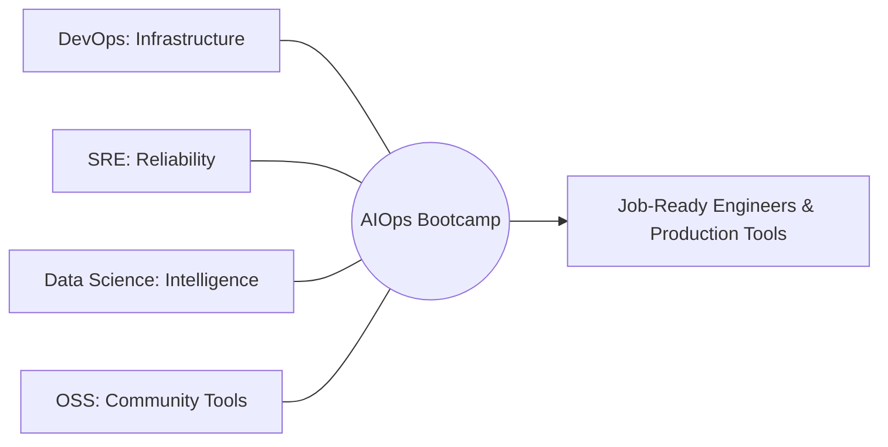

# Communities & Personas

> **AIOps is the meeting point of multiple disciplines.**

This bootcamp is designed to bring together diverse tech communities. Each community brings unique strengths and has specific learning outcomes from this program.

---

## 🚀 Target Communities

### 1. DevOps & Platform Engineering
*   **Why You’re Here:** You want to move beyond manual "YAML-wrangling" and build intelligent, self-healing platforms.
*   **Your Contribution:** Infrastructure-as-Code (IaC) templates, CI/CD patterns, and platform abstractions.
*   **Your Success:** Transitioning from *Platform Builder* to *Intelligent Platform Architect*.

### 2. SRE & Observability
*   **Why You’re Here:** You're fighting alert fatigue and high MTTR. You need ML to cut through the noise.
*   **Your Contribution:** SLO definitions, incident data, and real-world failure scenarios for model training.
*   **Your Success:** Reducing technical debt through predictive operations and automated RCA.

### 3. Data Science & Machine Learning
*   **Why You’re Here:** You want to apply your ML skills to "real-world" industrial problems outside of standard recommendation engines.
*   **Your Contribution:** Advanced model architectures, feature engineering patterns, and model evaluation logic.
*   **Your Success:** Becoming an *MLOps / AIOps Specialist* who understands the production environment.

### 4. Software Engineering
*   **Why You’re Here:** You want to build more resilient applications that "expose" the right data for AIOps systems.
*   **Your Contribution:** App-level instrumentation, structured logging patterns, and SDK improvements.
*   **Your Success:** Building "Observable-by-Design" applications that thrive in complex environments.

### 5. Open Source (OSS) Contributors
*   **Why You’re Here:** You want to build tools that hundreds of others will use.
*   **Your Contribution:** Pull Requests for core labs, bug fixes, and new tool integrations.
*   **Your Success:** Building a portfolio of contributions to the next generation of operations tools.

---

## 🤝 How We Succeed Together

### Community Participation Levels

| Level | Action | Reward |
| :--- | :--- | :--- |
| **Explorer** | Learning the labs & taking notes | Knowledge & Skills |
| **Builder** | Contributing new labs or fix bugs | Recognition & Portfolio |
| **Mentor** | Reviewing PRs & helping in Discussions | Status & Leadership |
| **Partner** | Bringing real-world use cases | Industry Influence |

---

## 📍 Where to Connect

*   **GitHub Discussions:** The "Virtual Campus" for Q&A and collaboration.
*   **Showcase:** Share your project and get feedback from across communities.
*   **Local Meetups:** We encourage forming local study groups (see [LEARNING_GROUPS.md](LEARNING_GROUPS.md)).

**Don't just learn in a silo. Engage with other communities to see the "full picture" of AIOps.**
