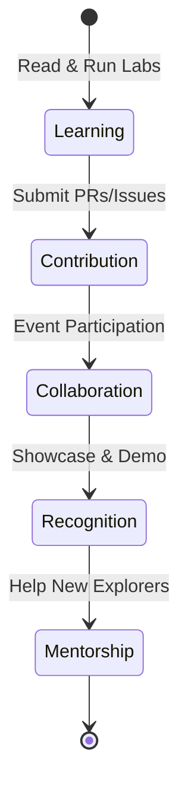

# Community Events & Engagement

> **Connecting the dots between learning and industry experts.**

Events bring the static documentation to life. We use events to showcase work, bring in expert voices, and solve complex problems in real-time.

---

## 🗓️ Event Types

### 1. Weekly "Pulse" Check-ins (Virtual)
*   **When:** Every Monday (Week Start)
*   **Goal:** Walk through the objectives for the upcoming week and answer "blocker" questions from the previous week.

### 2. Expert Masterclasses
*   **When:** Bi-weekly
*   **Goal:** Industry engineers from companies like AWS, Google, or Datadog share deep dives into specific modules (e.g., "The math behind Isolation Forest in production").

### 3. Global Demo Day
*   **When:** At the end of Week 8
*   **Goal:** The top capstone projects are presented to the entire community and invited hiring managers.

### 4. Collaborative Bug-Bashes
*   **When:** Ad-hoc
*   **Goal:** When a new lab is released, a "live stream" event to test it out together and fix bugs on the fly.

---

## 📈 The Engagement Loop

---

## 📍 How to Participate
1.  **Watch the Repo:** Ensure you get notifications for GitHub Discussions.
2.  **Add to Calendar:** (Link to a shared public calendar coming soon).
3.  **Propose an Event:** Have a topic you want to teach or discuss? Open an issue with the label `community-event`.

---

## 🏆 Hall of Fame
The Most Active Community Members (Top Contributors & Mentors) will be featured on the main [SHOWCASE.md](SHOWCASE.md) page and receive:
*   Early access to new labs
*   "Community Leader" badges
*   Networking intros with hiring partners

---

*“The strength of the team is each individual member.” — Phil Jackson*
