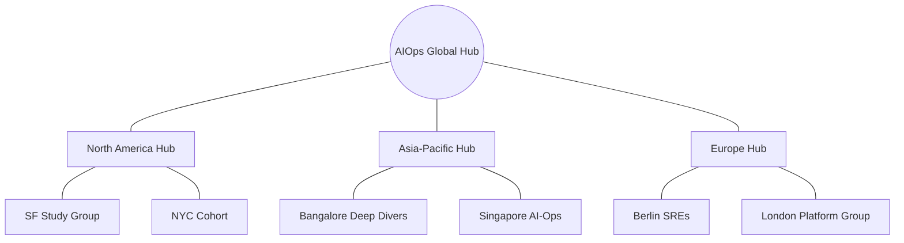

# Learning Groups & Regional Communities

> **Scale the bootcamp by learning together locally.**

While the content is global, the support is local. We encourage the formation of regional learning groups and corporate study cohorts.

---

## 🌍 Why Form a Group?
*   **Accountability:** Hard to quit when your friends are counting on you.
*   **Knowledge Swapping:** Faster debugging through group discussion.
*   **Networking:** Build a local professional network of AIOps experts.

---

## 🛠️ How to Start a Learning Group

### 1. The Channel
Start a local Discord, Slack, or WhatsApp group. Name it: `AIOps-Bootcamp-[City/Company]`.

### 2. The Schedule
Sync with the 8-week bootcamp roadmap. 
*   **Weekly Sync:** Meet once a week (virtual or in-person) to review dependencies.
*   **Demo Days:** Show off your weekly project deliverables to each other.

### 3. Roles in the Group
*   **Coordinator:** Organizes the time and place.
*   **Deep Diver:** Goes deep into the week's documentation to clarify doubts.
*   **Infrastructure Lead:** Helps others get their Docker/Cloud environments running.

---

## 🤝 Corporate Cohorts
If you are running this bootcamp within a company (e.g., as part of an SRE team upskilling):

*   **Internal Showcase:** Host internal presentations of the Week 8 Capstones.
*   **Internal Data:** If policies allow, try to adapt the labs to use (anonymized) internal telemetry data.
*   **Sponsorship:** Ask your company for a "Learning Day" (Friday) to focus on the labs.

---

## 🗺️ Visualizing the Network

---

## 📍 Register Your Group
If you've started a group, please open a PR and add it to the **"Regional Directory"** in this file! 

### Regional Directory:
*   *None yet! Be the first to start a group.*

---

*Building the future of operations, one community at a time.*
