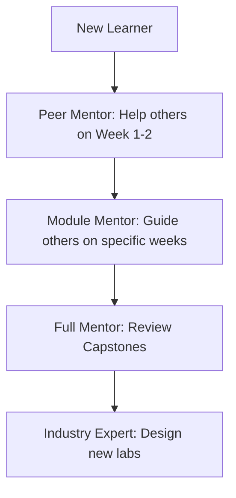

# Mentorship & Peer Learning

> **Learn one, Do one, Teach one.**

AIOps is a rapidly evolving field. Mentorship is the fastest way to bridge the gap between theory and production reality.

---

## 👨‍🏫 For Mentors

Experienced AIOps, SRE, or ML engineers are the backbone of this community.

### How to Mentor:
1.  **Code Reviews:** Review Pull Requests for the Week 1-8 projects. Focus on architectural sanity and production readiness.
2.  **Office Hours:** Host occasional voice/video sessions in the community Discord/Slack (links in README).
3.  **Real-world Context:** Share "war stories" — tell us when an ML model failed in production or how you solved a massive outage using AIOps.

### Benefits:
*   Identify top talent representing a "Job-Ready" standard.
*   Reinforce your own knowledge (teaching is the best way to learn).
*   Built a reputation as a thought leader in the space.

---

## 👨‍🎓 For Mentees (Participants)

The bootcamp is intense. Don't go it alone.

### How to be a Great Mentee:
1.  **Be Specific:** Instead of "I'm stuck," say "I'm seeing a 403 error on the OTLP exporter, here is my docker-compose config..."
2.  **Show Your Work:** Before asking for help, show what you've already tried.
3.  **Pay it Forward:** If you understand Week 1 perfectly, help someone who is just starting. This is "Peer Mentorship."

---

## 🤝 The "Buddy System"

We highly recommend finding a **Learning Buddy** from a *different* background.

*   **Example:** A DevOps Engineer and a Data Scientist pair up.
*   **The Swap:**
    *   DevOps Buddy explains Kubernetes networking.
    *   Data Science Buddy explains Isolation Forest math.
*   **Result:** Both become "AIOps Fluent" twice as fast.

---

## 📊 Mentorship Progress Tracking

---

## 📍 How to Find a Mentor/Buddy

1.  Go to the **GitHub Discussions**.
2.  Use the **"Introductions"** thread to state your background and what you're looking for.
3.  Tag yourself: `#LookingForBuddy` or `#OffersMentorship`.

---

*“None of us is as smart as all of us.” — Ken Blanchard*
