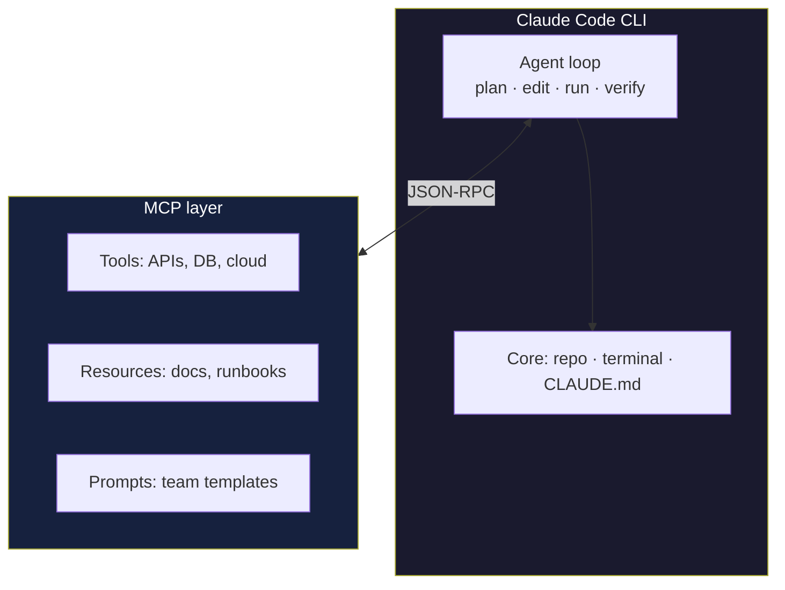
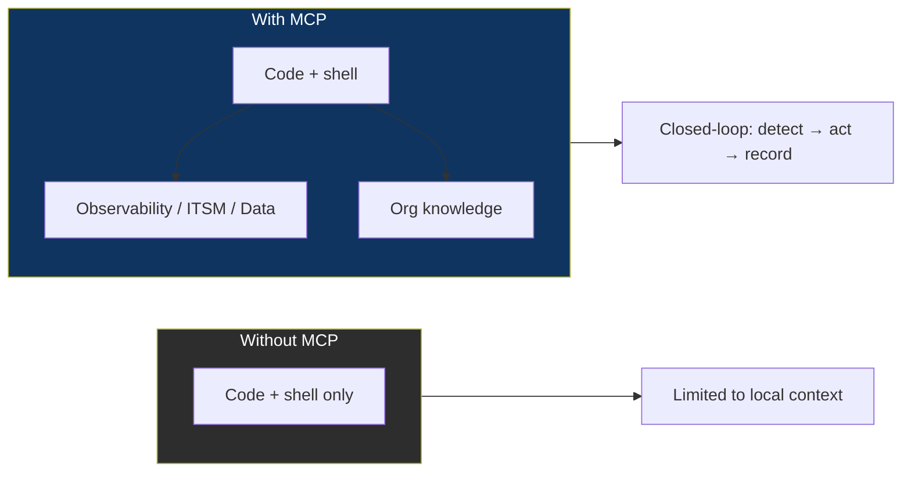
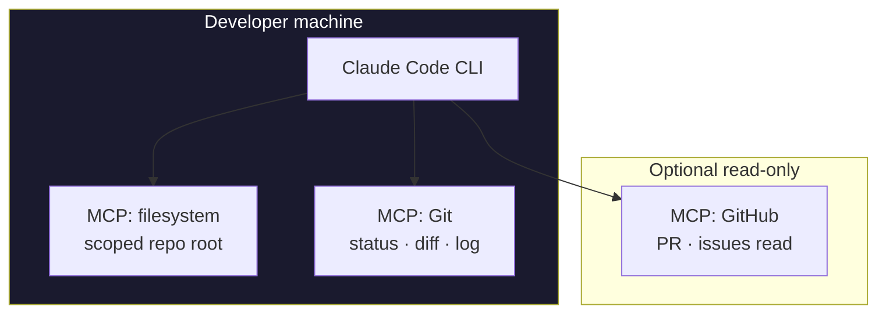
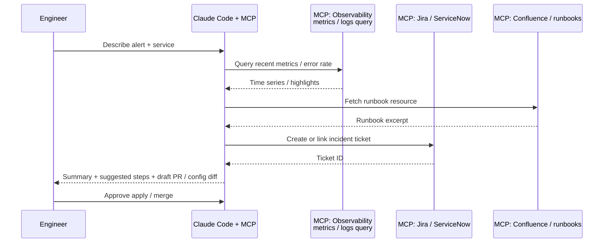
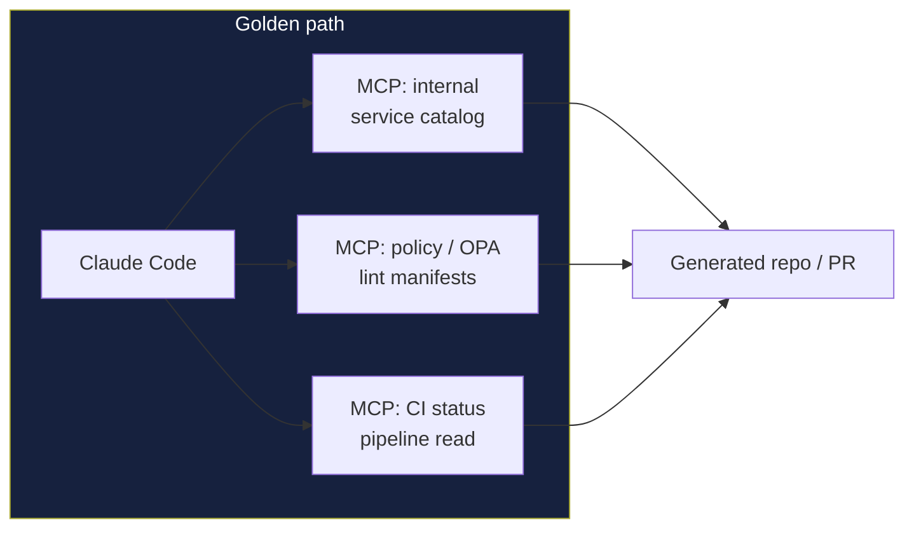
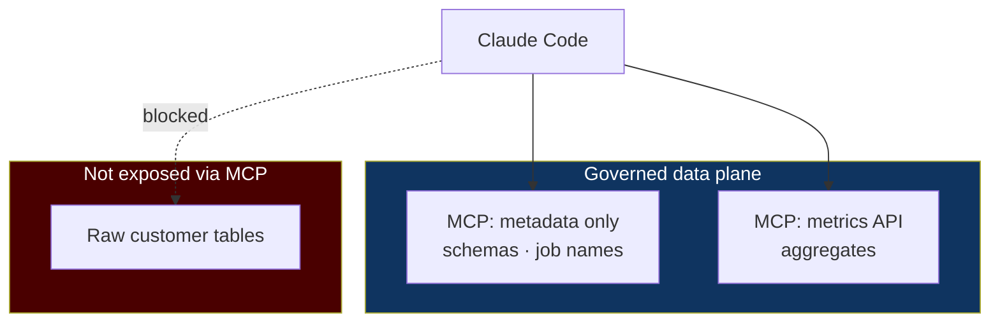

# Claude Code CLI: Best Practices & MCP-Powered Architectures

> **Purpose:** Practical guidance for using **Claude Code** (terminal-based agentic coding) effectively, and for designing **MCP** integrations so the CLI becomes a control plane for code, infrastructure, and operations—not just chat.  
> **Official docs:** [Claude Code](https://docs.claude.com/en/docs/claude-code/overview) · [MCP in Claude Code](https://docs.claude.com/en/docs/claude-code/mcp) · [CLI usage](https://docs.claude.com/en/docs/claude-code/cli-usage)

---

## What this combination gives you

**Claude Code** runs Claude in your development environment with deep access to your repo, shell, and (when configured) **external systems** through **MCP servers**. Alone, the model reasons over text and local context; with MCP, it can **invoke real tools** (APIs, databases, ticketing, observability) in a structured, permissioned way—similar to giving a senior engineer a curated toolbox instead of only a keyboard.

---

## Best practices for Claude Code CLI

### 1. Ground the model in your repository

| Practice | Why it matters |
|----------|----------------|
| Maintain a root **`CLAUDE.md`** (or project instructions your team agrees on) | Captures build commands, test commands, conventions, and “do not” rules so every session starts aligned. |
| Document **how to verify** changes (lint, test, typecheck) | Reduces “looks good” patches that break CI. |
| Keep **secrets out of CLAUDE.md** | Use environment variables and secret managers; reference variable *names*, not values. |

Treat `CLAUDE.md` as a **living onboarding doc** for the agent: stack, entrypoints, and non-negotiable standards.

### 2. Prefer small, reviewable steps

| Practice | Why it matters |
|----------|----------------|
| Ask for **plans** before large refactors | Surfaces trade-offs; you can narrow scope early. |
| **One concern per request** when possible | Easier to review diffs and roll back. |
| Run **tests and linters** after substantive edits | The CLI can run commands; your standards should be explicit in project docs. |

### 3. Use the terminal deliberately

| Practice | Why it matters |
|----------|----------------|
| Prefer **project-scoped** commands (`npm test`, `pytest`, `make`) over ad-hoc globals | Reproducible behavior across machines. |
| Avoid piping **secrets** into commands that might be logged | Same discipline as CI/CD. |
| For destructive operations (delete, `rm`, infra apply), require **explicit confirmation** in your workflow | Human gate for irreversible actions. |

### 4. Permissions and trust boundaries

| Practice | Why it matters |
|----------|----------------|
| Understand what Claude Code can **read**, **edit**, and **execute** in your setup | Align with your org’s risk model. |
| Use **least privilege** for API keys used by MCP servers | Scope tokens to minimum OAuth scopes or IAM actions. |
| **Review MCP tool definitions** before enabling in production repos | Third-party servers are supply chain; pin versions when possible. |

### 5. Session hygiene

| Practice | Why it matters |
|----------|----------------|
| **Summarize context** when switching tasks (new feature vs. hotfix) | Reduces contradictory instructions. |
| Keep **issue/ticket IDs** in the prompt when doing traceable work | Helps tie commits and PRs to intent. |
| For long sessions, periodically **restate constraints** (version pins, “do not upgrade X”) | Prevents drift. |

---

## Why MCP makes Claude Code disproportionately powerful

Without MCP, the agent is mostly bounded by **local files + shell**. With MCP:

| Capability | Example |
|------------|---------|
| **Tools** | Create a Jira ticket, query Postgres, call an internal remediation API. |
| **Resources** | Pull read-only snippets (runbook URL, service catalog entry, dashboard link). |
| **Prompts** | Standardize “incident triage” or “release checklist” prompts your platform team owns. |

The model still reasons—but **MCP is the contract** between that reasoning and your production systems. That is what turns “assistant in a repo” into **“operator connected to your stack.”**

---

## MCP configuration mindset (portable principles)

Exact filenames and CLI flags evolve—**always follow [current Claude Code MCP docs](https://docs.claude.com/en/docs/claude-code/mcp)**. Conceptually:

1. **Prefer explicit server lists** (what is allowed) over “everything on PATH.”
2. **Separate environments**: personal experiments vs. team-approved server bundles.
3. **Scope credentials** per server via env vars—never commit tokens beside `.mcp.json` / config.
4. **Transport choice**: local **stdio** for trusted dev tools; **HTTP** for shared or remote servers—always with TLS and auth where applicable.

---

## Use case 1: Secure day-to-day development

**Goal:** Fast iteration on a service with tight guardrails—format, test, and PR without leaking secrets.

**Practices:** Restrict filesystem MCP to the repo root; use Git MCP for history instead of blind `cat`; keep CI commands in `CLAUDE.md` so verification is repeatable.

---

## Use case 2: Incident triage and AIOps-assisted remediation

**Goal:** Correlate symptoms, pull runbooks, open or update tickets, and suggest safe remediation steps—with human approval for changes.

**Practices:** Observability MCP tools should be **read-only** by default; write actions (silence alert, scale) go through **approved playbooks** or human-run commands. Log ticket IDs in the session for auditability.

---

## Use case 3: Platform engineering and internal golden paths

**Goal:** Enforce “how we deploy here”—scaffold services, validate policy, open PRs—using org-specific MCP servers.

**Practices:** Encode **non-goals** in `CLAUDE.md` (e.g., “never bump major without review”); use policy MCP to catch drift before merge; keep CI MCP read-only unless paired with strict branch protections.

---

## Use case 4: Data-assisted debugging (read-only analytics)

**Goal:** Let the agent query **sanitized** production metadata (slow queries, deployment times) without raw PII.

**Practices:** Never expose broad SQL write; use **views** or **limited tools** with parameterized queries; redact or aggregate in the MCP server layer.

---

## Anti-patterns to avoid

| Anti-pattern | Risk |
|--------------|------|
| Connecting **high-privilege** cloud MCP to every developer laptop | Blast radius of a mistaken tool call. |
| **Unreviewed** third-party MCP servers in regulated repos | Supply chain and data exfiltration. |
| Letting the agent **apply infra** without review in production | Irreversible outages. |
| Putting **API keys in prompts** or committed config | Credential leakage. |

---

## Related reading in this repo

- [Model Context Protocol (MCP): concepts, clients, and servers](mcp-model-context-protocol.md)
- [Reading list](reading-list.md)

---

*This guide is educational. Product names, CLI flags, and config paths change—defer to [Anthropic’s Claude Code documentation](https://docs.claude.com/en/docs/claude-code/overview) for authoritative setup.*
