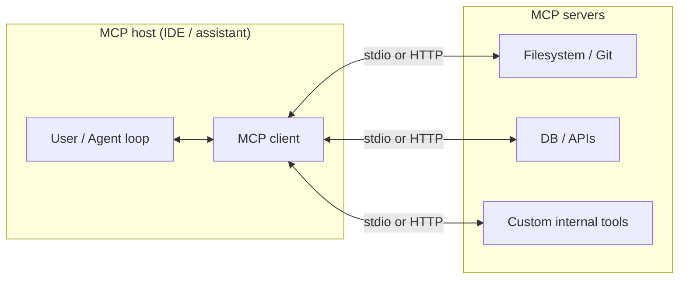

# Model Context Protocol (MCP): Concepts, Clients, and Servers

> **Purpose:** A concise reference for MCP—what it is, how it fits with different LLM ecosystems, and where to find servers and official documentation.  
> **Audience:** AIOps engineers building agents, IDE integrations, or internal tooling that connects models to data and actions.

---

## What is MCP?

The **Model Context Protocol (MCP)** is an **open standard** for connecting AI applications (**hosts**) to external **data**, **tools**, and **workflows** through **MCP servers**. It was introduced by [Anthropic](https://www.anthropic.com/) and is now used broadly across vendors and open-source clients.

Think of MCP as a **standard plug** between “the model + chat UI” and “your filesystem, APIs, databases, and internal services”—similar to how USB-C standardizes physical connections between devices.

**Official overview:** [What is MCP?](https://modelcontextprotocol.io/introduction)

---

## Core concepts

| Term | Role |
|------|------|
| **Host** | The application that runs the model and orchestration (e.g. Claude Desktop, Cursor, VS Code with Copilot). |
| **Client** | The component inside the host that speaks MCP to servers (manages connections, capability negotiation). |
| **Server** | A process that exposes **tools** (actions), **resources** (readable data), and/or **prompts** (templates) via the protocol. |
| **Transport** | How messages move between client and server (e.g. **stdio** for local subprocesses, **HTTP** / streamable HTTP for remote servers). |

MCP messages are structured for machine-to-machine use; in practice they are often carried as **JSON-RPC**-style interactions over the chosen transport. See the living spec: [Model Context Protocol specification](https://modelcontextprotocol.io/specification/latest).

---

## Architecture (high level)

**Capability types (typical server surface):**

- **Tools:** Functions the model can invoke (run query, create ticket, deploy).
- **Resources:** Read-only context (file snippets, doc URLs, config blobs).
- **Prompts:** Reusable prompt templates registered by the server.

---

## Why MCP matters for AIOps

- **One protocol, many hosts:** Build a server once; connect it from Claude, ChatGPT connectors, Cursor, VS Code, etc. (where supported).
- **Controlled access:** Servers define what is exposed; hosts enforce user consent and permissions in product-specific ways.
- **Operational pattern:** Fits “agent + runbooks + observability backends” stacks—your MCP server can wrap Prometheus, Kubernetes, or CMDB APIs.

---

## “LLM providers” vs “MCP clients” vs “MCP servers”

| Layer | What it is | Examples |
|--------|------------|----------|
| **Model API provider** | Who serves the LLM (tokens, multimodal, etc.) | Anthropic, OpenAI, Google, AWS Bedrock, Azure OpenAI, local models via Ollama/vLLM |
| **MCP host / client** | App that runs the assistant and connects to MCP servers | Claude apps, ChatGPT (MCP-related features per product docs), Cursor, VS Code, Windsurf, Amazon Q Developer, and many others |
| **MCP server** | Exposes tools/resources to **any** compliant host | Filesystem, Git, Slack, Postgres, *your* internal “on-call” server |

**Important:** MCP servers are usually **not** tied to a single LLM vendor. They implement the **same protocol**; which **host** you use determines which model provider backs the chat, unless your stack routes tools differently.

---

## MCP clients and hosts by ecosystem

Many applications advertise MCP support. The **authoritative community-maintained list** is on the official site:

- **[Example clients (official list)](https://modelcontextprotocol.io/clients)**

Below is a **representative grouping** for navigation (not exhaustive—prefer the official page for updates).

### Anthropic / Claude

| Client | Notes |
|--------|--------|
| Claude Desktop | Early widely used MCP host; connect local/remote servers per product docs. |
| Claude / Anthropic developer docs | [Building connectors / MCP](https://claude.com/docs/connectors/building) (follow current product naming). |

### OpenAI / ChatGPT

| Client | Notes |
|--------|--------|
| ChatGPT / OpenAI platform | OpenAI documents MCP-related integration for developers; see [OpenAI MCP docs](https://developers.openai.com/api/docs/mcp/). |

### Google

| Client | Notes |
|--------|--------|
| Gemini / Google AI ecosystem | Check current Google AI Studio / agent builder docs; many third-party hosts support Gemini APIs **and** MCP tool routing. |

### IDEs and developer tools (often multi-model)

| Client | Notes |
|--------|--------|
| [Visual Studio Code](https://code.visualstudio.com/docs/copilot/chat/mcp-servers) | MCP server configuration for Copilot chat. |
| [Cursor](https://cursor.com/docs/context/mcp) | MCP in Cursor context. |
| Amazon Q (CLI / IDE) | AWS-oriented agents with MCP support—see AWS announcements and docs. |
| JetBrains, Neovim extensions, etc. | Ecosystem moves quickly; verify feature matrix on the [official clients page](https://modelcontextprotocol.io/clients). |

### Multi-LLM / open-source hosts

Examples from the official clients list include apps and libraries that support **multiple providers** (OpenAI, Anthropic, Ollama, OpenRouter, etc.) **and** MCP. Again, use **[modelcontextprotocol.io/clients](https://modelcontextprotocol.io/clients)** as the source of truth.

---

## MCP servers: official reference vs community

### Official reference implementations

The GitHub org **[modelcontextprotocol](https://github.com/modelcontextprotocol)** maintains SDKs and **reference servers** (educational patterns; harden before production).

- **Repository:** [github.com/modelcontextprotocol/servers](https://github.com/modelcontextprotocol/servers)  
- **Examples index (docs):** [modelcontextprotocol.io/examples](https://modelcontextprotocol.io/examples)

**Commonly cited reference servers** (names may evolve—check the repo):

| Server | Typical use |
|--------|-------------|
| **Filesystem** | Constrained read/write under allowed roots. |
| **Git** | Read/search repo state. |
| **Fetch** | Pull and normalize web content for the model. |
| **Memory** | Structured scratch / memory patterns. |
| **Time** | Timezones and timestamps. |
| **Everything** | Demo surface for prompts, tools, resources. |

### Discovering more servers (registry and community)

| Resource | URL |
|----------|-----|
| **MCP Registry** | [registry.modelcontextprotocol.io](https://registry.modelcontextprotocol.io/) |
| **Official examples** | [modelcontextprotocol.io/examples](https://modelcontextprotocol.io/examples) |
| **Awesome / curated lists** | Search for community “awesome-mcp-servers” style lists; treat as **unvetted**—review code before use. |

**Categories you will see in the wild:**

- **Productivity:** GitHub, Slack, Google Drive, Notion (vendor or community servers).
- **Data:** PostgreSQL, BigQuery, Snowflake wrappers.
- **Cloud & DevOps:** Kubernetes, AWS, Terraform assistants (quality varies—audit carefully).
- **Browser automation:** Playwright/Puppeteer-style servers (high risk—scope permissions).

---

## Security and governance

MCP **tools can execute arbitrary code or call privileged APIs** depending on the server implementation. Treat every server like **supply chain + production access**:

- Prefer **least privilege** (narrow filesystem roots, read-only DB users, scoped OAuth).
- Run servers in **isolated** environments where possible.
- **Review** third-party servers; pin versions; audit logs for tool calls.
- Follow host-specific **permission** UX (Cursor, VS Code, Claude, etc.) so users explicitly approve risky actions.

Authorization and transport security are defined in the spec (e.g. OAuth patterns in current revisions)—see [Authorization](https://modelcontextprotocol.io/specification/latest/basic/authorization) in the latest specification.

---

## SDKs (build your own server or client)

Official multi-language SDKs are listed from the **Model Context Protocol** GitHub organization, including TypeScript, Python, Go, Java, C#, Rust, Ruby, PHP, Kotlin, and Swift (availability changes over time):

- [github.com/modelcontextprotocol](https://github.com/modelcontextprotocol)

---

## Quick links (bookmark list)

| Topic | URL |
|--------|-----|
| Introduction | https://modelcontextprotocol.io/introduction |
| Specification (latest) | https://modelcontextprotocol.io/specification/latest |
| Example clients | https://modelcontextprotocol.io/clients |
| Example servers / patterns | https://modelcontextprotocol.io/examples |
| Reference servers repo | https://github.com/modelcontextprotocol/servers |
| Registry | https://registry.modelcontextprotocol.io/ |
| Documentation index (`llms.txt`) | https://modelcontextprotocol.io/llms.txt |

---

## Related reading in this repo

- General curated list: [reading-list.md](reading-list.md)

---

*Last updated: Mar 2026. MCP clients, hosts, and vendor docs change frequently—always verify against official links above.*
