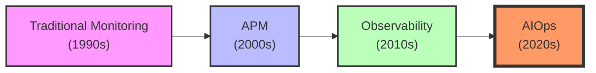
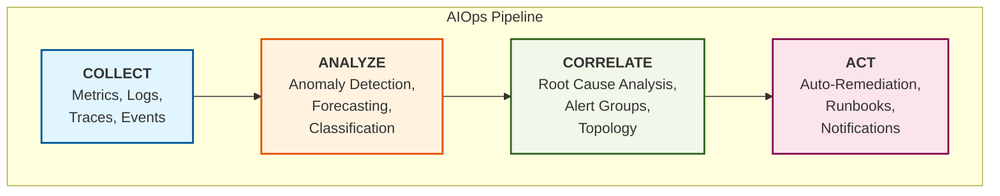
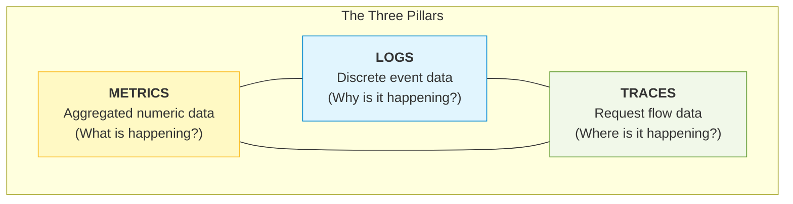
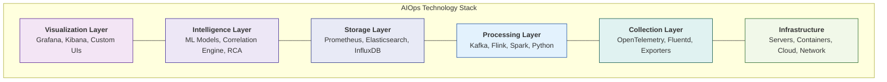

# Day 1-2: Introduction to AIOps

> **Duration:** 8 hours | **Difficulty:** Beginner

---

## 🎯 Learning Objectives

By the end of this session, you will:
1. Define AIOps and explain its evolution from traditional monitoring
2. Understand the key components of an AIOps platform
3. Identify use cases where AIOps delivers business value
4. Set up your development environment for the bootcamp

---

## 📑 Preparation & Resources

> [!TIP]
> **Daily Prerequisites:** Before you start this lecture, ensure you have a basic understanding of YAML and Linux CLI basics as outlined in the [Resources Guide](resources/RESOURCES.md#daily-prerequisites-getting-ready).

**Quick Links:**
*   📂 [Supporting Code & External Links](resources/RESOURCES.md)
*   💻 [Exercise 1: Environment Setup](exercises/exercise-01-setup.md)

## 📖 Lecture Content

### 1. What is AIOps?

**AIOps** (Artificial Intelligence for IT Operations) is the application of machine learning and data science to IT operations challenges.

> "AIOps combines big data and machine learning to automate IT operations processes, including event correlation, anomaly detection, and causality determination."
> — Gartner

#### Evolution of IT Operations



| Era | Approach | Limitations |
|-----|----------|-------------|
| **Traditional** | Static thresholds, siloed tools | Alert fatigue, slow response |
| **APM** | Application-centric monitoring | Limited to app layer |
| **Observability** | Metrics, logs, traces combined | Still requires human analysis |
| **AIOps** | AI-driven insights and automation | Current state of the art |

---

### 2. The AIOps Lifecycle



#### Key Capabilities

1. **Data Ingestion**: Collect data from all sources
2. **Noise Reduction**: Filter and correlate alerts
3. **Anomaly Detection**: Find unusual patterns
4. **Root Cause Analysis**: Identify underlying issues
5. **Automation**: Execute remediation actions

---

### 3. The Three Pillars of Observability

AIOps builds upon the three pillars of observability:



#### Metrics
Numeric measurements over time.

```
Example: CPU utilization every 15 seconds
cpu_usage{host="web-01"} 0.75 1704672000
cpu_usage{host="web-01"} 0.82 1704672015
cpu_usage{host="web-01"} 0.68 1704672030
```

**Use cases:** Performance monitoring, capacity planning, SLA tracking

#### Logs
Discrete events with context.

```
2024-01-08T10:30:00Z [ERROR] Connection timeout to database-01: 
  user_id=12345, request_id=abc123, latency_ms=30000
```

**Use cases:** Debugging, audit trails, security analysis

#### Traces
Request flow through distributed systems.

```
TraceID: abc123
├── Service: API Gateway (10ms)
│   └── Service: Auth Service (5ms)
│       └── Service: User DB (2ms)
└── Service: Order Service (50ms)
    └── Service: Payment Service (100ms) ← SLOW!
```

**Use cases:** Latency analysis, dependency mapping, bottleneck identification

---

### 4. AIOps Use Cases

| Use Case | Traditional Approach | AIOps Approach |
|----------|---------------------|----------------|
| **Anomaly Detection** | Static thresholds | ML-based dynamic detection |
| **Alert Management** | Manual triage | Auto-correlation & prioritization |
| **Root Cause Analysis** | Manual investigation | Topology-aware causality |
| **Capacity Planning** | Spreadsheets | Predictive forecasting |
| **Incident Response** | Manual runbooks | Auto-remediation |

#### Business Value

- **Reduce MTTD** (Mean Time To Detect): Catch issues faster
- **Reduce MTTR** (Mean Time To Resolve): Fix issues faster
- **Reduce Alert Fatigue**: Focus on what matters
- **Improve Availability**: Prevent outages
- **Optimize Costs**: Right-size resources

---

### 5. AIOps Technology Stack



---

## 🔬 Hands-On Exercises

Complete the exercises in the [exercises/](exercises/) folder:

1. **Exercise 1:** Environment Setup
2. **Exercise 2:** Explore Observability Data
3. **Exercise 3:** AIOps Use Case Analysis

---

## ❓ Knowledge Check

1. What does AIOps stand for and why was it created?
2. Name the three pillars of observability and give an example of each.
3. How does AIOps improve MTTD and MTTR?
4. What are the main layers of an AIOps technology stack?
5. Give three business benefits of implementing AIOps.

---

## 📚 Further Reading

- [Gartner's AIOps Definition](https://www.gartner.com/en/information-technology/glossary/aiops-artificial-intelligence-operations)
- [Google SRE Book - Chapter on Monitoring](https://sre.google/sre-book/monitoring-distributed-systems/)
- [CNCF Observability Whitepaper](https://www.cncf.io/blog/2021/09/23/cncf-observability-whitepaper/)

---

<p align="center">
  <a href="exercises/">Start Exercises</a> | <a href="../day-02-observability/">Next: Observability Stack →</a>
</p>
