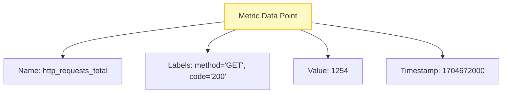
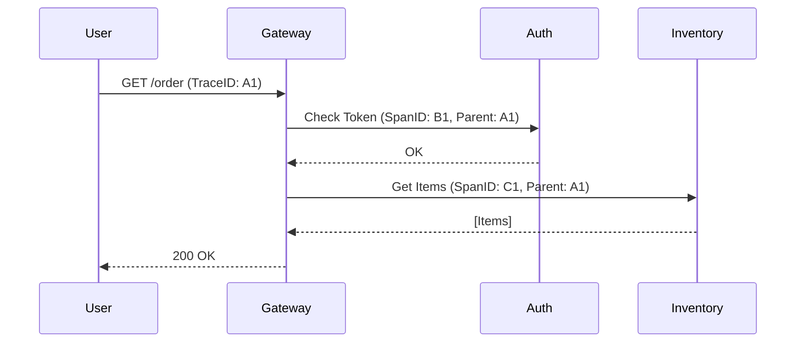

# Day 2: The Three Pillars - Metrics, Logs, and Traces (Deep Dive)

> **Duration:** 6 hours | **Difficulty:** Beginner-Intermediate

---

## 🎯 Learning Objectives

By the end of this session, you will:
1. Understand the technical data structures behind Metrics, Logs, and Traces.
2. Learn the concept of **Cardinality** and why it's the "AIOps Killer."
3. Differentiate between Structured and Unstructured logging.
4. Master the flow of context propagation in Distributed Tracing.
5. Identify which pillar to use for specific troubleshooting scenarios.

---

## 📖 Lecture Content

### 1. Metrics: The Pulse of the System

Metrics are **numerical aggregations** over time. They tell you *what* is happening.

#### Metric Types
1.  **Counter**: Increments only (e.g., total requests, errors).
2.  **Gauge**: Can go up or down (e.g., CPU usage, temperature, queue size).
3.  **Histogram**: Samples observations (e.g., request duration) and counts them in configurable buckets.
4.  **Summary**: Similar to Histogram, but calculates configurable quantiles (e.g., p95, p99) over a sliding time window.



#### The Cardinality Challenge
**Cardinality** refers to the number of unique combinations of label values.
*   Low Cardinality: `status_code` (200, 404, 500)
*   High Cardinality: `user_id` (millions of unique values)

> [!CAUTION]
> **Warning:** High cardinality labels can crash your TSDB (Prometheus) by creating too many unique time series. Never use `user_id`, `email`, or `request_id` as Prometheus labels.

---

### 2. Logs: The Narrative of the System

Logs are **discrete events**. They tell you *why* something happened.

#### Structured vs. Unstructured
*   **Unstructured:** `2024-01-08 10:00:00 - User 123 logged in from IP 1.2.3.4`
*   **Structured (JSON):** 
    ```json
    {"timestamp": "2024...", "event": "login", "user_id": 123, "ip": "1.2.3.4", "level": "INFO"}
    ```

**Why AIOps loves Structured Logs:**
Machines can parse JSON instantly. Analyzing unstructured logs requires complex Regex or ML-based log parsing (which we'll cover in Week 4).

---

### 3. Traces: The Journey of a Request

Traces follow a request across multiple services. They tell you *where* the bottleneck is.

#### Anatomy of a Trace
- **Trace ID**: Unique ID for the entire request path.
- **Span**: A single unit of work (e.g., a DB query, a function call).
- **Parent ID**: Links spans together to form a tree.



---

### 4. Which Pillar When? (The AIOps Perspective)

| Problem | Best Pillar | Why? |
| :--- | :--- | :--- |
| "The site is slow" | **Metrics** | High-level p99 latency alerts. |
| "Why is it slow for this user?" | **Traces** | Pinpoints which microservice is lagging. |
| "Database connection refused" | **Logs** | Provides the specific error string/stack trace. |

---

## 🛠️ Real-World Scenario: The "ghost" latency
A customer reports that their checkout is slow once every 10 attempts.

1.  **Metrics** show a small spike in p99 latency but no 500 errors.
2.  **Traces** show that in those slow requests, the `payment-service` is waiting 5 seconds for a response.
3.  **Logs** in the `payment-service` reveal: `WARN: Retry 3/3 for bank-api. Connection timeout.`

---

## 🔬 Knowledge Check
1.  Why is `user_email` a bad label for a Prometheus metric?
2.  What is the main difference between a Histogram and a Summary?
3.  Explain how a Trace ID differs from a Span ID.
4.  Why should you prefer JSON logs over plain text in AIOps?

---

## 📚 Resources
- [OTel Guide: What are Metrics, Logs, and Traces?](https://opentelemetry.io/docs/concepts/signals/)
- [Grafana: Deep Dive into Cardinality](https://grafana.com/blog/2022/02/15/what-are-cardinality-and-high-cardinality-metrics/)
- [Honeycomb: Observability Engineering (Free Sample)](https://www.honeycomb.io/whitepaper/observability-engineering)

---

<p align="center">
  <a href="../day-01-intro/">← Day 1: Intro</a> | <a href="../day-03-stack/">Day 3: Hands-on Stack →</a>
</p>
