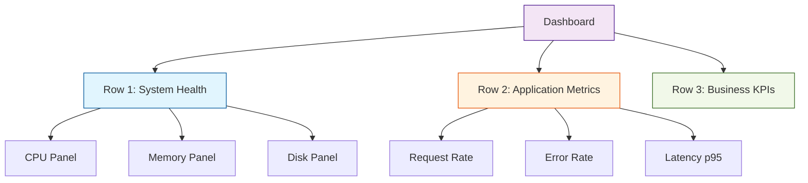

# PromQL & Grafana Cheat Sheet

> **Quick reference for querying metrics and building dashboards.**

---

## 📊 PromQL Essentials

### Basic Query Types

| Query Type | Example | Use Case |
| :--- | :--- | :--- |
| **Instant Vector** | `up` | Current value of all `up` metrics |
| **Range Vector** | `http_requests_total[5m]` | All values in last 5 minutes |
| **Scalar** | `count(up == 1)` | Single numeric value |

### Common Functions

#### Rate & Increase
```promql
# Per-second rate over 5 minutes
rate(http_requests_total[5m])

# Total increase over 1 hour
increase(http_requests_total[1h])

# Rate for counters that can reset
irate(http_requests_total[5m])
```

#### Aggregation
```promql
# Sum across all instances
sum(rate(http_requests_total[5m]))

# Average CPU by job
avg by (job) (node_cpu_seconds_total)

# Max memory usage
max(node_memory_usage_bytes)

# Count number of instances
count(up == 1)
```

#### Percentiles (Histograms)
```promql
# 95th percentile latency
histogram_quantile(0.95, 
  sum by (le) (rate(http_request_duration_seconds_bucket[5m]))
)

# 99th percentile
histogram_quantile(0.99, 
  sum by (le) (rate(http_request_duration_seconds_bucket[5m]))
)
```

### Filtering & Matching

```promql
# Exact match
http_requests_total{method="GET"}

# Regex match
http_requests_total{path=~"/api/.*"}

# Not equal
http_requests_total{status!="200"}

# Multiple labels
http_requests_total{method="POST", status=~"5.."}
```

---

## 🎨 Grafana Dashboard Best Practices

### Panel Types

| Visualization | Best For | Example Metric |
| :--- | :--- | :--- |
| **Time Series** | Trends over time | CPU usage, request rate |
| **Gauge** | Current value vs threshold | Memory %, disk usage |
| **Stat** | Single number | Total requests, uptime |
| **Table** | Multiple dimensions | Top 10 endpoints by latency |
| **Heatmap** | Distribution patterns | Request duration distribution |

### Dashboard Organization



### Variables for Dynamic Dashboards

```
# Create a variable for job selection
Query: label_values(up, job)
Name: job

# Use in panel query
up{job="$job"}
```

---

## 🚨 Alerting Rules

### Alert Rule Structure

```yaml
groups:
  - name: example_alerts
    rules:
      - alert: HighErrorRate
        expr: |
          sum(rate(http_requests_total{status=~"5.."}[5m])) 
          / 
          sum(rate(http_requests_total[5m])) 
          > 0.05
        for: 5m
        labels:
          severity: critical
        annotations:
          summary: "High error rate detected"
          description: "Error rate is {{ $value | humanizePercentage }}"
```

### Common Alert Patterns

```promql
# Instance down
up == 0

# High CPU (> 80% for 5 minutes)
100 - (avg by (instance) (irate(node_cpu_seconds_total{mode="idle"}[5m])) * 100) > 80

# High memory (> 90%)
(1 - node_memory_MemAvailable_bytes / node_memory_MemTotal_bytes) * 100 > 90

# Disk space low (< 10%)
(node_filesystem_avail_bytes / node_filesystem_size_bytes) * 100 < 10

# Request latency high (p95 > 1s)
histogram_quantile(0.95, rate(http_request_duration_seconds_bucket[5m])) > 1
```

---

## 🔍 Troubleshooting Queries

### Service Health
```promql
# Check which services are down
up == 0

# Count healthy instances per job
count by (job) (up == 1)
```

### Performance Investigation
```promql
# Top 5 endpoints by request count
topk(5, sum by (path) (rate(http_requests_total[5m])))

# Slowest endpoints (p99 latency)
topk(5, histogram_quantile(0.99, 
  sum by (path, le) (rate(http_request_duration_seconds_bucket[5m]))
))
```

### Resource Analysis
```promql
# Memory usage trend
node_memory_MemTotal_bytes - node_memory_MemAvailable_bytes

# Disk I/O rate
rate(node_disk_io_time_seconds_total[5m])

# Network traffic
rate(node_network_receive_bytes_total[5m])
```

---

## 💡 Pro Tips

1. **Use Recording Rules** for expensive queries that run frequently
2. **Set appropriate scrape intervals** (15s default, increase for high-cardinality targets)
3. **Use label_replace()** to normalize labels for better aggregation
4. **Test queries in Prometheus UI** before adding to Grafana
5. **Use $__interval** variable in Grafana for dynamic time ranges
