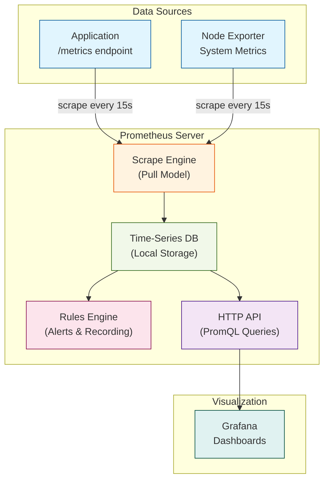
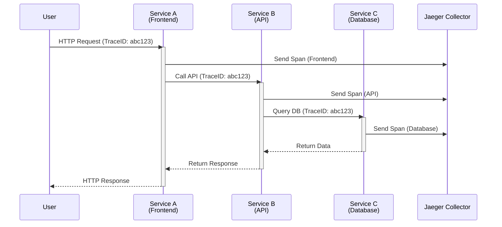

# Day 3: Observability Stack - Hands-On Deployment

> **Duration:** 8 hours | **Difficulty:** Intermediate

---

## 🎯 Learning Objectives

By the end of this session, you will:
1. Deploy a complete observability stack using Docker Compose
2. Configure Prometheus for metrics collection and scraping
3. Build Grafana dashboards with real-time data
4. Deploy Jaeger for distributed tracing
5. Write PromQL queries for operational insights
6. Create your first alerting rules

---

## 📑 Preparation & Resources

> [!TIP]
> **Prerequisites:** Ensure Docker Desktop is running and you have completed Day 2's pillar concepts. Review [Docker Compose Networking](https://docs.docker.com/compose/networking/) if needed.

**Quick Links:**
*   📂 [Resources & Troubleshooting](resources/RESOURCES.md)
*   💻 [Exercise 1: Stack Deployment](exercises/exercise-01-deploy.md)
*   📊 [PromQL & Grafana Cheat Sheet](cheatsheet.md)

**🎮 Interactive Learning:**
*   🎯 [PromQL Challenge Game](promql-challenges.md) - Level up your query skills!
*   🚨 [Incident Response Simulation](incident-simulation.md) - Practice debugging under pressure
*   🔥 [Chaos Engineering Lab](chaos-lab.md) - Break it to learn it
*   🏆 [Achievement System](achievements.md) - Track your progress & earn badges
*   ⚡ [Query Performance Tool](tools/promql-benchmark.py) - Optimize your queries

---

## 📖 Lecture Content

### 1. Prometheus Architecture

Prometheus is the de-facto standard for metrics in cloud-native environments.



#### Key Concepts

| Concept | Description | Why It Matters for AIOps |
|---------|-------------|-------------------------|
| **Pull Model** | Prometheus scrapes targets | Centralized control, easier to secure |
| **Exporters** | Expose metrics in Prometheus format | Standardized instrumentation |
| **TSDB** | Time-series database for storage | Optimized for time-based queries |
| **PromQL** | Query language for metrics | Foundation for ML feature engineering |
| **Rules** | Alert conditions and recording rules | Basis for intelligent alerting |

---

### 2. Grafana Overview

Grafana provides visualization and alerting.

**Key Features:**
- Multi-source dashboards (Prometheus, Elasticsearch, etc.)
- Rich visualization options
- Alerting and notifications
- User management and sharing

---

### 3. Jaeger for Distributed Tracing

Jaeger helps trace requests through distributed systems.



**How Jaeger Works:**
1. Each service sends "spans" (units of work) to the Jaeger Collector
2. All spans share the same Trace ID to form a complete request path
3. The Jaeger UI allows you to visualize the entire trace tree

---

## 🔬 Hands-On Lab: Deploy the Stack

### Docker Compose Setup

Create `infrastructure/docker-compose/observability-stack.yml`:

```yaml
version: '3.8'

services:
  # Prometheus - Metrics Collection
  prometheus:
    image: prom/prometheus:v2.47.0
    container_name: prometheus
    ports:
      - "9090:9090"
    volumes:
      - ./prometheus/prometheus.yml:/etc/prometheus/prometheus.yml
      - prometheus_data:/prometheus
    command:
      - '--config.file=/etc/prometheus/prometheus.yml'
      - '--storage.tsdb.path=/prometheus'
      - '--web.enable-lifecycle'
    restart: unless-stopped

  # Grafana - Visualization
  grafana:
    image: grafana/grafana:10.2.0
    container_name: grafana
    ports:
      - "3000:3000"
    environment:
      - GF_SECURITY_ADMIN_PASSWORD=admin
      - GF_USERS_ALLOW_SIGN_UP=false
    volumes:
      - grafana_data:/var/lib/grafana
      - ./grafana/provisioning:/etc/grafana/provisioning
    depends_on:
      - prometheus
    restart: unless-stopped

  # Jaeger - Distributed Tracing
  jaeger:
    image: jaegertracing/all-in-one:1.51
    container_name: jaeger
    ports:
      - "16686:16686"  # UI
      - "14268:14268"  # HTTP collector
      - "6831:6831/udp"  # Thrift compact
      - "4317:4317"    # OTLP gRPC
      - "4318:4318"    # OTLP HTTP
    environment:
      - COLLECTOR_OTLP_ENABLED=true
    restart: unless-stopped

  # Sample Application (instrumented)
  demo-app:
    build:
      context: ./demo-app
      dockerfile: Dockerfile
    container_name: demo-app
    ports:
      - "8080:8080"
    environment:
      - OTEL_EXPORTER_OTLP_ENDPOINT=http://jaeger:4317
      - OTEL_SERVICE_NAME=demo-app
    depends_on:
      - prometheus
      - jaeger
    restart: unless-stopped

  # Node Exporter - System Metrics
  node-exporter:
    image: prom/node-exporter:v1.6.1
    container_name: node-exporter
    ports:
      - "9100:9100"
    restart: unless-stopped

volumes:
  prometheus_data:
  grafana_data:
```

### Prometheus Configuration

Create `infrastructure/docker-compose/prometheus/prometheus.yml`:

```yaml
global:
  scrape_interval: 15s
  evaluation_interval: 15s

alerting:
  alertmanagers:
    - static_configs:
        - targets: []

rule_files: []

scrape_configs:
  # Prometheus self-monitoring
  - job_name: 'prometheus'
    static_configs:
      - targets: ['localhost:9090']

  # Node Exporter
  - job_name: 'node-exporter'
    static_configs:
      - targets: ['node-exporter:9100']

  # Demo Application
  - job_name: 'demo-app'
    static_configs:
      - targets: ['demo-app:8080']
    metrics_path: '/metrics'
```

### Grafana Datasource Provisioning

Create `infrastructure/docker-compose/grafana/provisioning/datasources/datasources.yml`:

```yaml
apiVersion: 1

datasources:
  - name: Prometheus
    type: prometheus
    access: proxy
    url: http://prometheus:9090
    isDefault: true
    editable: true

  - name: Jaeger
    type: jaeger
    access: proxy
    url: http://jaeger:16686
    editable: true
```

---

## 📝 Exercises

Complete these exercises:

1. **Deploy the Stack**
   ```bash
   cd infrastructure/docker-compose
   docker-compose -f observability-stack.yml up -d
   ```

2. **Verify Services**
   - Prometheus: http://localhost:9090
   - Grafana: http://localhost:3000 (admin/admin)
   - Jaeger: http://localhost:16686

3. **Explore Prometheus**
   - View targets: Status → Targets
   - Run query: `up`
   - Try: `node_cpu_seconds_total`

4. **Create First Dashboard**
   - Add panel with CPU usage
   - Add panel with memory usage
   - Save dashboard

5. **Find a Trace in Jaeger**
   - Generate traffic to demo app
   - Search for traces
   - Analyze span details

---

## ✅ Deliverables

- [ ] All services running
- [ ] Prometheus scraping targets
- [ ] Grafana dashboard with 2+ panels
- [ ] Successfully traced request in Jaeger

---

<p align="center">
  <a href="../day-01-intro/">← Day 1</a> | <a href="../day-03-instrumentation/">Day 5-6: Instrumentation →</a>
</p>
