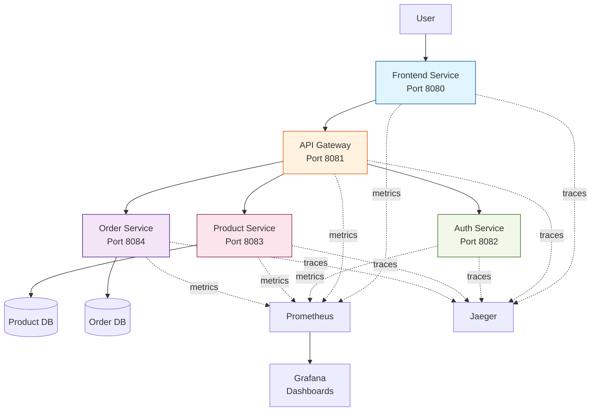

# Real-World Project: Multi-Service E-Commerce Monitoring

> **Build a production-grade monitoring solution for a microservices application.**

---

## 🎯 Project Overview

You will deploy a simulated e-commerce platform with multiple microservices and implement comprehensive monitoring using the observability stack.

### Architecture



---

## 📋 Requirements

### Phase 1: Service Deployment (Required)
- [ ] Deploy all 5 microservices using Docker Compose
- [ ] Each service exposes `/metrics` endpoint
- [ ] Each service sends traces to Jaeger
- [ ] All services are scraped by Prometheus

### Phase 2: Monitoring Setup (Required)
- [ ] Create a "Service Health" dashboard showing:
  - Uptime for each service
  - Request rate per service
  - Error rate per service
  - P95 latency per service
- [ ] Create a "Business Metrics" dashboard showing:
  - Orders per minute
  - Product views
  - Authentication attempts
  - Revenue (simulated)

### Phase 3: Alerting (Required)
- [ ] Alert when any service is down
- [ ] Alert when error rate > 5%
- [ ] Alert when P95 latency > 500ms
- [ ] Alert when order rate drops suddenly

### Phase 4: Distributed Tracing (Stretch Goal)
- [ ] Implement full trace propagation across all services
- [ ] Create a dashboard showing trace statistics
- [ ] Document a slow trace and identify the bottleneck

---

## 🛠️ Implementation Guide

### Step 1: Service Code Structure

Each service should have this structure:
```
service-name/
├── app.py              # Flask application
├── requirements.txt    # Dependencies
├── Dockerfile
└── README.md
```

### Step 2: Sample Service Code

**File: `frontend/app.py`**
```python
from flask import Flask, jsonify
from prometheus_client import Counter, Histogram, generate_latest
from opentelemetry import trace
from opentelemetry.sdk.trace import TracerProvider
from opentelemetry.sdk.trace.export import BatchSpanProcessor
from opentelemetry.exporter.otlp.proto.grpc.trace_exporter import OTLPSpanExporter
import requests
import time
import random

app = Flask(__name__)

# Prometheus metrics
REQUEST_COUNT = Counter('http_requests_total', 'Total requests', ['method', 'endpoint', 'status'])
REQUEST_LATENCY = Histogram('http_request_duration_seconds', 'Request latency', ['endpoint'])

# OpenTelemetry setup
trace.set_tracer_provider(TracerProvider())
tracer = trace.get_tracer(__name__)
otlp_exporter = OTLPSpanExporter(endpoint="jaeger:4317", insecure=True)
span_processor = BatchSpanProcessor(otlp_exporter)
trace.get_tracer_provider().add_span_processor(span_processor)

@app.route('/health')
def health():
    return jsonify({"status": "healthy", "service": "frontend"})

@app.route('/metrics')
def metrics():
    return generate_latest()

@app.route('/')
def index():
    with tracer.start_as_current_span("frontend-request"):
        start = time.time()
        
        # Call API Gateway
        try:
            response = requests.get('http://api-gateway:8081/products', timeout=2)
            status = response.status_code
        except Exception as e:
            status = 500
        
        latency = time.time() - start
        REQUEST_COUNT.labels(method='GET', endpoint='/', status=status).inc()
        REQUEST_LATENCY.labels(endpoint='/').observe(latency)
        
        return jsonify({"message": "Frontend", "status": status})

if __name__ == '__main__':
    app.run(host='0.0.0.0', port=8080)
```

**File: `frontend/requirements.txt`**
```
flask==3.0.0
prometheus-client==0.19.0
opentelemetry-api==1.21.0
opentelemetry-sdk==1.21.0
opentelemetry-exporter-otlp-proto-grpc==1.21.0
requests==2.31.0
```

**File: `frontend/Dockerfile`**
```dockerfile
FROM python:3.11-slim
WORKDIR /app
COPY requirements.txt .
RUN pip install --no-cache-dir -r requirements.txt
COPY app.py .
CMD ["python", "app.py"]
```

### Step 3: Docker Compose for All Services

**File: `project/docker-compose.yml`**
```yaml
version: '3.8'

services:
  frontend:
    build: ./frontend
    ports:
      - "8080:8080"
    environment:
      - API_GATEWAY_URL=http://api-gateway:8081
    depends_on:
      - api-gateway

  api-gateway:
    build: ./api-gateway
    ports:
      - "8081:8081"
    depends_on:
      - auth-service
      - product-service
      - order-service

  auth-service:
    build: ./auth-service
    ports:
      - "8082:8082"

  product-service:
    build: ./product-service
    ports:
      - "8083:8083"

  order-service:
    build: ./order-service
    ports:
      - "8084:8084"

  # Observability Stack
  prometheus:
    image: prom/prometheus:v2.47.0
    ports:
      - "9090:9090"
    volumes:
      - ./prometheus.yml:/etc/prometheus/prometheus.yml
      - ./alerts.yml:/etc/prometheus/alerts.yml

  grafana:
    image: grafana/grafana:10.2.0
    ports:
      - "3000:3000"
    environment:
      - GF_SECURITY_ADMIN_PASSWORD=admin

  jaeger:
    image: jaegertracing/all-in-one:1.51
    ports:
      - "16686:16686"
      - "4317:4317"
```

---

## 📊 Evaluation Rubric

| Criteria | Points | Description |
| :--- | :---: | :--- |
| **Service Deployment** | 20 | All services running and healthy |
| **Metrics Instrumentation** | 20 | All services expose Prometheus metrics |
| **Dashboard Quality** | 25 | Clear, informative dashboards |
| **Alert Configuration** | 20 | Alerts are accurate and actionable |
| **Tracing Implementation** | 10 | Traces show full request path |
| **Documentation** | 5 | Clear README with setup instructions |
| **Total** | **100** | |

---

## 🚀 Getting Started

1. Create project directory structure
2. Implement one service at a time (start with frontend)
3. Test each service individually
4. Integrate with observability stack
5. Build dashboards incrementally
6. Add alerts last

---

## 💡 Tips for Success

- Start simple: Get one service working perfectly before adding others
- Use the provided code as a template
- Test metrics endpoint before deploying to Prometheus
- Use Jaeger UI to verify traces are being received
- Document any issues and solutions in your README

---

## 📤 Submission

Submit a PR with:
- All service code
- Docker Compose configuration
- Exported Grafana dashboards (JSON)
- Alert rules (YAML)
- README with:
  - Architecture diagram
  - Setup instructions
  - Screenshots of dashboards
  - Example traces
