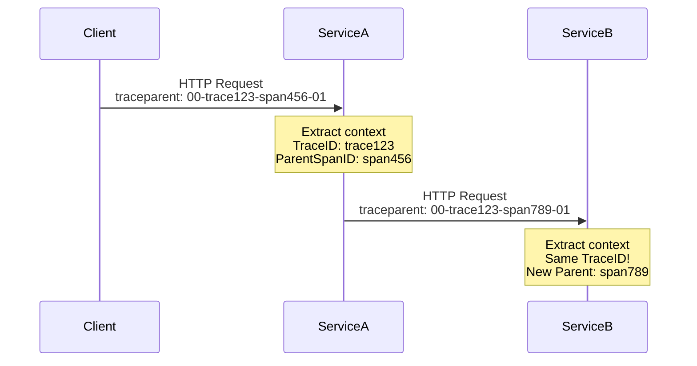

# Context Propagation & Instrumentation Cheat Sheet

> **Quick reference for OpenTelemetry instrumentation patterns.**

---

## 🔗 Context Propagation

### What is Context?

Context carries trace information (Trace ID, Span ID) across service boundaries, allowing distributed traces to be reconstructed.



### W3C Trace Context Header

```
traceparent: {version}-{trace-id}-{parent-id}-{trace-flags}

Example:
traceparent: 00-0af7651916cd43dd8448eb211c80319c-b7ad6b7169203331-01
             │  │                                │                │
             │  └── Trace ID (16 bytes hex)     │                └── Flags
             └───── Version                      └─────────────────── Parent Span ID
```

---

## 🎯 Instrumentation Patterns

### 1. Auto-Instrumentation (Zero Code)

**Python:**
```bash
# Install
pip install opentelemetry-distro
pip install opentelemetry-exporter-otlp

# Auto-instrument
opentelemetry-bootstrap -a install

# Run with auto-instrumentation
opentelemetry-instrument \
    --traces_exporter otlp \
    --metrics_exporter otlp \
    --service_name my-service \
    python app.py
```

**Pros:** ✅ No code changes, ✅ Works for common frameworks  
**Cons:** ❌ Less control, ❌ May miss business logic

---

### 2. Manual Instrumentation

**Creating Spans:**
```python
from opentelemetry import trace

tracer = trace.get_tracer(__name__)

# Basic span
with tracer.start_as_current_span("operation_name"):
    # Your code here
    result = do_work()

# Span with attributes
with tracer.start_as_current_span("process_order") as span:
    span.set_attribute("order.id", order_id)
    span.set_attribute("order.amount", 199.99)
    span.set_attribute("customer.tier", "premium")
    
    # Processing logic
    process_payment()
```

**Nested Spans:**
```python
with tracer.start_as_current_span("parent_operation"):
    # This is the parent
    
    with tracer.start_as_current_span("child_operation_1"):
        # Child 1
        pass
    
    with tracer.start_as_current_span("child_operation_2"):
        # Child 2
        pass
```

---

### 3. Adding Events to Spans

```python
with tracer.start_as_current_span("checkout") as span:
    span.add_event("Cart validated")
    
    # ... processing ...
    
    span.add_event("Payment processed", {
        "payment.method": "credit_card",
        "payment.amount": 99.99
    })
    
    span.add_event("Order confirmed")
```

---

### 4. Recording Exceptions

```python
with tracer.start_as_current_span("risky_operation") as span:
    try:
        result = might_fail()
    except Exception as e:
        span.record_exception(e)
        span.set_status(Status(StatusCode.ERROR, str(e)))
        raise
```

---

## 📊 Custom Metrics

### Counter (Always Increasing)
```python
from opentelemetry import metrics

meter = metrics.get_meter(__name__)

request_counter = meter.create_counter(
    name="http_requests_total",
    description="Total HTTP requests",
    unit="1"
)

# Increment
request_counter.add(1, {"method": "GET", "endpoint": "/api/users"})
```

### Histogram (Distribution)
```python
latency_histogram = meter.create_histogram(
    name="http_request_duration_seconds",
    description="HTTP request latency",
    unit="s"
)

# Record value
latency_histogram.record(0.125, {"endpoint": "/api/orders"})
```

### UpDownCounter (Can Increase or Decrease)
```python
active_connections = meter.create_up_down_counter(
    name="active_connections",
    description="Currently active connections"
)

# Connection opened
active_connections.add(1)

# Connection closed
active_connections.add(-1)
```

### Observable Gauge (Async)
```python
def get_cpu_usage():
    return psutil.cpu_percent()

meter.create_observable_gauge(
    name="system_cpu_usage",
    callbacks=[lambda: [(get_cpu_usage(), {})]],
    unit="%"
)
```

---

## 🔧 Common Instrumentation Libraries

### HTTP Frameworks

| Framework | Library | Auto-Instrument? |
|-----------|---------|------------------|
| Flask | `opentelemetry-instrumentation-flask` | ✅ Yes |
| FastAPI | `opentelemetry-instrumentation-fastapi` | ✅ Yes |
| Django | `opentelemetry-instrumentation-django` | ✅ Yes |
| Requests | `opentelemetry-instrumentation-requests` | ✅ Yes |

### Databases

| Database | Library | Auto-Instrument? |
|----------|---------|------------------|
| PostgreSQL | `opentelemetry-instrumentation-psycopg2` | ✅ Yes |
| MySQL | `opentelemetry-instrumentation-mysql` | ✅ Yes |
| Redis | `opentelemetry-instrumentation-redis` | ✅ Yes |
| MongoDB | `opentelemetry-instrumentation-pymongo` | ✅ Yes |

### Message Queues

| System | Library | Auto-Instrument? |
|--------|---------|------------------|
| Kafka | `opentelemetry-instrumentation-kafka-python` | ✅ Yes |
| RabbitMQ | `opentelemetry-instrumentation-pika` | ✅ Yes |

---

## 🌐 Multi-Language Context Propagation

### Python → Node.js
**Python (Sending):**
```python
import requests
from opentelemetry.propagate import inject

headers = {}
inject(headers)  # Adds traceparent header
response = requests.get("http://nodejs-service/api", headers=headers)
```

**Node.js (Receiving):**
```javascript
const { context, propagation } = require('@opentelemetry/api');

app.get('/api', (req, res) => {
    const ctx = propagation.extract(context.active(), req.headers);
    // Context is now propagated!
});
```

---

## 🎨 Semantic Conventions

Follow [OTel Semantic Conventions](https://opentelemetry.io/docs/specs/semconv/) for attribute names:

### HTTP Attributes
```python
span.set_attribute("http.method", "GET")
span.set_attribute("http.url", "https://api.example.com/users")
span.set_attribute("http.status_code", 200)
span.set_attribute("http.response.body.size", 1024)
```

### Database Attributes
```python
span.set_attribute("db.system", "postgresql")
span.set_attribute("db.name", "customers")
span.set_attribute("db.statement", "SELECT * FROM users WHERE id = ?")
span.set_attribute("db.operation", "SELECT")
```

### RPC/gRPC Attributes
```python
span.set_attribute("rpc.system", "grpc")
span.set_attribute("rpc.service", "UserService")
span.set_attribute("rpc.method", "GetUser")
```

---

## 🚀 Performance Best Practices

### 1. Sampling
```python
from opentelemetry.sdk.trace import TracerProvider
from opentelemetry.sdk.trace.sampling import TraceIdRatioBased

# Sample 10% of traces
sampler = TraceIdRatioBased(0.1)
provider = TracerProvider(sampler=sampler)
```

### 2. Batch Exports
```python
from opentelemetry.sdk.trace.export import Batch SpanProcessor

# Batch spans before exporting (more efficient)
processor = BatchSpanProcessor(
    exporter,
    max_queue_size=2048,
    schedule_delay_millis=5000,  # Export every 5s
    max_export_batch_size=512
)
```

### 3. Avoid High-Cardinality Attributes
```python
# ❌ BAD: User ID as attribute (high cardinality)
span.set_attribute("user.id", user_id)

# ✅ GOOD: User tier (low cardinality)
span.set_attribute("user.tier", "premium")
```

---

## 🐛 Debugging Tips

### Check if Tracing is Active
```python
from opentelemetry import trace

current_span = trace.get_current_span()
if current_span.is_recording():
    print(f"Active trace: {current_span.get_span_context().trace_id}")
else:
    print("No active trace")
```

### Export to Console (Testing)
```python
from opentelemetry.sdk.trace.export import ConsoleSpanExporter

# See spans in terminal
console_exporter = ConsoleSpanExporter()
provider.add_span_processor(BatchSpanProcessor(console_exporter))
```

### Validate Context Propagation
```bash
# Check headers in HTTP request
curl -v http://localhost:8080/api \
    -H "traceparent: 00-00000000000000000000000000000042-0000000000000042-01"
    
# Look for "traceparent" in response or logs
```

---

## 💡 Common Patterns

### Pattern 1: Decorate Functions
```python
def traced(func):
    def wrapper(*args, **kwargs):
        with tracer.start_as_current_span(func.__name__):
            return func(*args, **kwargs)
    return wrapper

@traced
def important_function():
    # Automatically traced!
    pass
```

### Pattern 2: Async/Await Support
```python
async def async_operation():
    with tracer.start_as_current_span("async_work"):
        await asyncio.sleep(1)
        return "done"
```

### Pattern 3: Background Tasks
```python
import threading
from opentelemetry import context

def background_task():
    # Works across threads!
    with tracer.start_as_current_span("background"):
        process_queue()

# Propagate context to thread
ctx = context.get_current()
thread = threading.Thread(
    target=lambda: context.attach(ctx) or background_task()
)
thread.start()
```
