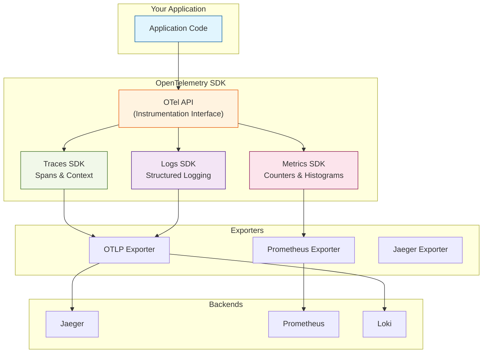
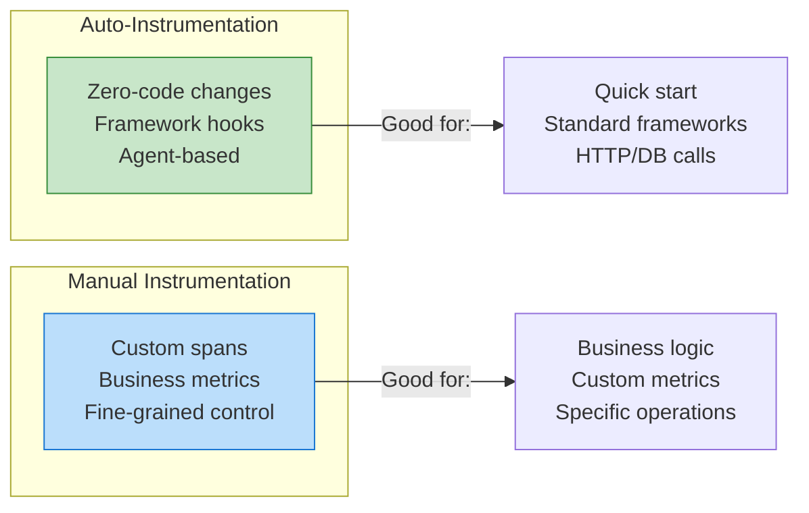

# Day 4: OpenTelemetry & Application Instrumentation

> **Duration:** 8 hours | **Difficulty:** Intermediate-Advanced

---

## 🎯 Learning Objectives

By the end of this session, you will:
1. Master OpenTelemetry architecture and core concepts
2. Instrument applications using auto and manual instrumentation
3. Understand context propagation across services
4. Export telemetry to multiple backends (Jaeger, Prometheus)
5. Create custom metrics, spans, and events
6. Implement distributed tracing best practices

---

## 📑 Preparation & Resources

> [!TIP]
> **Prerequisites:** Complete Day 3 stack deployment. Review [W3C Trace Context](https://www.w3.org/TR/trace-context/) specification basics.

**Quick Links:**
*   📂 [Resources & Best Practices](resources/RESOURCES.md)
*   💻 [Exercise 1: Auto-Instrumentation](exercises/exercise-01-auto.md)
*   📊 [Context Propagation Cheat Sheet](cheatsheet.md)

---

## 📖 Lecture Content

### 1. What is OpenTelemetry?

OpenTelemetry (OTel) is a **vendor-neutral observability framework** that provides a single set of APIs, SDKs, and tools to collect telemetry data.



### Key Concepts

| Concept | Description | Why Important for AIOps |
|---------|-------------|------------------------|
| **Trace** | End-to-end request journey | Shows full causality chain for ML models |
| **Span** | Single operation within a trace | Granular timing for bottleneck detection |
| **Context** | Propagation of trace information | Correlates signals across services |
| **Attributes** | Key-value metadata on spans | Feature engineering for anomaly detection |
| **OTLP** | OpenTelemetry Protocol | Standard wire format for telemetry |

### Auto vs Manual Instrumentation



---

### 2. OpenTelemetry Python Setup

#### Installation

```bash
pip install opentelemetry-api \
            opentelemetry-sdk \
            opentelemetry-instrumentation \
            opentelemetry-instrumentation-requests \
            opentelemetry-instrumentation-flask \
            opentelemetry-exporter-otlp \
            opentelemetry-exporter-prometheus
```

---

## 🔬 Hands-On Lab

### Create Instrumented Application

Create `demo-app/app.py`:

```python
#!/usr/bin/env python3
"""Demo application with OpenTelemetry instrumentation."""

import time
import random
import logging
from flask import Flask, jsonify, request

# OpenTelemetry imports
from opentelemetry import trace, metrics
from opentelemetry.sdk.trace import TracerProvider
from opentelemetry.sdk.trace.export import BatchSpanProcessor
from opentelemetry.sdk.metrics import MeterProvider
from opentelemetry.sdk.metrics.export import PeriodicExportingMetricReader
from opentelemetry.exporter.otlp.proto.grpc.trace_exporter import OTLPSpanExporter
from opentelemetry.exporter.prometheus import PrometheusMetricReader
from opentelemetry.instrumentation.flask import FlaskInstrumentor
from opentelemetry.instrumentation.requests import RequestsInstrumentor
from prometheus_client import start_http_server, REGISTRY

# Configure logging
logging.basicConfig(level=logging.INFO)
logger = logging.getLogger(__name__)

# Initialize Flask
app = Flask(__name__)

# Configure Tracing
trace_provider = TracerProvider()
otlp_exporter = OTLPSpanExporter(
    endpoint="http://jaeger:4317",
    insecure=True
)
trace_provider.add_span_processor(BatchSpanProcessor(otlp_exporter))
trace.set_tracer_provider(trace_provider)
tracer = trace.get_tracer(__name__)

# Configure Metrics
prometheus_reader = PrometheusMetricReader()
metrics_provider = MeterProvider(metric_readers=[prometheus_reader])
metrics.set_meter_provider(metrics_provider)
meter = metrics.get_meter(__name__)

# Create custom metrics
request_counter = meter.create_counter(
    name="app_requests_total",
    description="Total number of requests",
    unit="1"
)

request_duration = meter.create_histogram(
    name="app_request_duration_seconds",
    description="Request duration in seconds",
    unit="s"
)

active_requests = meter.create_up_down_counter(
    name="app_active_requests",
    description="Number of active requests",
    unit="1"
)

# Auto-instrument Flask and requests
FlaskInstrumentor().instrument_app(app)
RequestsInstrumentor().instrument()


@app.route('/health')
def health():
    """Health check endpoint."""
    return jsonify({"status": "healthy"})


@app.route('/api/orders', methods=['POST'])
def create_order():
    """Create a new order with traced operations."""
    active_requests.add(1, {"endpoint": "/api/orders"})
    start_time = time.time()
    
    try:
        with tracer.start_as_current_span("process_order") as span:
            order_id = f"order-{random.randint(10000, 99999)}"
            span.set_attribute("order.id", order_id)
            
            # Simulate validation
            with tracer.start_as_current_span("validate_order"):
                time.sleep(random.uniform(0.01, 0.05))
                
            # Simulate payment processing
            with tracer.start_as_current_span("process_payment") as payment_span:
                duration = random.uniform(0.05, 0.2)
                time.sleep(duration)
                payment_span.set_attribute("payment.duration_ms", duration * 1000)
                
                # Simulate occasional slow payment
                if random.random() < 0.1:
                    time.sleep(0.5)
                    payment_span.set_attribute("payment.slow", True)
            
            # Simulate inventory update
            with tracer.start_as_current_span("update_inventory"):
                time.sleep(random.uniform(0.02, 0.08))
            
            request_counter.add(1, {"endpoint": "/api/orders", "status": "success"})
            
            return jsonify({
                "order_id": order_id,
                "status": "created"
            })
            
    except Exception as e:
        request_counter.add(1, {"endpoint": "/api/orders", "status": "error"})
        logger.error(f"Order creation failed: {e}")
        return jsonify({"error": str(e)}), 500
        
    finally:
        duration = time.time() - start_time
        request_duration.record(duration, {"endpoint": "/api/orders"})
        active_requests.add(-1, {"endpoint": "/api/orders"})


@app.route('/api/products')
def list_products():
    """List products with simulated database query."""
    with tracer.start_as_current_span("list_products") as span:
        # Simulate DB query
        with tracer.start_as_current_span("db_query") as db_span:
            db_span.set_attribute("db.system", "postgresql")
            db_span.set_attribute("db.operation", "SELECT")
            time.sleep(random.uniform(0.01, 0.03))
        
        products = [
            {"id": 1, "name": "Widget A", "price": 29.99},
            {"id": 2, "name": "Widget B", "price": 39.99},
            {"id": 3, "name": "Widget C", "price": 49.99},
        ]
        
        span.set_attribute("products.count", len(products))
        request_counter.add(1, {"endpoint": "/api/products", "status": "success"})
        
        return jsonify(products)


@app.route('/metrics')
def metrics_endpoint():
    """Prometheus metrics endpoint."""
    from prometheus_client import generate_latest
    return generate_latest(REGISTRY), 200, {'Content-Type': 'text/plain'}


if __name__ == '__main__':
    # Start Prometheus metrics server on port 8081
    logger.info("Starting application on port 8080")
    app.run(host='0.0.0.0', port=8080, debug=False)
```

### Dockerfile

Create `demo-app/Dockerfile`:

```dockerfile
FROM python:3.11-slim

WORKDIR /app

COPY requirements.txt .
RUN pip install --no-cache-dir -r requirements.txt

COPY app.py .

EXPOSE 8080

CMD ["python", "app.py"]
```

### Requirements

Create `demo-app/requirements.txt`:

```txt
flask==3.0.0
opentelemetry-api==1.22.0
opentelemetry-sdk==1.22.0
opentelemetry-instrumentation==0.43b0
opentelemetry-instrumentation-flask==0.43b0
opentelemetry-instrumentation-requests==0.43b0
opentelemetry-exporter-otlp==1.22.0
opentelemetry-exporter-prometheus==0.43b0
prometheus-client==0.19.0
requests==2.31.0
```

---

## 📝 Exercises

### Exercise 1: Deploy and Generate Traffic

```bash
# Build and start
cd infrastructure/docker-compose
docker-compose -f observability-stack.yml up -d --build

# Generate traffic
for i in {1..50}; do
  curl -X POST http://localhost:8080/api/orders
  curl http://localhost:8080/api/products
  sleep 0.5
done
```

### Exercise 2: Explore Traces in Jaeger

1. Open http://localhost:16686
2. Select service: `demo-app`
3. Find a trace and examine spans
4. Identify the slowest operation

### Exercise 3: View Metrics in Prometheus

1. Open http://localhost:9090
2. Query: `app_requests_total`
3. Query: `app_request_duration_seconds_bucket`
4. Try: `histogram_quantile(0.95, rate(app_request_duration_seconds_bucket[5m]))`

### Exercise 4: Create Grafana Dashboard

1. Add panel: Request rate
2. Add panel: P95 latency
3. Add panel: Error rate
4. Add panel: Trace link (explore → Jaeger)

---

## ✅ Deliverables

- [ ] Instrumented app running and exporting telemetry
- [ ] Traces visible in Jaeger with multiple spans
- [ ] Custom metrics visible in Prometheus
- [ ] Grafana dashboard with 4+ panels

---

<p align="center">
  <a href="../day-02-observability/">← Day 3-4</a> | <a href="../day-04-tools/">Day 7: Tools Landscape →</a>
</p>
