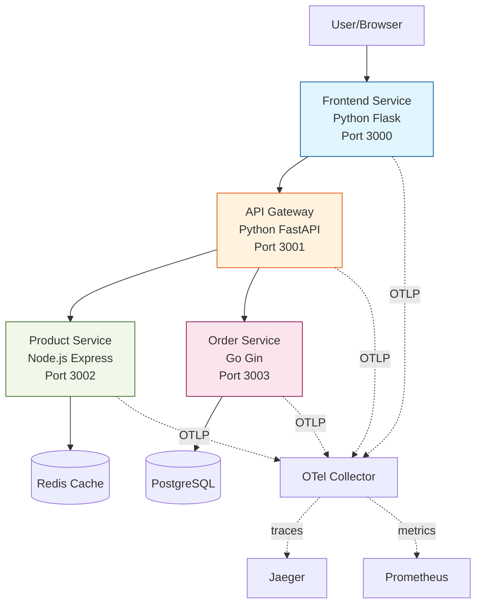

# Real-World Project: Distributed E-Commerce Platform with Full OTel Instrumentation

> **Build a microservices application with production-grade observability.**

---

## 🎯 Project Overview

Implement a complete e-commerce platform with 4 microservices, each fully instrumented with OpenTelemetry for metrics, traces, and logs.

### Architecture



---

## 📋 Requirements

### Phase 1: Core Services (Required)
- [ ] Frontend Service (Python/Flask) with user interface
- [ ] API Gateway (Python/FastAPI) for routing
- [ ] Product Service (Node.js) with Redis caching
- [ ] Order Service (Go) with PostgreSQL persistence

### Phase 2: Instrumentation (Required)
- [ ] All services export traces to Jaeger viahttps OTel Collector
- [ ] All services expose Prometheus metrics
- [ ] Context propagation works across all services
- [ ] Custom business metrics implemented

### Phase 3: Observability Features (Required)
- [ ] Grafana dashboard showing:
  - Service topology/dependency graph
  - Request rate per service
  - Error rate per service  
  - P95/P99 latency per service
  - Business metrics (orders/min, revenue)
- [ ] Alert rules for:
  - Service down
  - High error rate (>5%)
  - Slow requests (P95 > 500ms)

### Phase 4: Advanced Features (Stretch Goals)
- [ ] Distributed tracing showing database queries
- [ ] Cache hit/miss instrumentation
- [ ] Custom span events for business milestones
- [ ] Baggage propagation for A/B testing

---

## 🛠️ Implementation Guide

### Service 1: Frontend (Python/Flask)

**File: `frontend/app.py`**
```python
from flask import Flask, render_template_string, jsonify
from opentelemetry import trace
from opentelemetry.instrumentation.flask import FlaskInstrumentor
from opentelemetry.instrumentation.requests import RequestsInstrumentor
import requests

app = Flask(__name__)

# Auto-instrument
FlaskInstrumentor().instrument_app(app)
RequestsInstrumentor().instrument()

tracer = trace.get_tracer(__name__)

@app.route('/')
def index():
    with tracer.start_as_current_span("render_homepage"):
        # Call API gateway to get products
        products = requests.get("http://api-gateway:3001/products").json()
        
        html = """
        <h1>E-Commerce Store</h1>
        <ul>
        
            <li>{{ product.name }} - ${{ product.price }}</li>
        
        </ul>
        """
        return render_template_string(html, products=products)

@app.route('/checkout', methods=['POST'])
def checkout():
    with tracer.start_as_current_span("checkout_flow") as span:
        span.set_attribute("checkout.source", "web")
        
        # Call order service via API gateway
        order = requests.post("http://api-gateway:3001/orders", json={
            "items": ["product-1", "product-2"]
        }).json()
        
        return jsonify(order)

if __name__ == '__main__':
    app.run(host='0.0.0.0', port=3000)
```

### Service 2: API Gateway (Python/FastAPI)

**File: `api-gateway/app.py`**
```python
from fastapi import FastAPI, HTTPException
from opentelemetry import trace
from opentelemetry.instrumentation.fastapi import FastAPIInstrumentor
import httpx

app = FastAPI()
FastAPIInstrumentor.instrument_app(app)

tracer = trace.get_tracer(__name__)

@app.get("/products")
async def get_products():
    with tracer.start_as_current_span("proxy_to_product_service") as span:
        async with httpx.AsyncClient() as client:
            response = await client.get("http://product-service:3002/api/products")
            span.set_attribute("upstream.status", response.status_code)
            return response.json()

@app.post("/orders")
async def create_order(items: list):
    with tracer.start_as_current_span("proxy_to_order_service") as span:
        span.set_attribute("order.item_count", len(items))
        
        async with httpx.AsyncClient() as client:
            response = await client.post(
                "http://order-service:3003/api/orders",
                json={"items": items}
            )
            return response.json()
```

### Service 3: Product Service (Node.js)

**File: `product-service/app.js`**
```javascript
const express = require('express');
const redis = require('redis');
const { trace } = require('@opentelemetry/api');
const app = express();

const tracer = trace.getTracer('product-service');
const redisClient = redis.createClient({ host: 'redis' });

app.get('/api/products', async (req, res) => {
    const span = tracer.startSpan('get_products');
    
    try {
        // Try cache first
        const cached = await redisClient.get('products');
        
        if (cached) {
            span.setAttribute('cache.hit', true);
            span.end();
            return res.json(JSON.parse(cached));
        }
        
        // Cache miss - fetch from "database"
        span.setAttribute('cache.hit', false);
        const products = [
            { id: 1, name: 'Laptop', price: 999.99 },
            { id: 2, name: 'Mouse', price: 29.99 }
        ];
        
        await redisClient.setEx('products', 60, JSON.stringify(products));
        span.end();
        res.json(products);
        
    } catch (error) {
        span.recordException(error);
        span.end();
        res.status(500).json({ error: error.message });
    }
});

app.listen(3002, () => console.log('Product service on 3002'));
```

### Service 4: Order Service (Go)

**File: `order-service/main.go`**
```go
package main

import (
    "context"
    "encoding/json"
    "github.com/gin-gonic/gin"
    "go.opentelemetry.io/otel"
    "go.opentelemetry.io/otel/attribute"
    "database/sql"
    _ "github.com/lib/pq"
)

var tracer = otel.Tracer("order-service")

type Order struct {
    ID    int      `json:"id"`
    Items []string `json:"items"`
}

func createOrder(c *gin.Context) {
    ctx, span := tracer.Start(c.Request.Context(), "create_order")
    defer span.End()
    
    var order Order
    c.BindJSON(&order)
    
    span.SetAttributes(
        attribute.Int("order.item_count", len(order.Items)),
    )
    
    // Save to database
    _, dbSpan := tracer.Start(ctx, "db_insert_order")
    // ... database logic ...
    dbSpan.End()
    
    c.JSON(200, order)
}

func main() {
    r := gin.Default()
    r.POST("/api/orders", createOrder)
    r.Run(":3003")
}
```

---

## 📊 Evaluation Rubric

| Criteria | Points | Description |
|----------|--------|-------------|
| **Service Implementation** | 25 | All 4 services running and functional |
| **Trace Instrumentation** | 25 | Complete traces across all services |
| **Context Propagation** | 15 | Trace IDs propagate correctly |
| **Custom Metrics** | 15 | Business metrics implemented |
| **Dashboards** | 10 | Comprehensive Grafana dashboards |
| **Alerts** | 5 | Alert rules configured |
| **Documentation** | 5 | Clear README with architecture |
| **Total** | **100** | |

---

## 🚀 Getting Started

### Docker Compose Setup

**File: `docker-compose.yml`**
```yaml
version: '3.8'

services:
  frontend:
    build: ./frontend
    ports:
      - "3000:3000"
    environment:
      - OTEL_EXPORTER_OTLP_ENDPOINT=http://otel-collector:4317

  api-gateway:
    build: ./api-gateway
    ports:
      - "3001:3001"

  product-service:
    build: ./product-service
    ports:
      - "3002:3002"
    depends_on:
      - redis

  order-service:
    build: ./order-service
    ports:
      - "3003:3003"
    depends_on:
      - postgres

  redis:
    image: redis:alpine
  
  postgres:
    image: postgres:15
    environment:
      POSTGRES_PASSWORD: password

  otel-collector:
    image: otel/opentelemetry-collector:latest
    command: ["--config=/etc/otel-collector-config.yaml"]
    volumes:
      - ./otel-collector-config.yaml:/etc/otel-collector-config.yaml
    ports:
      - "4317:4317"  # OTLP gRPC
      - "4318:4318"  # OTLP HTTP

  prometheus:
    image: prom/prometheus
    ports:
      - "9090:9090"

  jaeger:
    image: jaegertracing/all-in-one
    ports:
      - "16686:16686"

  grafana:
    image: grafana/grafana
    ports:
      - "3004:3000"
```

---

## 💡 Tips for Success

1. **Start with one service** - Get Python frontend working first
2. **Incremental instrumentation** - Add OTel step by step
3. **Test context propagation early** - Verify trace IDs match
4. **Use OTel Collector** - Centralize export configuration
5. **Semantic conventions** - Follow OTel standards for attributes

---

## 📤 Submission

Submit a PR with:
- [ ] All service code
- [ ] Docker Compose setup
- [√] README with:
  - Architecture diagram
  - Setup instructions
  - Example trace screenshots
  - Dashboard screenshots
- [ ] `LEARNINGS.md` documenting challenges and solutions
