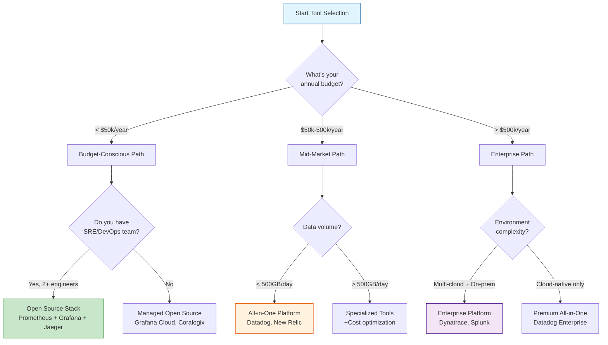

# AIOps Tool Selection Framework & Cheat Sheet

> **Make data-driven decisions about observability tooling.**

---

## 🎯 Decision Tree



---

## 📊 Comprehensive Tool Comparison

### All-in-One APM Platforms

| Feature | Datadog | New Relic | Dynatrace | Honeycomb | Elastic APM |
|---------|---------|-----------|-----------|-----------|-------------|
| **Metrics** | ⭐⭐⭐⭐⭐ | ⭐⭐⭐⭐ | ⭐⭐⭐⭐⭐ | ⭐⭐⭐ | ⭐⭐⭐⭐ |
| **Logs** | ⭐⭐⭐⭐⭐ | ⭐⭐⭐⭐ | ⭐⭐⭐ | ⭐⭐⭐ | ⭐⭐⭐⭐⭐ |
| **Traces** | ⭐⭐⭐⭐⭐ | ⭐⭐⭐⭐⭐ | ⭐⭐⭐⭐ | ⭐⭐⭐⭐⭐ | ⭐⭐⭐⭐ |
| **AI/ML** | ⭐⭐⭐⭐ (Watchdog) | ⭐⭐⭐⭐ (Applied Intelligence) | ⭐⭐⭐⭐⭐ (Davis AI) | ⭐⭐⭐ (BubbleUp) | ⭐⭐⭐ |
| **UX/Ease of Use** | ⭐⭐⭐⭐⭐ | ⭐⭐⭐⭐ | ⭐⭐⭐ | ⭐⭐⭐⭐ | ⭐⭐⭐ |
| **Integrations** | 500+ | 400+ | 300+ | 100+ | 300+ |
| **OTel Support** | ✅ Native | ✅ Native | ✅ Native | ✅ Native | ✅ Native |
| **Cost** | $$$$ | $$$$ | $$$$$ | $$$ | $$ |
| **Best For** | Startups & Scale-ups | App-centric teams | Large enterprises | High-cardinality data | Log-heavy workloads |

---

## 💰 Total Cost of Ownership (TCO) Calculator

### Commercial Platform Pricing Models

**Datadog:**
```
Base Cost = ($15/host/month × hosts) + 
            ($31/APM host/month × APM hosts) +
            ($0.10/GB × log ingestion) +
            ($5M spans/month included, then $1.27/1M)

Example (100 hosts, 20 APM, 100GB logs/day):
= ($15 × 100) + ($31 × 20) + ($0.10 × 3000GB) + spans
= $1,500 + $620 + $300 + ~$200
= $2,620/month = $31,440/year
```

**New Relic (Commitment-based):**
```
$0.25/GB ingested + $0.30/CCU/month
(100GB/day = 3000GB/month = $750 + compute units)

Typical: $1,500 - $3,000/month for mid-size app
```

**Dynatrace:**
```
$0.08/hour per "full-stack monitoring unit"
Typical enterprise: $50,000 - $200,000/year
```

### Open Source TCO

```
Infrastructure Costs:
- Prometheus: $500-2000/month (storage, compute)
- Grafana: $0 (self-hosted) or $49-299/user/month (Cloud)
- Jaeger: $300-1000/month (storage)
- Loki: $400-1500/month (storage)

Engineering Costs:
- Setup: 2-4 weeks (1-2 engineers) = $20-40k one-time
- Maintenance: 0.5-1 FTE = $50-100k/year

Total Year 1: $90-170k
Total Year 2+: $65-135k/year
```

---

## 🎯 Selection Criteria Matrix

### Functional Requirements

| Requirement | Weight | Datadog | New Relic | Dynatrace | Open Source |
|-------------|--------|---------|-----------|-----------|-------------|
| **Metrics Collection** | HIGH | 5/5 | 5/5 | 5/5 | 5/5 |
| **Distributed Tracing** | HIGH | 5/5 | 5/5 | 4/5 | 4/5 |
| **Log Aggregation** | MEDIUM | 5/5 | 4/5 | 3/5 | 5/5 |
| **Anomaly Detection** | HIGH | 4/5 | 4/5 | 5/5 | 2/5 |
| **RCA Automation** | HIGH | 3/5 | 4/5 | 5/5 | 1/5 |
| **Custom Dashboards** | MEDIUM | 5/5 | 4/5 | 4/5 | 5/5 |
| **Alert Management** | HIGH | 4/5 | 4/5 | 5/5 | 4/5 |
| **Multi-cloud Support** | MEDIUM | 5/5 | 5/5 | 5/5 | 5/5 |

**Weighted Score Calculation:**
```
Score = Σ(Feature_Score × Weight)
```

### Non-Functional Requirements

| Criterion | Datadog | New Relic | Dynatrace | Open Source |
|-----------|---------|-----------|-----------|-------------|
| **Setup Time** | 1 day | 1-2 days | 1 week | 2-4 weeks |
| **Learning Curve** | Low | Low | Medium | High |
| **Vendor Lock-in Risk** | High | High | High | Low |
| **Data Retention** | 15 months | 3+ months | 35 days default | Unlimited* |
| **SLA** | 99.9% | 99.9% | 99.5% | Self-managed |
| **Support Response** | < 1 hour (Enterprise) | < 4 hours | < 30 min (Dynatrace Managed) | Community |

*Limited by storage capacity

---

## 🚀 Migration Strategy

### From Open Source → Commercial

**When to Consider:**
- Engineering team too small to maintain stack
- Need advanced AI/ML features
- Compliance requires vendor SLA

**Migration Path:**
```
1. Parallel Run (1-2 weeks)
   - Keep existing stack running
   - Deploy commercial agent alongside
   - Compare data quality

2. Gradual Cutover (2-4 weeks)
   - Migrate dashboards
   - Update alert rules
   - Train team on new platform

3. Decommission (1 week)
   - Archive historical data
   - Sunset old infrastructure
```

### From Commercial → Commercial

**Common Scenarios:**
- Cost optimization (Datadog → Grafana Cloud)
- Feature requirements (APM → Full platform)
- M&A consolidation

**Key Risks:**
- Historical data loss
- Dashboard recreation effort
- Team retraining

---

## 📈 Emerging Trends (2026)

### 1. eBPF-Based Observability
**Tools:** Pixie, Cilium, Parca
**Impact:** Zero-code instrumentation, kernel-level visibility
**Adoption:** Early majority (20-30% of companies)

### 2. LLM-Powered RCA
**Tools:** GitHub Copilot for Ops, Dynatrace Davis AI, Datadog Bits AI
**Impact:** Natural language queries, automated runbook generation
**Adoption:** Emerging (5-10%)

### 3. OpenTelemetry Native Backends
**Tools:** Grafana Tempo, Jaeger, SigNoz
**Impact:** Vendor-neutral instrumentation, easier migration
**Adoption:** Mainstream (60%+ new deployments)

### 4. Observability Pipelines
**Tools:** Vector, Fluent Bit, Cribl
**Impact:** Cost optimization through intelligent routing
**Adoption:** Growth phase (15-25%)

---

## 🎁 Free Tiers & Trials

| Platform | Free Tier | Trial | Limitations |
|----------|-----------|-------|-------------|
| **Datadog** | ❌ None | 14 days | Full features |
| **New Relic** | ✅ Yes | Forever | 100GB/month, 1 user |
| **Dynatrace** | ✅ Yes (SaaS) | 15 days | Full features |
| **Grafana Cloud** | ✅ Yes | Forever | 10k series, 50GB logs |
| **Elastic Cloud** | ✅ Yes | 14 days | 1GB RAM |
| **Honeycomb** | ✅ Yes | Forever | 20M events/month |

---

## 💡 Pro Tips

1. **Start with OTel:** Use OpenTelemetry from day 1 to avoid vendor lock-in
2. **Negotiate:** Most vendors offer 20-40% discounts for annual commitments
3. **Benchmark:** Spin up free tiers of 2-3 tools and compare
4. **TCO Over Features:** A "worse" tool that's 50% cheaper might be the right choice
5. **Avoid Sprawl:** Resist the urge to use "best of breed" for everything—integration complexity kills

---

## 📝 RFP Template

When evaluating vendors, request:

- [ ] Proof of Concept (POC) on your actual infrastructure
- [ ] Detailed pricing calculator with your estimated scale
- [ ] References from similar-sized companies
- [ ] Data export capabilities (avoid lock-in)
- [ ] Professional services cost estimates
- [ ] SLA commitments in writing
- [ ] Compliance certifications (SOC 2, HIPAA, etc.)
