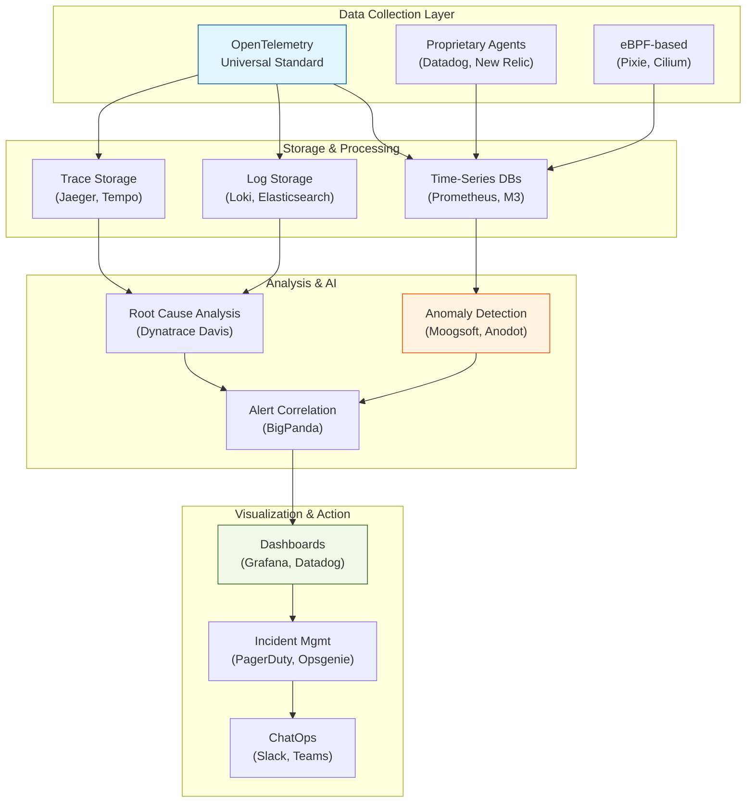

# Day 5: Industry AIOps Tools & Selection Framework

> **Duration:** 6 hours | **Difficulty:** Intermediate

---

## 🎯 Learning Objectives

By the end of this session, you will:
1. Compare major observability and AIOps platforms (commercial vs open-source)
2. Understand TCO (Total Cost of Ownership) trade-offs
3. Create a data-driven tool selection framework
4. Evaluate vendor lock-in risks and mitigation strategies
5. Navigate the procurement and evaluation process
6. Identify emerging trends in the AIOps landscape

---

## 📑 Preparation & Resources

> [!TIP]
> **Prerequisites:** Complete Days 1-4 to understand what features to evaluate. Review your organization's budget and scale requirements.

**Quick Links:**
*   📂 [Resources & Vendor Guides](resources/RESOURCES.md)
*   💻 [Exercise 1: Tool Evaluation](exercises/exercise-01-evaluation.md)
*   📊 [Tool Selection Decision Tree](cheatsheet.md)

---

## 📖 Lecture Content

### 1. The AIOps Tool Landscape

The observability and AIOps market is complex and evolving rapidly. Here's how the ecosystem is structured:



### Tool Categories

| Category | Purpose | Examples |
|----------|---------|----------|
| **All-in-One APM** | Metrics, logs, traces, APM in one platform | Datadog, New Relic, Dynatrace |
| **Log Analytics** | Specialized log search and analysis | Splunk, Elastic, Loki |
| **AIOps Platforms** | AI-driven event correlation and RCA | Moogsoft, BigPanda, ServiceNow |
| **Incident Management** | On-call, escalation, postmortems | PagerDuty, Opsgenie, Incident.io |
| **Open Source** | Self-hosted, customizable stack | Prometheus, Grafana, Jaeger, OpenTelemetry |

---

### 2. Tool Comparison Matrix

#### Observability Platforms

| Feature | Datadog | New Relic | Splunk | Elastic | Open Source |
|---------|---------|-----------|--------|---------|-------------|
| **Metrics** | ✅ Excellent | ✅ Good | ✅ Good | ✅ Good | ✅ Prometheus |
| **Logs** | ✅ Excellent | ✅ Good | ✅ Excellent | ✅ Excellent | ✅ Loki/ELK |
| **Traces** | ✅ Excellent | ✅ Excellent | ✅ Good | ✅ Good | ✅ Jaeger |
| **APM** | ✅ Excellent | ✅ Excellent | ✅ Good | ⚠️ Limited | ⚠️ Limited |
| **ML/AI** | ✅ Built-in | ✅ Built-in | ✅ Enterprise | ⚠️ Basic | ❌ DIY |
| **Pricing** | $$$ | $$$ | $$$$ | $$ | Free* |
| **Setup** | Easy | Easy | Medium | Medium | Complex |

*Infrastructure costs apply

---

### 3. Deep Dive: Top Platforms

#### Datadog
**Best for:** Cloud-native companies wanting all-in-one solution

**Pros:**
- Excellent UX and integrations
- Strong APM and RUM
- Good AI features (Watchdog)

**Cons:**
- Expensive at scale
- Vendor lock-in

#### Dynatrace
**Best for:** Enterprise with complex hybrid environments

**Pros:**
- Automatic discovery
- Strong AI (Davis)
- Deep infrastructure visibility

**Cons:**
- Complex pricing
- Steep learning curve

#### Splunk
**Best for:** Organizations with heavy log analytics needs

**Pros:**
- Most powerful log querying
- Strong security features (SIEM)
- Extensive ecosystem

**Cons:**
- Very expensive
- Resource intensive

#### Open Source Stack (Prometheus + Grafana + Loki + Jaeger)
**Best for:** Teams with engineering expertise and cost sensitivity

**Pros:**
- No license costs
- Full control
- Community support

**Cons:**
- Requires expertise
- No AI out of box
- Operational overhead

---

### 4. Decision Framework

```
                    ┌─────────────────────┐
                    │ Budget Constraints? │
                    └─────────┬───────────┘
                              │
              ┌───────────────┼───────────────┐
              │ Yes                           │ No
              ▼                               ▼
    ┌─────────────────┐             ┌─────────────────┐
    │ Engineering     │             │ Team Size?      │
    │ Capacity?       │             └────────┬────────┘
    └────────┬────────┘                      │
             │                    ┌──────────┼──────────┐
    ┌────────┼────────┐          │ Small              │ Large
    │ Yes            │ No        ▼                    ▼
    ▼                ▼    ┌──────────────┐   ┌──────────────┐
┌────────────┐  ┌────────────┐   │ Datadog    │   │ Dynatrace   │
│ Open Source│  │ Elastic    │   │ New Relic  │   │ ServiceNow  │
│ Stack      │  │ Cloud      │   └──────────────┘   └──────────────┘
└────────────┘  └────────────┘
```

#### Key Questions to Ask

1. **What's your monthly observability budget?**
2. **How much engineering time can you dedicate?**
3. **What's your scale (data volume, services)?**
4. **On-prem, cloud, or hybrid?**
5. **What compliance requirements exist?**

---

### 5. Emerging Trends

| Trend | Description | Examples |
|-------|-------------|----------|
| **OpenTelemetry** | Vendor-neutral instrumentation | Universal adoption |
| **eBPF** | Kernel-level observability | Cilium, Pixie |
| **LLM Integration** | AI-powered troubleshooting | GitHub Copilot for Ops |
| **Shift-Left** | Dev-time observability | Tilt, Telepresence |
| **Cost Management** | Optimizing observability spend | Edge aggregation |

---

## 📝 Exercises

### Exercise 1: Tool Evaluation

For a hypothetical startup with:
- 50 microservices
- $10k/month budget
- 3 SREs
- AWS-only infrastructure

Recommend a stack and justify your choice.

### Exercise 2: Feature Mapping

Map these requirements to tool features:
1. "We need to find the root cause of latency spikes"
2. "Security team needs 90-day log retention"
3. "We want predictive alerting"
4. "Developers need to trace requests locally"

### Exercise 3: Cost Calculation

Estimate monthly costs for:
- Datadog: 100 hosts, 10 APM hosts, 50GB logs/day
- Open Source: Same scale on AWS

---

## ✅ Deliverables

- [ ] Completed tool comparison for your scenario
- [ ] Feature mapping exercise
- [ ] Cost estimation worksheet

---

## 📚 Further Reading

- [CNCF Landscape](https://landscape.cncf.io/card-mode?category=observability-and-analysis)
- [Thoughtworks Tech Radar](https://www.thoughtworks.com/radar)
- [DevOps Enterprise Summit talks](https://videos.itrevolution.com/)

---

<p align="center">
  <a href="../day-04-instrumentation/lecture-notes.md">⬅️ Back: Day 4</a> | <strong>Day 5: Tools Landscape</strong> | <a href="../../week-02-data-engineering/README.md">Begin Week 2 ➡️</a>
</p>
