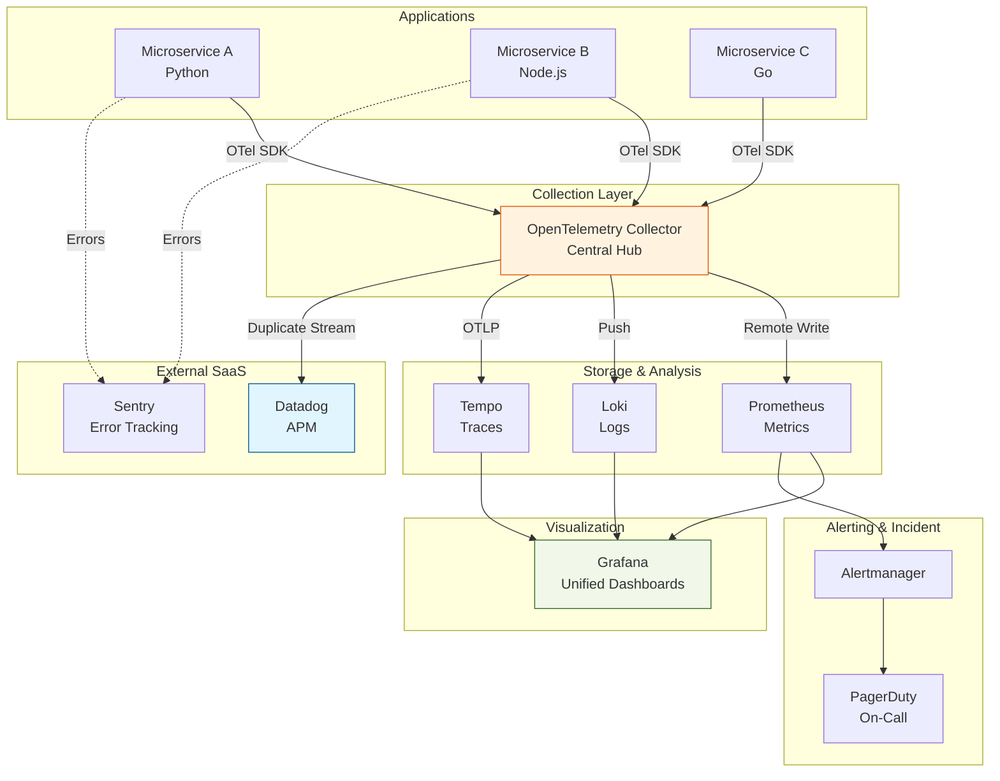

# Real-World Project: Multi-Tool Integration Platform

> **Build a unified observability platform leveraging best-of-breed tools.**

---

## 🎯 Project Overview

Many organizations use multiple observability tools rather than a single vendor. Your task is to integrate 3-4 different tools into a cohesive observability platform.

### Architecture



---

## 📋 Requirements

### Phase 1: Core Integration (Required)
- [ ] Deploy OTel Collector as central aggregation point
- [ ] Configure Prometheus remote write from OTel
- [ ] Set up Loki for log aggregation
- [ ] Deploy Grafana Tempo for traces
- [ ] Create unified Grafana dashboards

### Phase 2: External Tool Integration (Required)
- [ ] Integrate with Datadog (trial account)
- [ ] Set up Sentry for error tracking
- [ ] Configure PagerDuty for alerting
- [ ] Implement correlation between tools

### Phase 3: Advanced Features (Stretch Goals)
- [ ] Cost optimization via sampling in OTel Collector
- [ ] Tail-based sampling for interesting traces
- [ ] Cross-tool correlation (trace ID → Sentry → PagerDuty)
- [ ] Dashboard templates for each tool combination

---

## 🛠️ Implementation Guide

### Step 1: OTel Collector Configuration

**File: `otel-collector-config.yaml`**
```yaml
receivers:
  otlp:
    protocols:
      grpc:
        endpoint: 0.0.0.0:4317
      http:
        endpoint: 0.0.0.0:4318

processors:
  batch:
    timeout: 10s
    send_batch_size: 1024
  
  # Cost optimization: sample traces
  probabilistic_sampler:
    sampling_percentage: 10  # Keep 10% of traces
  
  # Enrich with metadata
  resource:
    attributes:
      - key: deployment.environment
        value: production
        action: upsert
  
  # Drop noisy metrics
  filter:
    metrics:
      exclude:
        match_type: regexp
        metric_names:
          - '.*test.*'
          - '.*debug.*'

exporters:
  # Send metrics to Prometheus
  prometheusremotewrite:
    endpoint: "http://prometheus:9090/api/v1/write"
    resource_to_telemetry_conversion:
      enabled: true
  
  # Send logs to Loki
  loki:
    endpoint: "http://loki:3100/loki/api/v1/push"
  
  # Send traces to Tempo
  otlp/tempo:
    endpoint: "tempo:4317"
    tls:
      insecure: true
  
  # Duplicate stream to Datadog
  datadog:
    api:
      key: "${DATADOG_API_KEY}"
      site: "datadoghq.com"
  
  # Logging for debugging
  logging:
    loglevel: debug

service:
  pipelines:
    metrics:
      receivers: [otlp]
      processors: [batch, resource, filter]
      exporters: [prometheusremotewrite, datadog]
    
    logs:
      receivers: [otlp]
      processors: [batch, resource]
      exporters: [loki, datadog]
    
    traces:
      receivers: [otlp]
      processors: [batch, probabilistic_sampler, resource]
      exporters: [otlp/tempo, datadog]
```

### Step 2: Docker Compose Setup

**File: `docker-compose.yml`**
```yaml
version: '3.8'

services:
  otel-collector:
    image: otel/opentelemetry-collector-contrib:latest
    command: ["--config=/etc/otel-collector-config.yaml"]
    volumes:
      - ./otel-collector-config.yaml:/etc/otel-collector-config.yaml
    ports:
      - "4317:4317"   # OTLP gRPC
      - "4318:4318"   # OTLP HTTP
      - "8888:8888"   # Prometheus metrics (collector itself)
    environment:
      - DATADOG_API_KEY=${DATADOG_API_KEY}

  prometheus:
    image: prom/prometheus:latest
    ports:
      - "9090:9090"
    volumes:
      - ./prometheus.yml:/etc/prometheus/prometheus.yml
      - prometheus_data:/prometheus
    command:
      -'--config.file=/etc/prometheus/prometheus.yml'
      - '--enable-feature=remote-write-receiver'

  loki:
    image: grafana/loki:latest
    ports:
      - "3100:3100"
    volumes:
      - ./loki-config.yaml:/etc/loki/local-config.yaml
      - loki_data:/loki

  tempo:
    image: grafana/tempo:latest
    command: ["-config.file=/etc/tempo.yaml"]
    volumes:
      - ./tempo-config.yaml:/etc/tempo.yaml
      - tempo_data:/var/tempo
    ports:
      - "3200:3200"   # tempo
      - "4317"        # otlp grpc

  grafana:
    image: grafana/grafana:latest
    ports:
      - "3000:3000"
    environment:
      - GF_AUTH_ANONYMOUS_ENABLED=true
      - GF_AUTH_ANONYMOUS_ORG_ROLE=Admin
    volumes:
      - ./grafana/provisioning:/etc/grafana/provisioning
      - grafana_data:/var/lib/grafana

volumes:
  prometheus_data:
  loki_data:
  tempo_data:
  grafana_data:
```

### Step 3: Application Instrumentation

**Python Service Example:**
```python
from opentelemetry import trace
from opentelemetry.sdk.trace import TracerProvider
from opentelemetry.sdk.trace.export import BatchSpanProcessor
from opentelemetry.exporter.otlp.proto.grpc.trace_exporter import OTLPSpanExporter
from opentelemetry.instrumentation.flask import FlaskInstrumentor
import sentry_sdk
from flask import Flask

# Sentry for error tracking
sentry_sdk.init(
    dsn="https://your-sentry-dsn@sentry.io/project-id",
    traces_sample_rate=0.1,
)

# OpenTelemetry for distributed tracing
provider = TracerProvider()
processor = BatchSpanProcessor(
    OTLPSpanExporter(endpoint="http://otel-collector:4317", insecure=True)
)
provider.add_span_processor(processor)
trace.set_tracer_provider(provider)

app = Flask(__name__)
FlaskInstrumentor().instrument_app(app)

@app.route('/api/endpoint')
def endpoint():
    tracer = trace.get_tracer(__name__)
    with tracer.start_as_current_span("business_logic"):
        # Your code
        try:
            result = process_data()
            return {"status": "success"}
        except Exception as e:
            # This will go to both OTel AND Sentry
            sentry_sdk.capture_exception(e)
            raise
```

### Step 4: Grafana Unified Dashboard

**File: `grafana/dashboards/unified-view.json`** (simplified)
```json
{
  "title": "Unified Observability View",
  "panels": [
    {
      "title": "Service Health (Prometheus)",
      "targets": [{
        "expr": "up{job=~'.*service.*'}",
        "datasource": "Prometheus"
      }]
    },
    {
      "title": "Error Logs (Loki)",
      "targets": [{
        "expr": "{job=~'.*service.*'} |= 'ERROR'",
        "datasource": "Loki"
      }]
    },
    {
      "title": "Trace Latency (Tempo)",
      "targets": [{
        "query": "{name=\"HTTP GET /api/endpoint\"}",
        "datasource": "Tempo"
      }]
    },
    {
      "title": "External Link: Datadog APM",
      "type": "text",
      "mode": "html",
      "content": "<a href='https://app.datadoghq.com/apm/traces'>View in Datadog →</a>"
    }
  ]
}
```

---

## 📊 Evaluation Rubric

| Criteria | Points | Description |
|----------|--------|-------------|
| **OTel Collector Config** | 20 | Properly configured pipelines |
| **Multi-Tool Integration** | 25 | 3+ tools successfully integrated |
| **Unified Dashboards** | 20 | Grafana shows data from all sources |
| **Cross-Tool Correlation** | 15 | Trace ID visible in Sentry/PagerDuty |
| **Cost Optimization** | 10 | Sampling/filtering implemented |
| **Documentation** | 10 | Clear setup guide and architecture |
| **Total** | **100** | |

---

## 🚀 Getting Started

1. **Sign up for trials:**
   - Datadog: 14-day free trial
   - Sentry: Free tier (5k events/month)
   - PagerDuty: 14-day trial

2. **Deploy core stack:**
   ```bash
   docker-compose up -d
   ```

3. **Verify connectivity:**
   - OTel Collector: http://localhost:8888/metrics
   - Prometheus: http://localhost:9090
   - Grafana: http://localhost:3000

4. **Instrument applications:**
   - Add OTel SDKs
   - Configure OTLP endpoint
   - Add Sentry SDK for errors

---

## 💡 Challenges

1. **Trace Correlation:** How do you find a trace in both Tempo and Datadog using the same trace ID?
2. **Cost Analysis:** Calculate savings from sampling 90% of traces vs sending all
3. **Failover:** What happens if Datadog is down? Does your system still work?
4. **Alert Routing:** Send high-priority alerts to PagerDuty, low-priority to Slack

---

## 📤 Submission

Submit:
- [ ] Complete Docker Compose setup
- [ ] OTel Collector configuration
- [ ] Application instrumentation code (Python/Node/Go)
- [ ] Grafana dashboards (exported JSON)
- [ ] Architecture diagram
- [ ] Cost analysis document
- [ ] Screenshots showing:
  - Same trace in Tempo and Datadog
  - Correlated error in Sentry
  - PagerDuty alert from Prometheus

---

## 📚 Why This Matters

In the real world, organizations rarely use a single vendor. You'll often need to:
- Integrate legacy tools with modern platforms
- Use best-of-breed tools for specific use cases
- Gradually migrate from one vendor to another
- Support multi-cloud environments with different tools

This project simulates that complexity and teaches you to be "tool-agnostic" - a critical skill for AIOps engineers.
