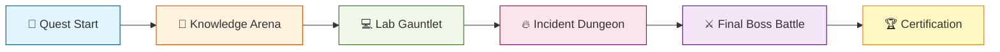

# Week 1 Final Assessment: The AIOps Quest 🎮

> **Prove your mastery through an epic gamified challenge!**

---

## 🌟 Welcome to the AIOps Quest!

Congratulations on completing Week 1! Now it's time to prove your skills through **The AIOps Quest** - a gamified assessment that tests everything you've learned across all 5 days.

### Quest Structure



### Scoring System

| Challenge Mode | Max Points | Time Limit | Difficulty |
|---------------|------------|------------|------------|
| **Knowledge Arena** | 200 | 30 min | ⭐⭐ |
| **Lab Gauntlet** | 300 | 90 min | ⭐⭐⭐ |
| **Incident Dungeon** | 300 | 60 min | ⭐⭐⭐⭐ |
| **Final Boss Battle** | 200 | 45 min | ⭐⭐⭐⭐⭐ |
| **Bonus Challenges** | 100 | - | ⭐⭐⭐⭐⭐ |
| **TOTAL** | **1100** | **3h 45m** | |

### Achievement Tiers

```
🥉 Bronze (550-699 points): Observability Apprentice
🥈 Silver (700-849 points): Monitoring Master  
🥇 Gold (850-999 points): AIOps Engineer
💎 Platinum (1000+ points): Week 1 Champion
```

---

## 🧠 Mode 1: Knowledge Arena (200 points)

Test your theoretical knowledge through progressive quiz challenges.

### Round 1: Multiple Choice Mayhem (80 points)

**Rules:**
- 40 questions, 2 points each
- 4 answer choices per question
- Wrong answer: -0.5 points (encourages thinking, not guessing)
- Time: 15 minutes

**Sample Questions:**

**Question 1 (Day 1 - AIOps Fundamentals)**
```
Which pillar of observability provides the "why" behind incidents?

A) Metrics - show aggregated numbers
B) Logs - provide event narratives  ✅
C) Traces - show request paths
D) Dashboards - visualize data

Answer: B
Explanation: Logs contain detailed event information and error messages 
that explain WHY something happened, while metrics show WHAT happened.
```

**Question 2 (Day 2 - Cardinality)**
```
Why should you NEVER use user_id as a Prometheus label?

A) It violates GDPR
B) It creates high cardinality that crashes TSDB ✅
C) It's not supported by Prometheus
D) It slows down queries slightly

Answer: B
Explanation: High cardinality (millions of unique user IDs) creates 
millions of unique time series, exhausting memory and storage.
```

**Question 3 (Day 3 - PromQL)**
```
What does rate(http_requests_total[5m]) calculate?

A) Total requests in last 5 minutes
B) Per-second average increase over 5 minutes ✅
C) Number of requests per 5-minute window
D) Percentage increase over 5 minutes

Answer: B
Explanation: rate() calculates the per-second average rate of increase 
over the specified time window.
```

---

### Round 2: True/False Speed Run (40 points)

**Rules:**
- 20 statements, 2 points each
- Must answer in under 30 seconds per question
- Bonus: +1 point for < 15 seconds
- Time: 10 minutes

**Sample Statements:**

1. **OpenTelemetry can only export to one backend at a time.**  
   ❌ FALSE - You can configure multiple exporters simultaneously

2. **Grafana can visualize data from Prometheus, Loki, and Jaeger.**  
   ✅ TRUE - Grafana supports multiple data sources

3. **High CPU usage always indicates a problem.**  
   ❌ FALSE - Could be legitimate load like batch processing

---

### Round 3: Scenario Matching (80 points)

**Rules:**
- Match 20 scenarios to correct tool/approach
- 4 points per correct match
- Time: 5 minutes

**Sample Scenarios:**

| Scenario | Best Tool/Approach |
|----------|-------------------|
| "Find which service is causing 500 errors" | Distributed Tracing (Jaeger) |
| "Alert when disk space < 10%" | Prometheus Alert Rules |
| "Search all logs for API key leak" | Log Aggregation (Loki) |
| "Calculate P95 latency" | Histogram + PromQL |
| "Track custom business metric (orders/min)" | Custom Counter Metric |

---

## 💻 Mode 2: Lab Gauntlet (300 points)

Hands-on challenges testing your practical skills.

### Challenge 1: The Broken Dashboard (60 points)

**Scenario:** You're given a Grafana dashboard with 5 broken panels. Fix them!

**Setup:**
```bash
cd week-01-fundamentals/final-assessment/lab-gauntlet
docker-compose up -d
```

**Tasks:**
1. Panel 1 shows "No Data" - Fix the Prometheus query ✅ (10 pts)
2. Panel 2 has wrong time range - Correct it ✅ (10 pts)
3. Panel 3 missing labels - Add proper label filters ✅ (15 pts)
4. Panel 4 shows incorrect units - Fix unit conversion ✅ (10 pts)
5. Panel 5 slow query (>5s) - Optimize with recording rule ✅ (15 pts)

**Deliverable:** Export fixed dashboard JSON

---

### Challenge 2: Instrument the Black Box (100 points)

**Scenario:** Legacy Python app with ZERO observability. Add it!

**Given:** `mystery_app.py` - A Flask app with no instrumentation

**Tasks:**
1. Add OpenTelemetry auto-instrumentation ✅ (20 pts)
2. Create 3 custom metrics (counter, histogram, gauge) ✅ (30 pts)
3. Add manual spans for business logic ✅ (25 pts)
4. Configure sampling (50% of traces) ✅ (15 pts)
5. Export to Jaeger AND Prometheus ✅ (10 pts)

**Verification:**
```bash
# Must see traces in Jaeger
curl http://localhost:16686/api/traces?service=mystery-app

# Must see metrics in Prometheus
curl http://localhost:9090/api/v1/query?query=mystery_app_requests_total
```

---

### Challenge 3: PromQL Puzzle Solver (70 points)

**Rules:** Write PromQL queries to solve 10 specific problems

**Sample Puzzles:**

**Puzzle 1: Critical Services (10 pts)**
```
Write a query that shows only services with error rate > 5%

Solution:
sum by (service) (rate(http_requests_total{status=~"5.."}[5m])) 
/ 
sum by (service) (rate(http_requests_total[5m])) 
> 0.05
```

**Puzzle 2: Capacity Forecast (15 pts)**
```
Predict when disk will be 95% full (assuming current trend continues)

Solution:
predict_linear(
  node_filesystem_avail_bytes{mountpoint="/"}[24h], 
  24*3600
) < (node_filesystem_size_bytes * 0.05)
```

---

### Challenge 4: The Great Migration (70 points)

**Scenario:** Migrate from self-hosted Prometheus to Grafana Cloud

**Tasks:**
1. Export historical data (last 7 days) ✅ (15 pts)
2. Configure remote write to Grafana Cloud ✅ (20 pts)
3. Migrate 5 dashboards ✅ (15 pts)
4. Update alert rules for new backend ✅ (10 pts)
5. Verify no data loss during cutover ✅ (10 pts)

**Bonus:** Implement rollback plan (+10 pts)

---

## 🔥 Mode 3: Incident Dungeon (300 points)

Survive 5 escalating incidents using your observability skills!

### Level 1: The Slow API (50 points) ⭐

**Alert:** P95 latency for `/api/checkout` > 2s (SLA is 500ms)

**Your Mission:**
1. Identify which service is slow ✅ (15 pts)
2. Find the root cause ✅ (20 pts)
3. Propose a fix ✅ (15 pts)

**Hints Available:** 3 hints, -5 points each

**Tools Provided:**
- Prometheus (metrics)
- Jaeger (traces)
- Loki (logs)
- Pre-configured Grafana dashboards

**Expected Solution Path:**
```
1. Check Prometheus: p95 metric spiked at 10:32 AM
2. Find trace in Jaeger with high duration
3. Identify database query taking 1.8s
4. Check logs: "Connection pool exhausted"
5. Root cause: DB connection pool too small (max 10, need 50)
```

**Scoring:**
- Time < 10 min: Full points
- Time 10-15 min: 80% points
- Time > 15 min: 60% points
- Used hints: Deduct accordingly

---

### Level 2: The Memory Leak (60 points) ⭐⭐

**Alert:** Kubernetes pod keeps restarting due to OOMKilled

**Your Mission:**
1. Identify which container/process ✅ (20 pts)
2. Prove it's a memory leak (show trend) ✅ (25 pts)
3. Determine leak rate (MB/hour) ✅ (15 pts)

**Advanced:** Predict when next OOMKill will occur using PromQL

---

### Level 3: The Cascade Failure (80 points) ⭐⭐⭐

**Alert:** Multiple services down simultaneously!

**Your Mission:**
1. Determine failure sequence (which failed first?) ✅ (30 pts)
2. Identify root cause service ✅ (30 pts)
3. Explain cascading impact ✅ (20 pts)

**Complexity:** 
- 5 microservices
- Dependencies not documented
- Must use distributed tracing to map dependencies

---

### Level 4: The Silent Killer (60 points) ⭐⭐⭐⭐

**Alert:** None! But customers are complaining...

**Your Mission:**
1. Find the issue with NO active alerts ✅ (25 pts)
2. Explain why alerts didn't fire ✅ (20 pts)
3. Create new alert rule to catch this ✅ (15 pts)

**Twist:** The issue is in a blind spot of your monitoring!

---

### Level 5: The Midnight Mystery (50 points) ⭐⭐⭐⭐

**Alert:** Error rate spikes every night at 2 AM

**Your Mission:**
1. Correlate with external events (cron job? batch process?) ✅ (20 pts)
2. Identify pattern in traces ✅ (15 pts)
3. Propose prevention strategy ✅ (15 pts)

**Tools:** Historical data from last 30 days available

---

## ⚔️ Final Boss Battle: The Production Apocalypse (200 points)

**Scenario:** Black Friday sale. Your e-commerce platform is under extreme load. Multiple things are breaking simultaneously. You have 45 minutes to save the company!

### Mission Briefing

```
Time: 11:47 PM, Day before Black Friday
Status: 🔴 CRITICAL - Multiple systems degraded
CEO on call: "Fix it or we lose $2M in revenue!"
```

### Multi-Front Crisis

**Front 1: Performance Degradation** (60 pts)
- Checkout latency: 8s (normal: 200ms)
- Task: Root cause using traces
- Task: Identify bottleneck service
- Task: Recommend immediate mitigation

**Front 2: Alert Storm** (50 pts)
- 847 alerts in last 10 minutes
- Task: Identify root cause alert (which one triggered cascade?)
- Task: Silence noise, keep signal
- Task: Create alert inhibition rules

**Front 3: Data Loss Threat** (50 pts)
- Database replication lag: 45 minutes (normal: <1s)
- Task: Determine if data is at risk
- Task: Predict if replication will catch up
- Task: Decision: Force promotion or wait?

**Front 4: Budget Overrun** (40 pts)
- Observability costs: $12k this hour (normal: $200/hour)
- Task: Identify cost spike source
- Task: Implement emergency cost controls
- Task: Maintain critical monitoring

### Victory Conditions

**Minimum (100/200 points):**
- Checkout restored to < 1s latency
- Alert storm reduced to < 10 active alerts
- No data loss

**Perfect Score (200/200 points):**
- All above + root cause documented
- Preventive measures proposed
- Costs reduced back to normal
- Timeline reconstruction accurate

### Scoring Modifiers

**Speed Bonuses:**
- Solve in < 30 min: +20 points
- Solve in < 20 min: +40 points (nearly impossible!)

**Penalties:**
- Each incorrect action: -10 points
- Used "nuclear option" (restart all services): -30 points

---

## 🎁 Bonus Challenges (100 points)

Complete these optional challenges for extra points!

### Bonus 1: Tool Vendor Pitch (25 pts)

Create a 5-minute presentation recommending Datadog vs Open Source stack for a startup with:
- 30 microservices
- $50k/year budget
- 5-person SRE team

**Deliverables:**
- Slides (max 5)
- TCO calculation
- Decision matrix

---

### Bonus 2: Custom Exporter (35 pts)

Build a Prometheus exporter for a custom data source:
- Bitcoin price (from CoinGecko API)
- Export as gauge metric
- Update every 60 seconds
- Include proper labels (currency, exchange)

**Code must run and be scrapable by Prometheus!**

---

### Bonus 3: Dashboard Artistry (20 pts)

Create the most beautiful Grafana dashboard showing Week 1 project metrics.

**Judging criteria:**
- Aesthetics (colors, layout)
- Usability (logical grouping)
- Advanced features (variables, annotations)

---

### Bonus 4: Meme Generator (20 pts)

Create 5 observability memes that made you laugh during Week 1.

**Examples:**
- "When your alert fires at 3 AM for the 5th time"
- "Me: 'I'll just check one metric' | Me 2 hours later: [complex PromQL]"

**Prize:** Best meme featured in bootcamp README!

---

## 📊 Final Scoring & Certification

### Score Calculation

```python
total_score = (
    knowledge_arena_score +
    lab_gauntlet_score +
    incident_dungeon_score +
    final_boss_score +
    bonus_challenges_score
)

# Apply multipliers
if completed_in_one_sitting:
    total_score *= 1.1  # +10% stamina bonus

if helped_peer_during_week:
    total_score *= 1.05  # +5% collaboration bonus

final_score = min(total_score, 1100)  # Cap at max possible
```

### Certification Levels

**🥉 Bronze (550-699): Observability Apprentice**
- Understands core concepts
- Can use basic tools
- Ready for Week 2 with support

**🥈 Silver (700-849): Monitoring Master**
- Solid practical skills
- Can troubleshoot independently
- Strong foundation for Week 2

**🥇 Gold (850-999): AIOps Engineer**
- Advanced troubleshooting
- Tool expertise
- Excellent Week 2 preparation

**💎 Platinum (1000+): Week 1 Champion**
- Mastery of all topics
- Creative problem-solving
- Will excel in Week 2

---

## 📈 Week 2 Readiness Assessment

Based on your scores, here's what to focus on:

### If You Scored < 700

**Focus Areas Before Week 2:**
- [ ] Review PromQL fundamentals (Day 3)
- [ ] Practice manual OTel instrumentation (Day 4)
- [ ] Redo incident simulation (Day 3)

**Recommendation:** Spend 2-3 extra days on Week 1 before proceeding

---

### If You Scored 700-849

**Strong Areas:** Identified from quiz performance
**Growth Areas:** Identified from lab failures

**Recommendation:** Ready for Week 2, but bookmark Week 1 for reference

---

### If You Scored 850+

**Outstanding!** You've mastered Week 1.

**Week 2 Preview:**
- Data engineering for observability pipelines
- Time-series feature engineering
- Building data pipelines with Kafka

**Challenge:** Can you maintain this momentum?

---

## 🎮 How to Start Your Quest

### Prerequisites
```bash
# Ensure all Week 1 infrastructure is running
cd week-01-fundamentals/final-assessment
docker-compose up -d

# Verify readiness
./check-readiness.sh
```

### Quest Commands

```bash
# Start Knowledge Arena
./start-quest.sh --mode knowledge

# Start Lab Gauntlet
./start-quest.sh --mode labs

# Start Incident Dungeon
./start-quest.sh --mode incidents

# Start Final Boss
./start-quest.sh --mode boss

# View leaderboard
./leaderboard.sh

# Submit final score
./submit-score.sh --github-username YOUR_USERNAME
```

---

## 🏆 Leaderboard & Community

**Global Leaderboard:** [See top scorers](https://aiops-bootcamp.dev/leaderboard/week1)

**Share Your Victory:**
```markdown
## 🎉 I completed the AIOps Quest!

Score: XXX/1100 (Tier: Gold 🥇)
Time: X hours Y minutes
Hardest Challenge: [Final Boss Battle]

#AIOpsBootcamp #Week1Complete
```

**Badge for GitHub Profile:**
```markdown

```

---

## 💡 Tips for Success

1. **Time Management:** Don't spend too long on one challenge
2. **Read Carefully:** Many failures come from misreading requirements
3. **Use Your Notes:** This isn't a closed-book exam!
4. **Ask for Hints:** Better -5 points than stuck for an hour
5. **Take Breaks:** Especially before Final Boss
6. **Have Fun:** It's a game, not a crucible!

---

## 🎯 Good Luck, Adventurer!

Remember: The goal isn't perfection. The goal is to identify gaps in your knowledge and solidify your skills. Even if you score Bronze, you've learned MORE than most engineers know about observability.

**Now go forth and conquer the AIOps Quest!** ⚔️

---

**Next:** [Week 2: Data Engineering for AIOps](../../../week-02-data-engineering/README.md)
