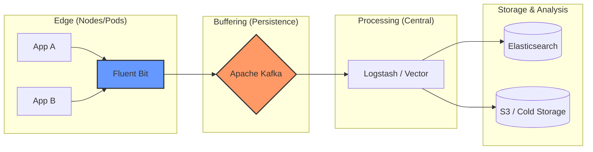

# Week 2 Day 1: Log Collection & Aggregation at Scale

> **Duration:** 8 hours | **Difficulty:** Intermediate-Advanced
> **Focus:** Building resilient, high-throughput log pipelines for AIOps.

---

## 🎯 Learning Objectives

By the end of this session, you will:
1. Design a resilient log pipeline architecture using the **"Collection-Buffer-Transform-Store"** pattern.
2. Configure **Fluent Bit** for high-performance log collection and filtering.
3. Implement **Kafka** as a distributed buffer to prevent data loss during spikes.
4. Transform unstructured logs into **machine-ready JSON** for ML ingestion.
5. Understand the trade-offs between different log shippers (Fluent Bit vs. Fluentd vs. Logstash).

---

## 📖 Lecture Content

### 1. The Modern Log Pipeline Architecture

In a production AIOps environment, sending logs directly from an app to a database is a recipe for disaster. We need a multi-stage pipeline to handle volume, diversity, and reliability.



#### The Four Pillars of the Pipeline:
| Stage | Component | Responsibility |
|-------|-----------|----------------|
| **Collection** | Fluent Bit | Lightweight agent, local parsing, initial filtering. |
| **Buffering** | Kafka | Decouples producers from consumers; prevents data loss during storage downtime. |
| **Transformation**| Logstash / Vector | Rich enrichment (GeoIP, user-agent parsing), routing to multiple backends. |
| **Storage** | Elasticsearch / Loki | Indexing for fast search and ML query ingestion. |

---

### 2. Log Collection: Fluent Bit vs. Fluentd

| Feature | Fluent Bit | Fluentd |
|---------|------------|---------|
| **Language** | C (High Performance) | Ruby/C (Extensible) |
| **Memory Footprint** | ~650 KB | ~40 MB |
| **Plugins** | 100+ | 1000+ |
| **Use Case** | Edge, Sidecars, Containers | Central Aggregator, Complex Logic |

**AIOps Recommendation:** Use **Fluent Bit** at the edge for efficiency and **Kafka** for reliability.

---

### 3. Structured Logging: The Foundation of AIOps

AI models cannot "read" text like humans. They need structured data.

❌ **Bad (Unstructured):**
`2024-01-19 20:22:27 [INFO] User 123 logged in from 1.2.3.4 took 50ms`

✅ **Good (JSON):**
```json
{
  "timestamp": "2024-01-19T20:22:27Z",
  "level": "INFO",
  "event": "user_login",
  "user_id": 123,
  "client_ip": "1.2.3.4",
  "duration_ms": 50,
  "service": "auth-service",
  "metadata": {
    "region": "us-east-1",
    "version": "v2.1.0"
  }
}
```

**Why it matters for AIOps:**
- **Parsing overhead:** JSON is natively parsed by almost all ML libraries (Pandas, Scikit-learn).
- **Schema enforcement:** Consistent fields allow for robust anomaly detection features.

---

### 4. Buffering with Kafka: Why?

Imagine a "Log Storm" where your app starts emitting 100x more logs due to an error.
- **Without Buffer:** Elasticsearch crashes under the load. Logs are lost.
- **With Kafka:** Kafka stores the logs on disk. Logstash pulls them as fast as it can. Your storage remains stable, and every log event is eventually processed.

---

## 🛠️ Configuration Example: Fluent Bit to Kafka

```ini
[INPUT]
    Name          tail
    Path          /var/log/app/*.log
    Parser        docker
    Tag           app.logs

[FILTER]
    Name          record_modifier
    Match         *
    Record        cluster_id prod-us-1

[OUTPUT]
    Name          kafka
    Match         app.logs
    Brokers       kafka-broker:9092
    Topics        raw-logs
    Format        json
```

---

## 📝 Key Design Considerations

1. **Backpressure:** How does the collector behave when the buffer is full? (Drop logs vs. Pause collection).
2. **Cardinality:** Avoid adding high-cardinality fields (like `session_id`) as index tags in storage, but keep them in the JSON body.
3. **Log Levels:** Use levels dynamically. In AIOps, we often want `DEBUG` logs only when an anomaly is detected (Adaptive Log Collection).

---

## ✅ Deliverables for Today

- [ ] A working Docker Compose stack with Fluent Bit, Kafka, and Elasticsearch.
- [ ] A Python script generating structured JSON logs.
- [ ] A validated pipeline showing logs flowing from App → Kafka → ES.

---

<p align="center">
  <a href="../../">← Back to Week 2</a> | <a href="cheatsheet.md">Go to Cheat Sheet →</a>
</p>
