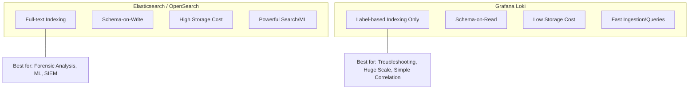
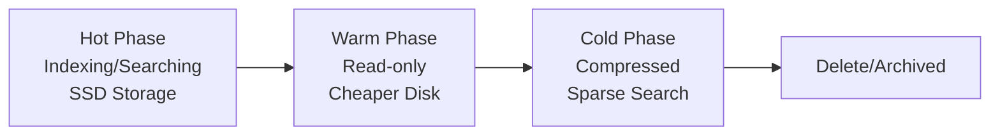

# Week 2 Day 2: Log Storage, Indexing & Analytics

> **Duration:** 8 hours | **Difficulty:** Intermediate
> **Focus:** Choosing the right storage layer and extracting actionable insights from logs.

---

## 🎯 Learning Objectives

By the end of this session, you will:
1. Deep dive into **Elasticsearch** (Search-based) vs. **Grafana Loki** (Aggregation-based) storage architectures.
2. Implement **Log Lifecycle Management (ILM)** to manage storage costs.
3. Master **Logstash** and **Vector** for advanced enrichment (GeoIP, User-Agent parsing).
4. Build complex visualizations and dashboards using **Kibana** and **Grafana Explore**.
5. Understand **Schema-on-Write** vs. **Schema-on-Read** trade-offs for AIOps.

---

## 📖 Lecture Content

### 1. The Storage Dilemma: Elasticsearch vs. Loki

In AIOps, you must choose your storage backend based on whether you need high-speed searching or high-speed ingestion at low cost.



#### Comparison Matrix:
| Feature | Elasticsearch | Grafana Loki |
|---------|---------------|--------------|
| **Indexing** | Every field is indexed (Full text) | Only specific labels (e.g., `app`, `env`) |
| **Storage** | Very High (Indexes > Data size) | Very Low (Compressed chunks) |
| **Query Speed** | Instant search on any field | Fast on labels, grep-like on message |
| **AIOps Usage** | Great for Anomaly Detection (built-in ML) | Great for rapid troubleshooting |

---

### 2. Advanced Transformation with Logstash

While Fluent Bit is lightweight, **Logstash** (or **Vector**) provides the heavy lifting for AIOps preprocessing.

#### The Grok Filter: Turning Text to Features
Grok is a way to use pre-defined regex patterns to parse logs.

```ruby
filter {
  grok {
    match => { "message" => "%{IP:client_ip} %{WORD:method} %{URIPATHPARAM:request} %{NUMBER:duration:float}" }
  }
  geoip {
    source => "client_ip"
  }
}
```

**Why this matters for AIOps:**
- **GeoIP:** Helps detect anomalies by geographic location (e.g., login from unknown country).
- **User-Agent:** Categorizes traffic (Mobile vs Desktop vs Bot).
- **Duration Normalization:** Converts strings to floats so you can run statistical models.

---

### 3. Log Lifecycle Management (ILM)

AIOps data grows exponentially. You cannot keep 100% of logs in high-speed storage forever.



**Best Practices:**
- **Hot (0-7 days):** Use for active alerting and incident response.
- **Warm (7-30 days):** Use for trend analysis and historical comparison.
- **Cold (30-90+ days):** Archeology and compliance (move to S3).

---

### 4. Schema-on-Read (Loki) vs. Schema-on-Write (ES)

- **Schema-on-Write (Elasticsearch):** You define fields *before* storage. Highly structured, fast for ML, but rigid.
- **Schema-on-Read (Loki):** You store raw text and extract fields *at the time of query*. Flexible, easy to scale, but query-intensive.

---

### 5. AIOps Perspective: Feature Extraction from Logs

Logs are often high-cardinality "text features."
- **Event Frequency:** Sudden drop in "Heartbeat" logs vs. normal frequency.
- **Message Entropy:** Measuring how "new" or "rare" a log message is (using clustering).
- **Correlation:** Linking a log error in Service A to a latency spike in Service B using a correlation ID.

---

## ✅ Deliverables for Today

- [ ] Deploy an **ELK (Elasticsearch, Logstash, Kibana)** stack.
- [ ] Configure a **Logstash pipeline** that parses raw IP addresses into GeoIP locations.
- [ ] Create a **Grafana Loki** instance and push logs using Promtail or Fluent Bit.
- [ ] Comparison report: Search for a specific string in ES vs Loki and record query time.

---

<p align="center">
  <a href="../day-01-logs/lecture-notes.md">⬅️ Back: Day 1</a> | <strong>Day 2: Storage & Analytics</strong> | <a href="../day-03-metrics/lecture-notes.md">Next: Day 3 ➡️</a>
</p>
