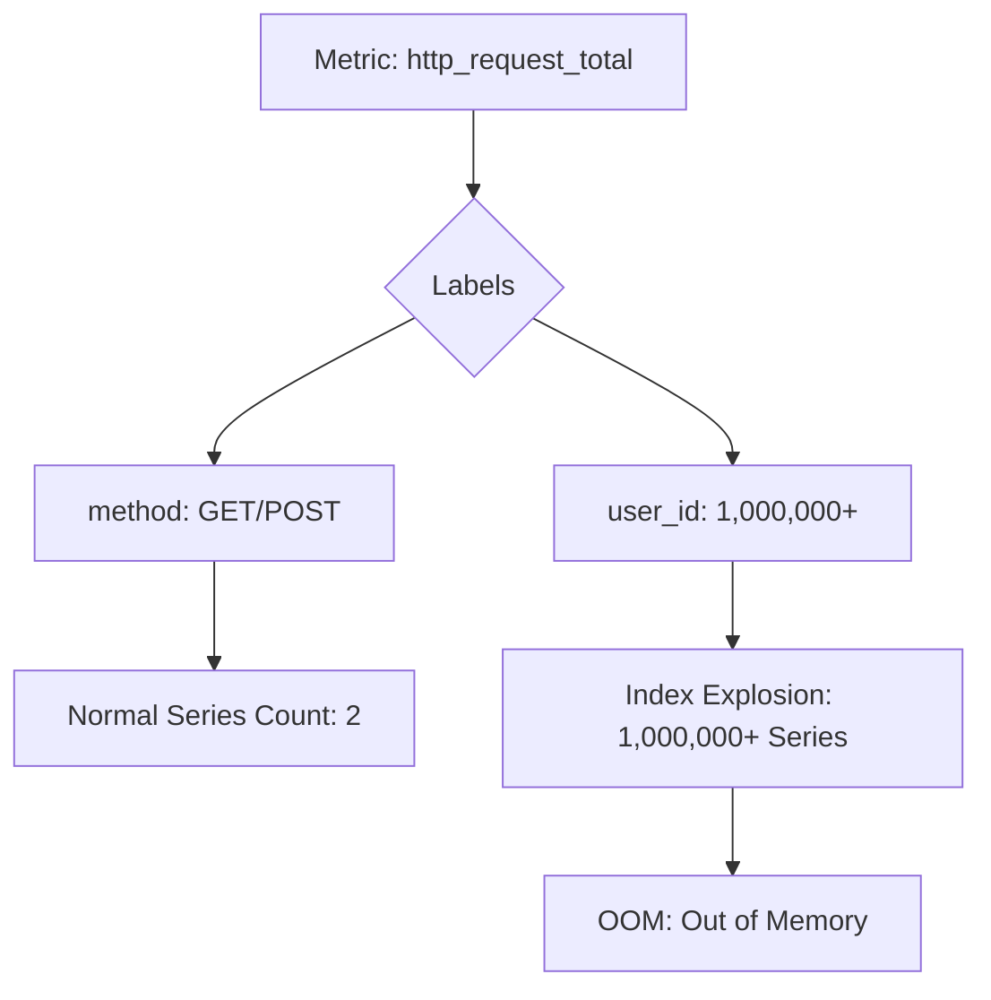
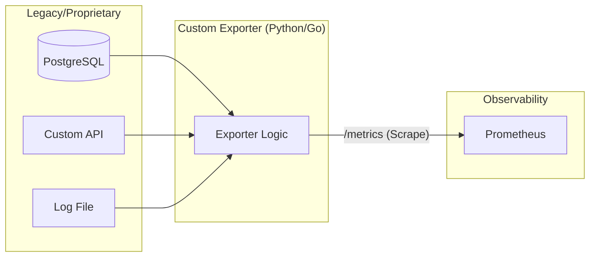

# Week 2 Day 4: Advanced Metrics Engineering & Custom Exporters

> **Duration:** 8 hours | **Difficulty:** Advanced
> **Focus:** Bridging the gap between infrastructure metrics and business/application state for AIOps.

---

## 🎯 Learning Objectives

By the end of this session, you will:
1. Identify when and why to build a reference **Custom Exporter**.
2. Master the `prometheus_client` Python library to expose proprietary data.
3. Understand and mitigate **High Cardinality** in metric labels.
4. Implement **Prometheus Relabeling** for data normalization and cost control.
5. Architect a "Database-to-Metrics" pipeline for business-aware AIOps.

---

## 📖 Lecture Content

### 1. Beyond Standard Metrics
Most AIOps platforms fail because they only look at "Generic" infrastructure metrics (CPU, RAM). To build truly intelligent systems, we need **Domain-Specific Metrics**.

- **App State:** Unique active users, specific function execution counts.
- **Business State:** Total revenue in last 5m, abandoned carts, pending shipments.
- **System Internals:** Tail logs size, queue depths in propriety message brokers.

---

### 2. The High Cardinality "Explosion"
High cardinality is the #1 reason Prometheus/TSDBs crash. it happens when a label has too many unique values.

**Rule of Thumb:**
- **Good Labels:** `service`, `env`, `method`, `status_code`.
- **Bad Labels:** `user_id`, `email`, `request_id`, `timestamp`.

---

### 3. Creating Custom Exporters (The Architecture)

A custom exporter acts as a translator. It "scrapes" a non-Prometheus source and hosts a `/metrics` endpoint.

#### Best Practices for Custom Exporters:
1. **Never "Push" if you can "Pull":** Use the standard scrape model.
2. **Statelessness:** The exporter should not store its own history.
3. **Caching:** If the source API is slow, cache results for 30s to avoid overloading the source on every scrape.

---

### 4. Advanced Relabeling: Pruning Data at the Source

Relabeling happens *after* scraping but *before* storage. It is your primary tool for **Cost Management**.

| Action | Purpose |
|--------|---------|
| `keep` | Only store metrics that match a regex. |
| `drop` | Remove specific metrics or labels (e.g., drop `debug_` metrics). |
| `replace` | Standardize labels (e.g., convert `srv` to `service`). |
| `labeldrop` | Remove high-cardinality labels while keeping the metric. |

---

### 5. Transitioning to AIOps: Metrics as Features

In Week 4, we will use these metrics as ML features. For successful ML, your metrics must be:
- **Consistent:** Labels must not change formatting between deployments.
- **Normalized:** Spikes should be context-aware (is a 100% CPU spike normal at 2 AM?).
- **Contextual:** Business metrics (sales) correlated with system metrics (latency).

---

## ✅ Deliverables for Today

- [ ] A functional Python Custom Exporter for a non-standard data source.
- [ ] A Prometheus config using `relabel_configs` to drop at least one label.
- [ ] A visualization showing "Business State" vs "System Health."

---

  <a href="../day-03-metrics/lecture-notes.md">⬅️ Back: Day 3</a> | <strong>Day 4: Custom Exporters</strong> | <a href="../day-05-06-tsdb/lecture-notes.md">Next: Day 5-6 ➡️</a>

