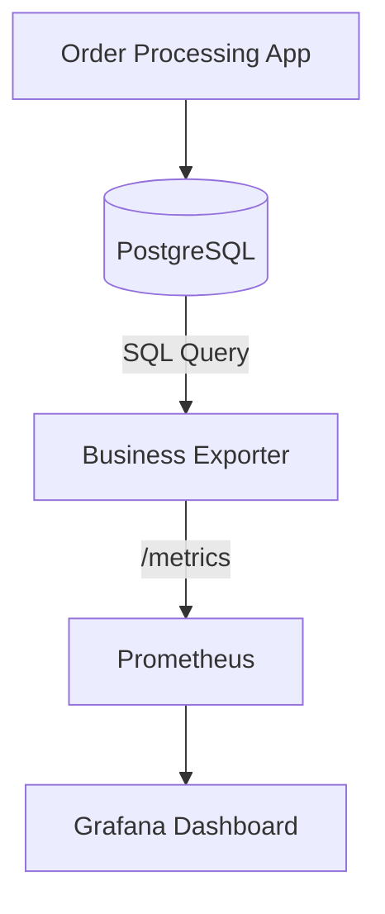

# Week 2 Day 4 Project: The Business Logic Exporter 💰

> **AIOps Goal:** Correlate technical failure with financial impact. 

---

## 🎯 Project Overview

In this project, you will build a sophisticated Custom Exporter that connects to a "Production Database" (simulated) to extract business KPIs. You will then build a Grafana dashboard that visualizes **Technical Health (CPU/RAM)** alongside **Business Health (Revenue/Orders)**.

## 🏗️ Architecture



---

## 📋 Requirements

### 1. The Database (Mock)
You will use a Python script to create a local SQLite database (simulating PostgreSQL) containing an `orders` table with fields: `id`, `amount`, `status`, `created_at`.

### 2. The Custom Exporter (`biz_exporter.py`)
Your exporter must run SQL queries every 30 seconds to calculate:
- `total_revenue_usd`: Total amount of 'completed' orders.
- `pending_orders_count`: Count of orders with 'pending' status.
- `failed_transactions_total`: Count of orders with 'failed' status.

### 3. Advanced Feature: Threshold Labeling
Your exporter should add a label `severity="critical"` if `failed_transactions_total` exceeds 5 in the last minute. This allows AIOps models to prioritize these metrics.

---

## 🛠️ Step-by-Step Implementation

### Step 1: Database Simulator
Create `db_sim.py`:
```python
import sqlite3
import random
import time

def init_db():
    conn = sqlite3.connect('orders.db')
    c = conn.cursor()
    c.execute('''CREATE TABLE IF NOT EXISTS orders 
                 (id INTEGER PRIMARY KEY, amount REAL, status TEXT, created_at TIMESTAMP)''')
    conn.commit()
    return conn

def inject_orders():
    conn = init_db()
    c = conn.cursor()
    statuses = ['completed', 'completed', 'completed', 'pending', 'failed']
    while True:
        amt = random.uniform(10.0, 500.0)
        status = random.choice(statuses)
        c.execute("INSERT INTO orders (amount, status, created_at) VALUES (?, ?, datetime('now'))", (amt, status))
        conn.commit()
        print(f"Injected order: {status} - ${amt:.2f}")
        time.sleep(random.randint(1, 5))

if __name__ == "__main__":
    inject_orders()
```

### Step 2: The Business Exporter
Build your exporter using `prometheus_client`.
- Hint: Use a `Gauge` for `total_revenue_usd` (since you'll be recalculating the total or the delta).
- Hint: `sqlite3.connect('orders.db', check_same_thread=False)` is needed for multi-threaded exporters.

### Step 3: Grafana "AIOps Sentinel" Dashboard
Create a dashboard that shows:
- **Left Panel:** Revenue per Minute (Bar Chart).
- **Middle Panel:** System CPU (from node-exporter) vs. Failed Transactions. 
- **Right Panel:** Alert Table (showing if 'failed' > 'completed' in any 5m window).

---

## ✅ Evaluation Rubric

| Criteria | Points |
|----------|--------|
| **Functional:** Exporter correctly reflects DB state. | 30 |
| **AIOps Context:** Labels (like severity) are used intelligently. | 25 |
| **Resilience:** Exporter handles DB connection failures gracefully. | 20 |
| **Visuals:** Grafana dashboard clearly shows the "Correlation" between Tech and Biz. | 25 |

---

## 📤 Submission
Submit your `biz_exporter.py`, the SQL queries used, and a exported JSON for your Grafana dashboard.
