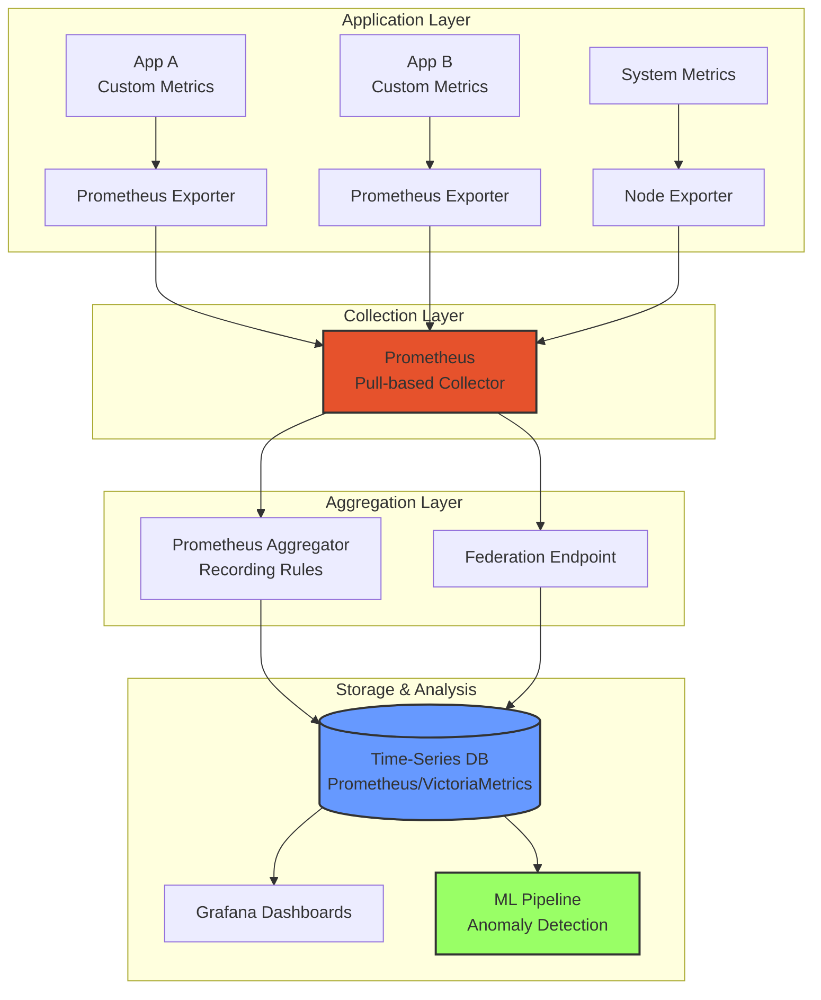
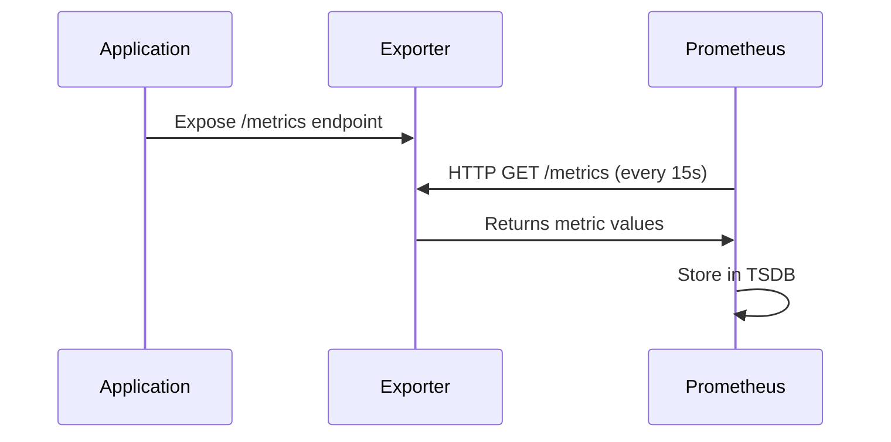
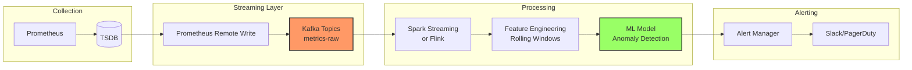

# Week 2 Day 3: Metrics Pipeline Design

> **Duration:** 8 hours | **Difficulty:** Intermediate-Advanced
> **Focus:** Building scalable, intelligent metrics collection pipelines for AIOps.

---

## 🎯 Learning Objectives

By the end of this session, you will:
1. Design a **multi-tier metrics architecture** (Push vs. Pull, Aggregation layers).
2. Build **custom Prometheus exporters** for application-specific metrics.
3. Implement **metric aggregation strategies** (pre-aggregation vs. post-aggregation).
4. Understand **metric cardinality** and its impact on storage costs.
5. Design **real-time metric pipelines** for anomaly detection.
6. Master the **four metric types** (Counter, Gauge, Histogram, Summary) and when to use each.

---

## 📖 Lecture Content

### 1. The Metrics Pipeline Architecture

Metrics are the "pulse" of your system. Unlike logs, they are **pre-aggregated** and **time-series** in nature, making them perfect for real-time anomaly detection.



#### The Three-Tier Architecture:

| Tier | Component | Responsibility |
|------|-----------|----------------|
| **Collection** | Prometheus / Telegraf | Pulls metrics from exporters at regular intervals (scrape). |
| **Aggregation** | Recording Rules / Federation | Pre-computes expensive queries (e.g., `rate()`, `histogram_quantile()`). |
| **Storage** | Prometheus TSDB / VictoriaMetrics | Stores time-series data with compression and retention policies. |

---

### 2. Push vs. Pull: The Fundamental Choice

#### Pull Model (Prometheus)
- **How it works:** Prometheus **scrapes** exporters at regular intervals.
- **Advantages:**
  - Centralized configuration (no need to know all app endpoints).
  - Resilient to app crashes (Prometheus just skips failed scrapes).
  - Natural rate limiting (scrape interval controls load).
- **Disadvantages:**
  - Short-lived jobs (e.g., batch jobs) may finish before being scraped.
  - Requires service discovery or static configuration.



#### Push Model (StatsD, InfluxDB)
- **How it works:** Applications **push** metrics to a collector.
- **Advantages:**
  - Works with short-lived jobs.
  - Fire-and-forget (no need to maintain HTTP endpoints).
- **Disadvantages:**
  - Need to know collector address (configuration complexity).
  - Can overwhelm collector during traffic spikes.

**AIOps Recommendation:** Use **Pull** for long-running services, **Push Gateway** for batch jobs.

---

### 3. The Four Metric Types: When to Use What?

#### Counter
- **Definition:** A monotonically increasing value (can only go up or reset to zero).
- **Use Case:** Total requests, total errors, bytes transferred.
- **Example:**
  ```prometheus
  http_requests_total{method="GET", status="200"} 1523
  http_requests_total{method="POST", status="500"} 12
  ```
- **AIOps Insight:** Use `rate(http_requests_total[5m])` to get requests per second.

#### Gauge
- **Definition:** A value that can go up or down.
- **Use Case:** Current memory usage, active connections, queue size.
- **Example:**
  ```prometheus
  memory_usage_bytes{instance="web-1"} 2147483648
  active_connections{instance="web-1"} 42
  ```
- **AIOps Insight:** Directly usable for anomaly detection (sudden spike in memory = alert).

#### Histogram
- **Definition:** Samples observations and counts them in configurable buckets.
- **Use Case:** Request latency, response size distribution.
- **Example:**
  ```prometheus
  http_request_duration_seconds_bucket{le="0.1"} 1000
  http_request_duration_seconds_bucket{le="0.5"} 1500
  http_request_duration_seconds_bucket{le="1.0"} 1800
  http_request_duration_seconds_bucket{le="+Inf"} 2000
  http_request_duration_seconds_sum 450.5
  http_request_duration_seconds_count 2000
  ```
- **AIOps Insight:** Use `histogram_quantile(0.95, rate(...))` to get 95th percentile latency.

#### Summary
- **Definition:** Similar to Histogram, but calculates quantiles on the client side.
- **Use Case:** Pre-computed percentiles (faster queries, but less flexible).
- **Example:**
  ```prometheus
  http_request_duration_seconds{quantile="0.5"} 0.2
  http_request_duration_seconds{quantile="0.95"} 0.8
  http_request_duration_seconds{quantile="0.99"} 1.5
  http_request_duration_seconds_sum 450.5
  http_request_duration_seconds_count 2000
  ```

**Decision Tree:**
```
Is the value always increasing? → Counter
Can it go up and down? → Gauge
Do you need percentiles? → Histogram (flexible) or Summary (pre-computed)
```

---

### 4. Metric Cardinality: The Hidden Cost

**Cardinality** = Number of unique time-series (unique combinations of label values).

#### High Cardinality Example (BAD):
```prometheus
http_requests_total{user_id="12345", session_id="abc123", ip="1.2.3.4"} 1
http_requests_total{user_id="67890", session_id="xyz789", ip="5.6.7.8"} 1
# This creates millions of time-series!
```

#### Low Cardinality Example (GOOD):
```prometheus
http_requests_total{method="GET", status="200", endpoint="/api/users"} 1523
http_requests_total{method="POST", status="500", endpoint="/api/users"} 12
# Only a few hundred time-series
```

**Impact:**
- **Storage:** Each unique time-series requires storage. High cardinality = exponential storage growth.
- **Query Performance:** More time-series = slower queries.
- **Cost:** Cloud TSDB services charge per time-series.

**Best Practices:**
1. **Avoid high-cardinality labels:** Don't use `user_id`, `session_id`, `request_id` as labels.
2. **Use recording rules:** Pre-aggregate high-cardinality metrics.
3. **Drop unnecessary metrics:** Use relabeling to filter out unwanted series.

---

### 5. Building Custom Prometheus Exporters

A **Prometheus Exporter** is an HTTP server that exposes metrics in Prometheus format.

#### Basic Exporter Structure:

```python
from prometheus_client import Counter, Gauge, Histogram, start_http_server
import time
import random

# Define metrics
request_counter = Counter('app_requests_total', 'Total requests', ['method', 'status'])
active_users = Gauge('app_active_users', 'Currently active users')
request_duration = Histogram('app_request_duration_seconds', 'Request duration')

# Expose metrics endpoint
start_http_server(8000)

# Simulate application metrics
while True:
    # Increment counter
    request_counter.labels(method='GET', status='200').inc()
    
    # Update gauge
    active_users.set(random.randint(100, 1000))
    
    # Record histogram
    with request_duration.time():
        time.sleep(random.uniform(0.1, 0.5))
    
    time.sleep(1)
```

#### Advanced: Multi-Process Exporter (Gunicorn)

When running multiple worker processes, use a **multiprocess mode**:

```python
from prometheus_client import multiprocess, CollectorRegistry, generate_latest
from prometheus_client import Counter, Gauge
from flask import Flask, Response

app = Flask(__name__)

# Use multiprocess registry
registry = CollectorRegistry()
multiprocess.MultiProcessCollector(registry)

request_counter = Counter('app_requests_total', 'Total requests', 
                          ['method', 'status'], registry=registry)

@app.route('/metrics')
def metrics():
    return Response(generate_latest(registry), mimetype='text/plain')
```

---

### 6. Aggregation Strategies

#### Pre-Aggregation (Recording Rules)

Compute expensive queries **before** they're needed:

```yaml
# prometheus.yml
groups:
  - name: api_aggregates
    interval: 30s
    rules:
      - record: api:requests:rate5m
        expr: rate(http_requests_total[5m])
      
      - record: api:latency:p95
        expr: histogram_quantile(0.95, 
              rate(http_request_duration_seconds_bucket[5m]))
```

**Benefits:**
- Faster dashboard queries (pre-computed).
- Reduced storage (aggregated metrics have lower cardinality).

#### Post-Aggregation (Query-Time)

Compute on-the-fly during queries:

```promql
# Compute rate at query time
rate(http_requests_total[5m])

# Compute percentile at query time
histogram_quantile(0.95, rate(http_request_duration_seconds_bucket[5m]))
```

**Trade-off:** Slower queries but more flexible.

---

### 7. Real-Time Metrics Pipeline for Anomaly Detection



**Key Components:**
1. **Prometheus Remote Write:** Streams metrics to Kafka in real-time.
2. **Streaming Processor:** Computes rolling windows (e.g., 5-minute averages).
3. **Feature Engineering:** Creates features like:
   - `rate_change = (current_rate - previous_rate) / previous_rate`
   - `z_score = (value - mean) / std_dev`
4. **ML Model:** Detects anomalies using isolation forest, LSTM, or statistical methods.

---

### 8. Metric Naming Conventions

Follow the **Prometheus naming best practices**:

```
<namespace>_<metric_name>_<unit>_<suffix>
```

**Examples:**
- ✅ `http_requests_total` (counter)
- ✅ `http_request_duration_seconds` (histogram)
- ✅ `node_memory_usage_bytes` (gauge)
- ❌ `httpRequests` (camelCase)
- ❌ `http_requests` (missing `_total` suffix for counter)

**Suffixes:**
- `_total` for counters
- `_seconds`, `_bytes`, `_ratio` for units
- `_bucket`, `_sum`, `_count` for histograms

---

## 🛠️ Configuration Example: Prometheus Scraping

```yaml
# prometheus.yml
global:
  scrape_interval: 15s
  evaluation_interval: 15s

scrape_configs:
  - job_name: 'node-exporter'
    static_configs:
      - targets: ['node-exporter:9100']

  - job_name: 'custom-app'
    static_configs:
      - targets: ['app:8000']
    metrics_path: '/metrics'
    scrape_interval: 10s  # More frequent for critical metrics
```

---

## 📝 Key Design Considerations

1. **Scrape Interval:** Balance between freshness and load. 15s is standard, 5s for critical metrics.
2. **Retention:** Prometheus default is 15 days. Use remote storage (Thanos, Cortex) for long-term retention.
3. **Label Explosion:** Monitor cardinality. Use `prometheus_tsdb_head_series` metric to track.
4. **Recording Rules:** Pre-compute expensive queries to speed up dashboards.

---

## ✅ Deliverables for Today

- [ ] A custom Prometheus exporter for a Python application.
- [ ] A Prometheus configuration that scrapes multiple exporters.
- [ ] A Grafana dashboard visualizing the collected metrics.
- [ ] A recording rule that pre-computes a rate metric.

---

<p align="center">
  <a href="../day-02-storage-analytics/lecture-notes.md">⬅️ Back: Day 2</a> | <strong>Day 3: Metric Pipelines</strong> | <a href="../day-03-04-metrics/lecture-notes.md">Next: Day 4 ➡️</a>
</p>
