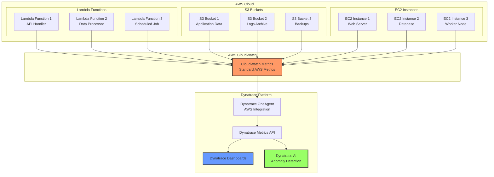

# Dynatrace AWS Metrics Collection Project

> **Objective:** Build a comprehensive solution to collect and monitor standard metrics from AWS Lambda, S3, and EC2 resources using Dynatrace.

---

## 🎯 Project Overview

This project demonstrates how to collect and monitor standard AWS resource metrics using Dynatrace's OneAgent and CloudWatch integration. You'll learn to:

1. **Collect Lambda Metrics:** Invocations, errors, duration, throttles, concurrent executions
2. **Collect S3 Metrics:** Request counts, bytes transferred, errors, bucket size
3. **Collect EC2 Metrics:** CPU utilization, network I/O, disk I/O, memory
4. **Integrate with Dynatrace:** Send metrics to Dynatrace for AIOps analysis
5. **Create Dashboards:** Visualize AWS resource health and performance

---

## 🏗️ Architecture



---

## 📋 Standard Metrics Collected

### AWS Lambda Metrics

| Metric Name | Description | Unit | Use Case |
|------------|-------------|------|----------|
| `aws.lambda.invocations` | Total number of invocations | Count | Track function usage |
| `aws.lambda.errors` | Number of errors | Count | Monitor failures |
| `aws.lambda.duration` | Function execution time | Milliseconds | Performance monitoring |
| `aws.lambda.throttles` | Number of throttled invocations | Count | Capacity planning |
| `aws.lambda.concurrent_executions` | Concurrent executions | Count | Resource limits |
| `aws.lambda.dead_letter_errors` | Dead letter queue errors | Count | Error handling |

### AWS S3 Metrics

| Metric Name | Description | Unit | Use Case |
|------------|-------------|------|----------|
| `aws.s3.bucket_size` | Total bucket size | Bytes | Storage monitoring |
| `aws.s3.number_of_objects` | Object count | Count | Capacity planning |
| `aws.s3.all_requests` | Total requests | Count | Usage tracking |
| `aws.s3.get_requests` | GET requests | Count | Read operations |
| `aws.s3.put_requests` | PUT requests | Count | Write operations |
| `aws.s3.delete_requests` | DELETE requests | Count | Deletion tracking |
| `aws.s3.bytes_downloaded` | Data downloaded | Bytes | Bandwidth monitoring |
| `aws.s3.bytes_uploaded` | Data uploaded | Bytes | Bandwidth monitoring |
| `aws.s3.4xx_errors` | Client errors | Count | Error monitoring |
| `aws.s3.5xx_errors` | Server errors | Count | Error monitoring |

### AWS EC2 Metrics

| Metric Name | Description | Unit | Use Case |
|------------|-------------|------|----------|
| `aws.ec2.cpu_utilization` | CPU usage percentage | Percent | Performance monitoring |
| `aws.ec2.network_in` | Network bytes received | Bytes | Network monitoring |
| `aws.ec2.network_out` | Network bytes sent | Bytes | Network monitoring |
| `aws.ec2.disk_read_ops` | Disk read operations | Count | I/O monitoring |
| `aws.ec2.disk_write_ops` | Disk write operations | Count | I/O monitoring |
| `aws.ec2.disk_read_bytes` | Disk bytes read | Bytes | I/O monitoring |
| `aws.ec2.disk_write_bytes` | Disk bytes written | Bytes | I/O monitoring |
| `aws.ec2.status_check_failed` | Instance status check failures | Count | Health monitoring |

---

## 🛠️ Implementation

### Prerequisites

1. **AWS Account** with Lambda, S3, and EC2 resources
2. **Dynatrace Account** with API access
3. **AWS IAM Role** with CloudWatch read permissions
4. **Python 3.8+** for scripts

### Step 1: Set Up Dynatrace AWS Integration

#### 1.1 Create IAM Role for Dynatrace

```json
{
  "Version": "2012-10-17",
  "Statement": [
    {
      "Effect": "Allow",
      "Action": [
        "cloudwatch:GetMetricStatistics",
        "cloudwatch:ListMetrics",
        "ec2:DescribeInstances",
        "ec2:DescribeRegions",
        "lambda:ListFunctions",
        "lambda:GetFunction",
        "s3:ListBuckets",
        "s3:GetBucketLocation",
        "tag:GetResources"
      ],
      "Resource": "*"
    }
  ]
}
```

#### 1.2 Configure Dynatrace AWS Integration

1. Go to **Dynatrace → Settings → Cloud and virtualization → AWS**
2. Add AWS account with IAM role ARN
3. Enable metrics collection for:
   - Lambda functions
   - S3 buckets
   - EC2 instances

---

### Step 2: Lambda Metrics Collection

#### 2.1 Lambda Function with Custom Metrics

Create a Lambda function that emits custom metrics:

```python
# lambda_with_metrics.py
import boto3
import json
import time
from datetime import datetime

cloudwatch = boto3.client('cloudwatch')

def lambda_handler(event, context):
    start_time = time.time()
    
    try:
        # Your business logic here
        result = process_request(event)
        
        # Emit success metrics
        put_metric('aws.lambda.invocations', 1, {
            'FunctionName': context.function_name,
            'Status': 'Success'
        })
        
        duration = (time.time() - start_time) * 1000  # Convert to ms
        put_metric('aws.lambda.duration', duration, {
            'FunctionName': context.function_name
        })
        
        return {
            'statusCode': 200,
            'body': json.dumps(result)
        }
    
    except Exception as e:
        # Emit error metrics
        put_metric('aws.lambda.errors', 1, {
            'FunctionName': context.function_name,
            'ErrorType': type(e).__name__
        })
        
        put_metric('aws.lambda.invocations', 1, {
            'FunctionName': context.function_name,
            'Status': 'Error'
        })
        
        raise

def put_metric(metric_name, value, dimensions):
    """Put custom metric to CloudWatch"""
    cloudwatch.put_metric_data(
        Namespace='Custom/Lambda',
        MetricData=[
            {
                'MetricName': metric_name,
                'Value': value,
                'Unit': 'Count' if 'count' in metric_name.lower() else 'Milliseconds',
                'Dimensions': [
                    {'Name': k, 'Value': v}
                    for k, v in dimensions.items()
                ],
                'Timestamp': datetime.utcnow()
            }
        ]
    )
```

#### 2.2 CloudWatch to Dynatrace Bridge

Create a Lambda function that forwards CloudWatch metrics to Dynatrace:

```python
# cloudwatch_to_dynatrace.py
import boto3
import requests
import os
import json
from datetime import datetime, timedelta

cloudwatch = boto3.client('cloudwatch')
DYNATRACE_URL = os.environ['DYNATRACE_URL']
DYNATRACE_API_TOKEN = os.environ['DYNATRACE_API_TOKEN']

def lambda_handler(event, context):
    """Forward CloudWatch metrics to Dynatrace"""
    
    # Get Lambda metrics from CloudWatch
    lambda_metrics = get_lambda_metrics()
    
    # Convert to Dynatrace format
    dynatrace_metrics = convert_to_dynatrace(lambda_metrics)
    
    # Send to Dynatrace
    send_to_dynatrace(dynatrace_metrics)
    
    return {'statusCode': 200, 'body': 'Metrics forwarded'}

def get_lambda_metrics():
    """Fetch Lambda metrics from CloudWatch"""
    end_time = datetime.utcnow()
    start_time = end_time - timedelta(minutes=5)
    
    metrics = []
    
    # Get all Lambda functions
    lambda_client = boto3.client('lambda')
    functions = lambda_client.list_functions()['Functions']
    
    for func in functions:
        function_name = func['FunctionName']
        
        # Get invocations
        invocations = cloudwatch.get_metric_statistics(
            Namespace='AWS/Lambda',
            MetricName='Invocations',
            Dimensions=[{'Name': 'FunctionName', 'Value': function_name}],
            StartTime=start_time,
            EndTime=end_time,
            Period=300,
            Statistics=['Sum']
        )
        
        # Get errors
        errors = cloudwatch.get_metric_statistics(
            Namespace='AWS/Lambda',
            MetricName='Errors',
            Dimensions=[{'Name': 'FunctionName', 'Value': function_name}],
            StartTime=start_time,
            EndTime=end_time,
            Period=300,
            Statistics=['Sum']
        )
        
        # Get duration
        duration = cloudwatch.get_metric_statistics(
            Namespace='AWS/Lambda',
            MetricName='Duration',
            Dimensions=[{'Name': 'FunctionName', 'Value': function_name}],
            StartTime=start_time,
            EndTime=end_time,
            Period=300,
            Statistics=['Average']
        )
        
        metrics.append({
            'function_name': function_name,
            'invocations': invocations,
            'errors': errors,
            'duration': duration
        })
    
    return metrics

def convert_to_dynatrace(cloudwatch_metrics):
    """Convert CloudWatch metrics to Dynatrace format"""
    dynatrace_metrics = []
    
    for metric_group in cloudwatch_metrics:
        function_name = metric_group['function_name']
        
        # Process invocations
        for datapoint in metric_group['invocations'].get('Datapoints', []):
            dynatrace_metrics.append({
                'metricId': 'aws.lambda.invocations',
                'value': datapoint['Sum'],
                'timestamp': int(datapoint['Timestamp'].timestamp() * 1000),
                'dimensions': {
                    'function_name': function_name
                }
            })
        
        # Process errors
        for datapoint in metric_group['errors'].get('Datapoints', []):
            dynatrace_metrics.append({
                'metricId': 'aws.lambda.errors',
                'value': datapoint['Sum'],
                'timestamp': int(datapoint['Timestamp'].timestamp() * 1000),
                'dimensions': {
                    'function_name': function_name
                }
            })
        
        # Process duration
        for datapoint in metric_group['duration'].get('Datapoints', []):
            dynatrace_metrics.append({
                'metricId': 'aws.lambda.duration',
                'value': datapoint['Average'],
                'timestamp': int(datapoint['Timestamp'].timestamp() * 1000),
                'dimensions': {
                    'function_name': function_name
                }
            })
    
    return dynatrace_metrics

def send_to_dynatrace(metrics):
    """Send metrics to Dynatrace Metrics API"""
    url = f"{DYNATRACE_URL}/api/v2/metrics/ingest"
    
    headers = {
        'Authorization': f'Api-Token {DYNATRACE_API_TOKEN}',
        'Content-Type': 'text/plain; charset=utf-8'
    }
    
    # Format metrics as Dynatrace ingest format
    lines = []
    for metric in metrics:
        dims = ','.join([f"{k}={v}" for k, v in metric['dimensions'].items()])
        line = f"{metric['metricId']},{dims} {metric['value']} {metric['timestamp']}"
        lines.append(line)
    
    payload = '\n'.join(lines)
    
    response = requests.post(url, headers=headers, data=payload)
    response.raise_for_status()
    
    return response
```

---

### Step 3: S3 Metrics Collection

#### 3.1 S3 Metrics Collector

```python
# s3_metrics_collector.py
import boto3
import requests
import os
from datetime import datetime, timedelta

s3 = boto3.client('s3')
cloudwatch = boto3.client('cloudwatch')
DYNATRACE_URL = os.environ['DYNATRACE_URL']
DYNATRACE_API_TOKEN = os.environ['DYNATRACE_API_TOKEN']

def collect_s3_metrics():
    """Collect S3 metrics from CloudWatch and send to Dynatrace"""
    
    # List all S3 buckets
    buckets = s3.list_buckets()['Buckets']
    
    end_time = datetime.utcnow()
    start_time = end_time - timedelta(minutes=5)
    
    dynatrace_metrics = []
    
    for bucket in buckets:
        bucket_name = bucket['Name']
        
        # Get bucket size
        size_metric = cloudwatch.get_metric_statistics(
            Namespace='AWS/S3',
            MetricName='BucketSizeBytes',
            Dimensions=[
                {'Name': 'BucketName', 'Value': bucket_name},
                {'Name': 'StorageType', 'Value': 'StandardStorage'}
            ],
            StartTime=start_time,
            EndTime=end_time,
            Period=3600,
            Statistics=['Average']
        )
        
        # Get number of objects
        objects_metric = cloudwatch.get_metric_statistics(
            Namespace='AWS/S3',
            MetricName='NumberOfObjects',
            Dimensions=[
                {'Name': 'BucketName', 'Value': bucket_name},
                {'Name': 'StorageType', 'Value': 'AllStorageTypes'}
            ],
            StartTime=start_time,
            EndTime=end_time,
            Period=3600,
            Statistics=['Average']
        )
        
        # Get request metrics
        all_requests = cloudwatch.get_metric_statistics(
            Namespace='AWS/S3',
            MetricName='AllRequests',
            Dimensions=[{'Name': 'BucketName', 'Value': bucket_name}],
            StartTime=start_time,
            EndTime=end_time,
            Period=300,
            Statistics=['Sum']
        )
        
        # Get GET requests
        get_requests = cloudwatch.get_metric_statistics(
            Namespace='AWS/S3',
            MetricName='GetRequests',
            Dimensions=[{'Name': 'BucketName', 'Value': bucket_name}],
            StartTime=start_time,
            EndTime=end_time,
            Period=300,
            Statistics=['Sum']
        )
        
        # Get PUT requests
        put_requests = cloudwatch.get_metric_statistics(
            Namespace='AWS/S3',
            MetricName='PutRequests',
            Dimensions=[{'Name': 'BucketName', 'Value': bucket_name}],
            StartTime=start_time,
            EndTime=end_time,
            Period=300,
            Statistics=['Sum']
        )
        
        # Get bytes downloaded
        bytes_downloaded = cloudwatch.get_metric_statistics(
            Namespace='AWS/S3',
            MetricName='BytesDownloaded',
            Dimensions=[{'Name': 'BucketName', 'Value': bucket_name}],
            StartTime=start_time,
            EndTime=end_time,
            Period=300,
            Statistics=['Sum']
        )
        
        # Get bytes uploaded
        bytes_uploaded = cloudwatch.get_metric_statistics(
            Namespace='AWS/S3',
            MetricName='BytesUploaded',
            Dimensions=[{'Name': 'BucketName', 'Value': bucket_name}],
            StartTime=start_time,
            EndTime=end_time,
            Period=300,
            Statistics=['Sum']
        )
        
        # Get 4xx errors
        errors_4xx = cloudwatch.get_metric_statistics(
            Namespace='AWS/S3',
            MetricName='4xxErrors',
            Dimensions=[{'Name': 'BucketName', 'Value': bucket_name}],
            StartTime=start_time,
            EndTime=end_time,
            Period=300,
            Statistics=['Sum']
        )
        
        # Get 5xx errors
        errors_5xx = cloudwatch.get_metric_statistics(
            Namespace='AWS/S3',
            MetricName='5xxErrors',
            Dimensions=[{'Name': 'BucketName', 'Value': bucket_name}],
            StartTime=start_time,
            EndTime=end_time,
            Period=300,
            Statistics=['Sum']
        )
        
        # Convert to Dynatrace format
        metrics_data = [
            (size_metric, 'aws.s3.bucket_size', 'Bytes'),
            (objects_metric, 'aws.s3.number_of_objects', 'Count'),
            (all_requests, 'aws.s3.all_requests', 'Count'),
            (get_requests, 'aws.s3.get_requests', 'Count'),
            (put_requests, 'aws.s3.put_requests', 'Count'),
            (bytes_downloaded, 'aws.s3.bytes_downloaded', 'Bytes'),
            (bytes_uploaded, 'aws.s3.bytes_uploaded', 'Bytes'),
            (errors_4xx, 'aws.s3.4xx_errors', 'Count'),
            (errors_5xx, 'aws.s3.5xx_errors', 'Count')
        ]
        
        for metric_data, metric_id, unit in metrics_data:
            for datapoint in metric_data.get('Datapoints', []):
                value = datapoint.get('Sum') or datapoint.get('Average', 0)
                dynatrace_metrics.append({
                    'metricId': metric_id,
                    'value': value,
                    'timestamp': int(datapoint['Timestamp'].timestamp() * 1000),
                    'dimensions': {
                        'bucket_name': bucket_name
                    }
                })
    
    # Send to Dynatrace
    send_to_dynatrace(dynatrace_metrics)
    
    return len(dynatrace_metrics)

def send_to_dynatrace(metrics):
    """Send metrics to Dynatrace Metrics API"""
    url = f"{DYNATRACE_URL}/api/v2/metrics/ingest"
    
    headers = {
        'Authorization': f'Api-Token {DYNATRACE_API_TOKEN}',
        'Content-Type': 'text/plain; charset=utf-8'
    }
    
    lines = []
    for metric in metrics:
        dims = ','.join([f"{k}={v}" for k, v in metric['dimensions'].items()])
        line = f"{metric['metricId']},bucket_name={dims} {metric['value']} {metric['timestamp']}"
        lines.append(line)
    
    payload = '\n'.join(lines)
    
    response = requests.post(url, headers=headers, data=payload)
    response.raise_for_status()
    
    return response

if __name__ == '__main__':
    count = collect_s3_metrics()
    print(f"Collected and sent {count} S3 metrics to Dynatrace")
```

---

### Step 4: EC2 Metrics Collection

#### 4.1 EC2 Metrics Collector

```python
# ec2_metrics_collector.py
import boto3
import requests
import os
from datetime import datetime, timedelta

ec2 = boto3.client('ec2')
cloudwatch = boto3.client('cloudwatch')
DYNATRACE_URL = os.environ['DYNATRACE_URL']
DYNATRACE_API_TOKEN = os.environ['DYNATRACE_API_TOKEN']

def collect_ec2_metrics():
    """Collect EC2 metrics from CloudWatch and send to Dynatrace"""
    
    # Get all running instances
    instances = ec2.describe_instances(
        Filters=[{'Name': 'instance-state-name', 'Values': ['running']}]
    )
    
    end_time = datetime.utcnow()
    start_time = end_time - timedelta(minutes=5)
    
    dynatrace_metrics = []
    
    for reservation in instances['Reservations']:
        for instance in reservation['Instances']:
            instance_id = instance['InstanceId']
            instance_name = get_instance_name(instance)
            
            # Get CPU utilization
            cpu_metric = cloudwatch.get_metric_statistics(
                Namespace='AWS/EC2',
                MetricName='CPUUtilization',
                Dimensions=[{'Name': 'InstanceId', 'Value': instance_id}],
                StartTime=start_time,
                EndTime=end_time,
                Period=300,
                Statistics=['Average']
            )
            
            # Get network in
            network_in = cloudwatch.get_metric_statistics(
                Namespace='AWS/EC2',
                MetricName='NetworkIn',
                Dimensions=[{'Name': 'InstanceId', 'Value': instance_id}],
                StartTime=start_time,
                EndTime=end_time,
                Period=300,
                Statistics=['Sum']
            )
            
            # Get network out
            network_out = cloudwatch.get_metric_statistics(
                Namespace='AWS/EC2',
                MetricName='NetworkOut',
                Dimensions=[{'Name': 'InstanceId', 'Value': instance_id}],
                StartTime=start_time,
                EndTime=end_time,
                Period=300,
                Statistics=['Sum']
            )
            
            # Get disk read ops
            disk_read_ops = cloudwatch.get_metric_statistics(
                Namespace='AWS/EC2',
                MetricName='DiskReadOps',
                Dimensions=[{'Name': 'InstanceId', 'Value': instance_id}],
                StartTime=start_time,
                EndTime=end_time,
                Period=300,
                Statistics=['Sum']
            )
            
            # Get disk write ops
            disk_write_ops = cloudwatch.get_metric_statistics(
                Namespace='AWS/EC2',
                MetricName='DiskWriteOps',
                Dimensions=[{'Name': 'InstanceId', 'Value': instance_id}],
                StartTime=start_time,
                EndTime=end_time,
                Period=300,
                Statistics=['Sum']
            )
            
            # Get disk read bytes
            disk_read_bytes = cloudwatch.get_metric_statistics(
                Namespace='AWS/EC2',
                MetricName='DiskReadBytes',
                Dimensions=[{'Name': 'InstanceId', 'Value': instance_id}],
                StartTime=start_time,
                EndTime=end_time,
                Period=300,
                Statistics=['Sum']
            )
            
            # Get disk write bytes
            disk_write_bytes = cloudwatch.get_metric_statistics(
                Namespace='AWS/EC2',
                MetricName='DiskWriteBytes',
                Dimensions=[{'Name': 'InstanceId', 'Value': instance_id}],
                StartTime=start_time,
                EndTime=end_time,
                Period=300,
                Statistics=['Sum']
            )
            
            # Get status check failed
            status_check = cloudwatch.get_metric_statistics(
                Namespace='AWS/EC2',
                MetricName='StatusCheckFailed',
                Dimensions=[{'Name': 'InstanceId', 'Value': instance_id}],
                StartTime=start_time,
                EndTime=end_time,
                Period=300,
                Statistics=['Sum']
            )
            
            # Convert to Dynatrace format
            metrics_data = [
                (cpu_metric, 'aws.ec2.cpu_utilization', 'Percent'),
                (network_in, 'aws.ec2.network_in', 'Bytes'),
                (network_out, 'aws.ec2.network_out', 'Bytes'),
                (disk_read_ops, 'aws.ec2.disk_read_ops', 'Count'),
                (disk_write_ops, 'aws.ec2.disk_write_ops', 'Count'),
                (disk_read_bytes, 'aws.ec2.disk_read_bytes', 'Bytes'),
                (disk_write_bytes, 'aws.ec2.disk_write_bytes', 'Bytes'),
                (status_check, 'aws.ec2.status_check_failed', 'Count')
            ]
            
            for metric_data, metric_id, unit in metrics_data:
                for datapoint in metric_data.get('Datapoints', []):
                    value = datapoint.get('Sum') or datapoint.get('Average', 0)
                    dynatrace_metrics.append({
                        'metricId': metric_id,
                        'value': value,
                        'timestamp': int(datapoint['Timestamp'].timestamp() * 1000),
                        'dimensions': {
                            'instance_id': instance_id,
                            'instance_name': instance_name
                        }
                    })
    
    # Send to Dynatrace
    send_to_dynatrace(dynatrace_metrics)
    
    return len(dynatrace_metrics)

def get_instance_name(instance):
    """Extract instance name from tags"""
    for tag in instance.get('Tags', []):
        if tag['Key'] == 'Name':
            return tag['Value']
    return instance['InstanceId']

def send_to_dynatrace(metrics):
    """Send metrics to Dynatrace Metrics API"""
    url = f"{DYNATRACE_URL}/api/v2/metrics/ingest"
    
    headers = {
        'Authorization': f'Api-Token {DYNATRACE_API_TOKEN}',
        'Content-Type': 'text/plain; charset=utf-8'
    }
    
    lines = []
    for metric in metrics:
        dims = ','.join([f"{k}={v}" for k, v in metric['dimensions'].items()])
        line = f"{metric['metricId']},{dims} {metric['value']} {metric['timestamp']}"
        lines.append(line)
    
    payload = '\n'.join(lines)
    
    response = requests.post(url, headers=headers, data=payload)
    response.raise_for_status()
    
    return response

if __name__ == '__main__':
    count = collect_ec2_metrics()
    print(f"Collected and sent {count} EC2 metrics to Dynatrace")
```

---

## 🚀 Deployment

### Option 1: Lambda-based Collection (Recommended)

Deploy collectors as scheduled Lambda functions:

```yaml
# serverless.yml or CloudFormation template
Resources:
  MetricsCollectorFunction:
    Type: AWS::Lambda::Function
    Properties:
      FunctionName: aws-metrics-to-dynatrace
      Runtime: python3.9
      Handler: index.lambda_handler
      Timeout: 300
      Environment:
        Variables:
          DYNATRACE_URL: https://your-environment.live.dynatrace.com
          DYNATRACE_API_TOKEN: your-api-token
      Events:
        Schedule:
          Type: Schedule
          Properties:
            Schedule: rate(5 minutes)
```

### Option 2: EC2-based Collection

Run collectors on an EC2 instance with cron:

```bash
# /etc/cron.d/aws-metrics-collector
*/5 * * * * ec2-user /usr/local/bin/collect_aws_metrics.sh
```

---

## 📊 Dynatrace Dashboard Configuration

### Create Custom Dashboard

1. Go to **Dynatrace → Dashboards → Create Dashboard**
2. Add tiles for:
   - Lambda invocations and errors
   - S3 bucket size and request rates
   - EC2 CPU and network utilization
3. Set up alerts for:
   - Lambda error rate > 5%
   - S3 5xx errors > 0
   - EC2 CPU > 80%

### Sample Dashboard JSON

```json
{
  "dashboardMetadata": {
    "name": "AWS Resources Overview",
    "owner": "admin"
  },
  "tiles": [
    {
      "name": "Lambda Invocations",
      "tileType": "DATA_EXPLORER",
      "configured": true,
      "bounds": {
        "top": 0,
        "left": 0,
        "width": 304,
        "height": 152
      },
      "tileFilter": {},
      "customName": "Lambda Invocations",
      "queries": [
        {
          "id": "A",
          "spaceAggregation": "AUTO",
          "timeAggregation": "DEFAULT",
          "splitBy": ["function_name"],
          "rate": "NONE",
          "metricSelector": "aws.lambda.invocations"
        }
      ]
    }
  ]
}
```

---

## ✅ Success Criteria

- [ ] Lambda metrics collected and visible in Dynatrace
- [ ] S3 metrics collected for all buckets
- [ ] EC2 metrics collected for all running instances
- [ ] Dashboard created with key metrics
- [ ] Alerts configured for critical thresholds
- [ ] Metrics updated every 5 minutes

---

## 📚 Resources

- [Dynatrace AWS Integration](https://www.dynatrace.com/support/help/setup-and-configuration/setup-on-cloud-platforms/amazon-web-services)
- [Dynatrace Metrics API](https://www.dynatrace.com/support/help/dynatrace-api/metric-api)
- [AWS CloudWatch Metrics](https://docs.aws.amazon.com/AmazonCloudWatch/latest/monitoring/working_with_metrics.html)
- [Dynatrace Custom Metrics](https://www.dynatrace.com/support/help/how-to-use-dynatrace/metrics/metric-ingestion)

---

<p align="center">
  <a href="../project/README.md">← Back to Main Project</a>
</p>
