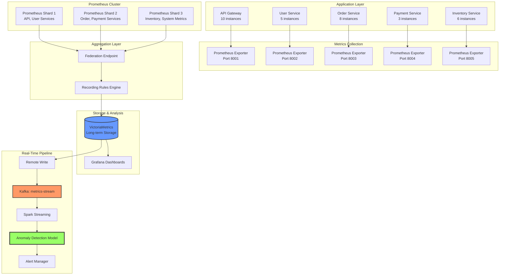

# Day 3 Project: Intelligent Metrics Pipeline for E-Commerce Platform

> **Challenge:** Build a production-ready metrics pipeline that collects, aggregates, and analyzes metrics from a distributed e-commerce platform with real-time anomaly detection.

---

## 🎯 Project Overview

You've been hired by **ShopFast Inc.**, a fast-growing e-commerce platform experiencing:
- **Scale issues:** 10,000+ requests/second across 50+ microservices
- **High cardinality:** Metrics exploding due to per-user, per-product labels
- **Slow dashboards:** Grafana queries taking 30+ seconds
- **Reactive monitoring:** Issues are discovered too late

Your mission: Design and implement an **intelligent metrics pipeline** that:
1. Collects metrics from all services efficiently
2. Reduces cardinality through smart aggregation
3. Detects anomalies in real-time
4. Provides fast, actionable dashboards

---

## 🏗️ System Architecture



---

## 📋 Project Requirements

### Phase 1: Metrics Collection (2 hours)

#### 1.1 Create Service Exporters

Build Prometheus exporters for each service that expose:

**API Gateway Metrics:**
- `shopfast_api_requests_total` (Counter) - Total requests by method, status, endpoint
- `shopfast_api_request_duration_seconds` (Histogram) - Request latency
- `shopfast_api_active_connections` (Gauge) - Current active connections
- `shopfast_api_cache_hits_total` (Counter) - Cache hit rate

**Order Service Metrics:**
- `shopfast_orders_total` (Counter) - Orders by status, payment_method
- `shopfast_order_value_total` (Counter) - Revenue by product_category
- `shopfast_order_processing_duration_seconds` (Histogram) - Processing time
- `shopfast_cart_abandonments_total` (Counter) - Abandoned carts

**Payment Service Metrics:**
- `shopfast_payments_total` (Counter) - Payments by status, gateway
- `shopfast_payment_amount_total` (Counter) - Payment amounts
- `shopfast_payment_failures_total` (Counter) - Failed payments
- `shopfast_payment_gateway_latency_seconds` (Histogram) - Gateway response time

#### 1.2 Simulate High Traffic

Create `traffic_simulator.py` that:
- Generates realistic traffic patterns (peak hours, weekends)
- Simulates anomalies (sudden spikes, error bursts)
- Injects failures (service degradation, timeouts)

```python
# Example structure
class TrafficSimulator:
    def __init__(self):
        self.services = {
            'api-gateway': APIGatewayExporter(port=8001),
            'user-service': UserServiceExporter(port=8002),
            'order-service': OrderServiceExporter(port=8003),
            'payment-service': PaymentServiceExporter(port=8004),
            'inventory-service': InventoryServiceExporter(port=8005)
        }
    
    def simulate_normal_traffic(self):
        # Generate baseline traffic
        pass
    
    def inject_anomaly(self, service, metric, duration):
        # Temporarily modify metric behavior
        pass
```

### Phase 2: Aggregation & Cardinality Reduction (2 hours)

#### 2.1 Design Recording Rules

Create `recording_rules.yml` that:

1. **Pre-computes expensive queries:**
   ```yaml
   - record: shopfast:api:requests:rate5m
     expr: sum(rate(shopfast_api_requests_total[5m])) by (status, endpoint)
   
   - record: shopfast:api:latency:p95
     expr: histogram_quantile(0.95,
           sum(rate(shopfast_api_request_duration_seconds_bucket[5m])) 
           by (endpoint, le))
   ```

2. **Reduces cardinality:**
   ```yaml
   # Drop instance label, aggregate by service only
   - record: shopfast:service:requests:total
     expr: sum(shopfast_api_requests_total) by (service, status)
   ```

3. **Computes business metrics:**
   ```yaml
   - record: shopfast:business:revenue:rate1h
     expr: sum(rate(shopfast_order_value_total[1h])) by (product_category)
   
   - record: shopfast:business:conversion:rate
     expr: |
       sum(rate(shopfast_orders_total{status="completed"}[5m])) 
       / 
       sum(rate(shopfast_api_requests_total{endpoint="/checkout"}[5m]))
   ```

#### 2.2 Implement Federation

Set up Prometheus federation to aggregate metrics from shards:

```yaml
# federated-prometheus.yml
scrape_configs:
  - job_name: 'federate'
    honor_labels: true
    metrics_path: '/federate'
    params:
      'match[]':
        - '{__name__=~"shopfast:.*"}'
        - '{__name__=~"shopfast:service:.*"}'
    static_configs:
      - targets:
        - 'prometheus-shard-1:9090'
        - 'prometheus-shard-2:9090'
        - 'prometheus-shard-3:9090'
```

### Phase 3: Real-Time Anomaly Detection (3 hours)

#### 3.1 Build Streaming Pipeline

Create `anomaly_detector.py` that:

1. **Consumes from Kafka:**
   ```python
   from kafka import KafkaConsumer
   import json
   
   consumer = KafkaConsumer(
       'metrics-stream',
       bootstrap_servers='localhost:9092',
       value_deserializer=lambda m: json.loads(m.decode('utf-8'))
   )
   ```

2. **Implements rolling window statistics:**
   ```python
   class MetricWindow:
       def __init__(self, window_size=300):  # 5 minutes
           self.window = deque(maxlen=window_size)
           self.metric_name = None
       
       def add(self, timestamp, value):
           self.window.append((timestamp, value))
       
       def compute_features(self):
           values = [v for _, v in self.window]
           return {
               'mean': np.mean(values),
               'std': np.std(values),
               'min': np.min(values),
               'max': np.max(values),
               'trend': self._compute_trend(values)
           }
   ```

3. **Detects anomalies using multiple methods:**
   - **Statistical:** Z-score > 3
   - **ML-based:** Isolation Forest
   - **Threshold-based:** Value > 2x historical average

#### 3.2 Train Anomaly Detection Model

Create `train_model.py`:

```python
from sklearn.ensemble import IsolationForest
from sklearn.preprocessing import StandardScaler
import pandas as pd

def train_anomaly_model(historical_data_path):
    # Load historical metrics
    df = pd.read_csv(historical_data_path)
    
    # Feature engineering
    features = ['value', 'rolling_mean', 'rolling_std', 'z_score', 'hour_of_day']
    X = df[features]
    
    # Train model
    model = IsolationForest(contamination=0.05, random_state=42)
    model.fit(X)
    
    # Save model
    joblib.dump(model, 'anomaly_model.pkl')
    return model
```

#### 3.3 Alert Generation

Create `alert_generator.py` that:

1. **Formats alerts:**
   ```python
   def create_alert(anomaly):
       return {
           'labels': {
               'alertname': 'MetricAnomaly',
               'metric': anomaly['metric_name'],
               'severity': anomaly['severity'],
               'service': anomaly['service']
           },
           'annotations': {
               'summary': f"Anomaly in {anomaly['metric_name']}",
               'description': f"Value: {anomaly['value']}, Expected: {anomaly['expected']}"
           },
           'startsAt': anomaly['timestamp']
       }
   ```

2. **Sends to Alertmanager:**
   ```python
   import requests
   
   def send_to_alertmanager(alert):
       url = 'http://alertmanager:9093/api/v1/alerts'
       response = requests.post(url, json=[alert])
       return response.status_code == 200
   ```

### Phase 4: Visualization & Dashboards (1 hour)

#### 4.1 Create Grafana Dashboards

Build dashboards showing:

1. **Service Health Overview:**
   - Request rate by service
   - Error rate by service
   - P95 latency by service
   - Active connections

2. **Business Metrics:**
   - Revenue over time
   - Conversion rate
   - Top product categories
   - Cart abandonment rate

3. **Anomaly Detection:**
   - Anomaly timeline
   - Z-scores visualization
   - Model confidence scores
   - Alert history

---

## 🗂️ Project Structure

```
day-03-metrics/project/
├── README.md
├── docker-compose.yml
├── exporters/
│   ├── api_gateway_exporter.py
│   ├── user_service_exporter.py
│   ├── order_service_exporter.py
│   ├── payment_service_exporter.py
│   └── inventory_service_exporter.py
├── simulators/
│   └── traffic_simulator.py
├── prometheus/
│   ├── prometheus.yml
│   ├── recording_rules.yml
│   └── federated-prometheus.yml
├── pipeline/
│   ├── remote_write_adapter.py
│   ├── anomaly_detector.py
│   ├── train_model.py
│   └── alert_generator.py
├── dashboards/
│   ├── service-health.json
│   ├── business-metrics.json
│   └── anomaly-detection.json
└── requirements.txt
```

---

## ✅ Evaluation Rubric

| Criteria | Points | Description |
|----------|--------|-------------|
| **Exporter Quality** | 20 | All services expose correct metrics with proper types |
| **Cardinality Reduction** | 25 | Recording rules successfully reduce time-series count by >50% |
| **Pipeline Architecture** | 20 | End-to-end pipeline works (Prometheus → Kafka → ML → Alerts) |
| **Anomaly Detection** | 20 | Model correctly identifies anomalies with <5% false positives |
| **Dashboard Quality** | 10 | Dashboards are intuitive and load in <2 seconds |
| **Code Quality** | 5 | Clean, documented, follows best practices |

---

## 🚀 Getting Started

### Prerequisites

```bash
pip install prometheus-client kafka-python scikit-learn pandas numpy flask requests
docker-compose up -d  # Start Kafka, Prometheus, Grafana
```

### Step 1: Start Exporters

```bash
python exporters/api_gateway_exporter.py &
python exporters/user_service_exporter.py &
# ... start all exporters
```

### Step 2: Start Prometheus

```bash
docker run -p 9090:9090 \
  -v $(pwd)/prometheus:/etc/prometheus \
  prom/prometheus:latest
```

### Step 3: Start Traffic Simulator

```bash
python simulators/traffic_simulator.py
```

### Step 4: Start Anomaly Detection Pipeline

```bash
python pipeline/anomaly_detector.py
```

### Step 5: Open Grafana

- Navigate to http://localhost:3000
- Import dashboards from `dashboards/` directory

---

## 🎓 Bonus Challenges

1. **Multi-Region Support:**
   - Extend federation to aggregate metrics from multiple regions
   - Handle timezone differences in aggregation

2. **Adaptive Thresholds:**
   - Learn normal behavior patterns per time-of-day
   - Adjust anomaly thresholds dynamically based on historical data

3. **Root Cause Analysis:**
   - Correlate anomalies across multiple metrics
   - Identify which service is the root cause of issues

4. **Cost Optimization:**
   - Implement metric retention policies
   - Archive old metrics to S3
   - Use downsampling for long-term storage

---

## 📚 Resources

- [Prometheus Best Practices](https://prometheus.io/docs/practices/)
- [VictoriaMetrics Documentation](https://docs.victoriametrics.com/)
- [Isolation Forest Algorithm](https://scikit-learn.org/stable/modules/generated/sklearn.ensemble.IsolationForest.html)
- [Grafana Dashboard Best Practices](https://grafana.com/docs/grafana/latest/dashboards/)

---

<p align="center">
  <a href="../lecture-notes.md">← Back to Lecture Notes</a> | 
  <a href="../exercises/exercise-01-exporter.md">Go to Exercises →</a>
</p>
