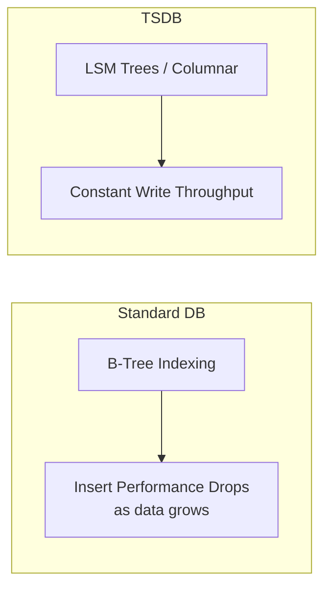
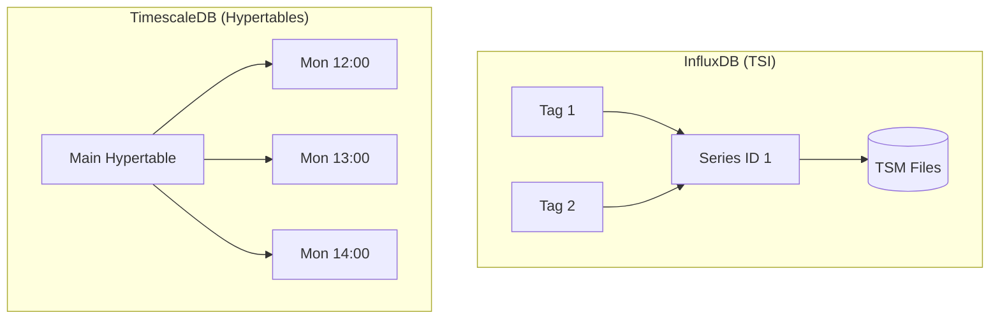

# Week 2 Day 5-6: Time-Series Databases (TSDB) for AIOps

> **Duration:** 16 hours | **Difficulty:** Intermediate-Advanced
> **Theme:** Designing the storage layer for a high-performance observability platform.

---

## 🎯 Learning Objectives

By the end of this module, you will:
1. Master the core architecture of Time-Series Databases (TSDB).
2. Evaluate trade-offs between **NoSQL TSDBs** (InfluxDB) and **Relational TSDBs** (TimescaleDB).
3. Understand high-scale patterns: **Downsampling**, **Retention Policies**, and **Sharding**.
4. Learn the **inverted index** mechanism (TSI) and its impact on cardinality.
5. Deploy and query metrics across multiple distributed backends.

---

## 📖 Lecture Content

### 1. What makes a database "Time-Series"?

In AIOps, we deal with "Timestamped Data." Standard relational databases (PostgreSQL/MySQL) can store this, but they struggle at scale due to B-Tree index bloat.

**Key Components of a TSDB:**
| Component | Function | Why it matters |
|-----------|----------|----------------|
| **Measurement** | The "Table" name | e.g., `cpu_usage` |
| **Tags / Labels** | Indexed metadata | e.g., `host`, `region` |
| **Fields** | The actual values | e.g., `usage_percent` (not indexed) |
| **Timestamp** | The primary key | Always indexed by default |

---

### 2. Architecture Patterns: InfluxDB vs TimescaleDB

There is a major "fork" in the TSDB world: **Native Time-Series** (InfluxDB) vs **Relational Extension** (TimescaleDB).

#### InfluxDB (Native NoSQL)
- **Engine:** TSM (Time-Structured Merge Tree).
- **Indexing:** TSI (Time-Series Index) on disk to handle millions of series.
- **Language:** Flux (Functional) or InfluxQL.
- **Best for:** Native cloud monitoring, IoT, high ingestion rates.

#### TimescaleDB (PostgreSQL Extension)
- **Mechanism:** **Hypertables**. It chunks data into standard PostgreSQL tables automatically.
- **Language:** SQL (full support for joins, CTEs, window functions).
- **Best for:** When you need to join metrics with SQL-based business data (e.g., joins with `customers` table).

---

### 3. Solving the Cardinality Problem (TSI)

Recall from Week 1 Day 2 that **high cardinality** (too many unique tag combinations) kills Prometheus. Multi-tenant TSDBs solve this by moving the index from RAM to Disk.

- **TSI (Time Series Index):** InfluxDB's approach to index high cardinality data on disk, allowing search over billions of series without OOM (Out of Memory) crashes.

---

### 4. Advanced Data Engineering: Downsampling

Storage is expensive. You don't need "1-second resolution" for metrics that are 3 months old.

**The Downsampling Pipeline:**
1. **Raw Data:** 1-second resolution (Kept for 7 days).
2. **Aggregated Data:** 1-minute resolution (Kept for 30 days).
3. **Long-term Data:** 1-hour resolution (Kept for 2 years).

---

### 5. Multi-Tenant Architectures

In AIOps, we often build platforms for "Internal Customers."
- **Isolation:** Tenant A should never see Tenant B's data.
- **Resource Quotas:** Prevent one tenant from flooding the system (e.g., limit to 10k series/tenant).

---

## 🛠️ Performance Tuning Tips

1. **Batch Your Writes:** Never send 1 point per HTTP request. Send batches of 5000+.
2. **Schema Design:** Use Tags for metadata you search by; use Fields for values you aggregate.
3. **Retention Policies:** Set them *before* you fill your disk.

---

## ✅ Deliverables

- [ ] A Docker stack running InfluxDB 2.x and TimescaleDB.
- [ ] A comparison dashboard showing the same data queried via Flux and SQL.
- [ ] A functional Downsampling task in InfluxDB.

---

  <a href="../day-03-04-metrics/">← Day 3-4: Metrics</a> | <a href="cheatsheet.md">Go to Cheat Sheet →</a>

