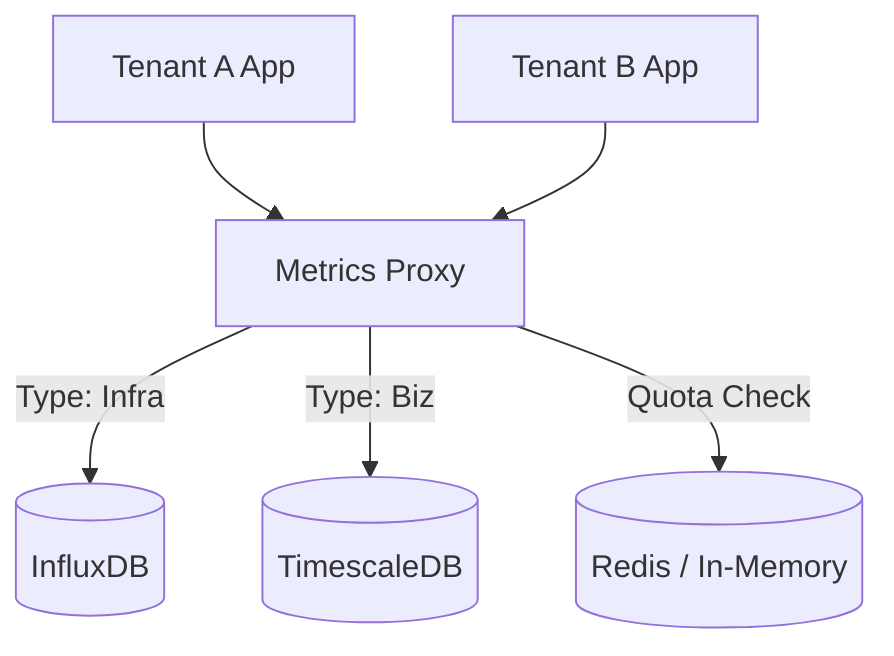

# Day 5-6 Project: Multi-Tenant Metrics Aggregator 🚀

> **Objective:** Build a scalable, multi-tenant ingestion architecture that routes metrics to specialized TSDB backends based on tenant requirements.

---

## 🎯 Project Overview

In a large-scale AIOps environment, you often have different types of data:
1. **Infrastructure Metrics:** High volume, simple structure (Best for **InfluxDB**).
2. **Business/Analytical Metrics:** Lower volume, need complex Joins (Best for **TimescaleDB**).

Your task is to build a **Metrics Proxy** in Python that:
- Receives a JSON payload containing a `tenant_id` and `metric_type`.
- Routes 'infrastructure' metrics to InfluxDB.
- Routes 'business' metrics to TimescaleDB.
- Implements a basic "Storage Quota" to prevent any single tenant from crashing the backends.

---

## 🏗️ Architecture



---

## 📋 Requirements

### 1. Ingestion API (The Proxy)
- Create a FastAPI or Flask-based endpoint `/ingest`.
- Expected Payload:
```json
{
  "tenant_id": "cust_123",
  "metric_type": "infra",
  "measurement": "cpu_load",
  "tags": {"host": "web-01", "region": "us-east"},
  "value": 45.2
}
```

### 2. Intelligent Routing
- If `metric_type == "infra"`, write to InfluxDB measurement specified in the payload.
- If `metric_type == "biz"`, write to a TimescaleDB table.

### 3. Basic Quota Management
- Implement a simple counter: Max 100 metrics per per hour per `tenant_id`.
- If exceeded, return `429 Too Many Requests`.

### 4. Data Engineering Challenge: Downsampling
- Configure an **InfluxDB Task** (using Flux) that automatically downsamples the `infra` metrics from raw to 1-hour averages into a separate bucket named `long_term_storage`.

### 5. Phase 2: Advanced Visualization (The Multi-Tenant View)
- [ ] Create a Grafana Dashboard template that accepts a `$tenant_id` variable.
- [ ] Use **Mixed Data Sources** in one dashboard:
    - Top Row: Infrastructure Health (from InfluxDB).
    - Bottom Row: Business Performance (from TimescaleDB).
- [ ] Use **Data Links** to click on an infrastructure spike and jump to the corresponding business log in Loki (Optional).

### 6. Phase 3: Intelligent Alerting (The "Silent" Outage)
- [ ] Implement an Alerting rule in your proxy:
    - **Logic:** If `biz_revenue` drops by 50% but `infra_cpu` is normal, send a `CRITICAL_SILENT_FAILURE` alert.
    - This simulates a logic bug that infrastructure monitoring would miss.

### 7. Stretch Goal: The Great Migration
- [ ] Write a script to migrate 24 hours of data from InfluxDB to TimescaleDB.
- [ ] Handle the schema mapping: Measurement -> Table, Tags -> Columns.

---

## 🛠️ Implementation Guidance

### Step 1: Initialize Backends
Use the Docker Compose from the exercises to run both InfluxDB and TimescaleDB.

### Step 2: Build the Proxy
Use the `influxdb-client` and `psycopg2` libraries to connect your Python proxy to the backends.

### Step 3: Test with Multi-Tenancy
Write a script that simulates two tenants:
- **Tenant 1 (Good):** Sends 1 metric every 10 seconds.
- **Tenant 2 (Bad):** Sends 50 metrics a second (should trigger the 429 quota).

---

## ✅ Evaluation Rubric

| Criteria | Points |
|----------|--------|
| **Functional:** Routing logic correctly splits data between TSDBs. | 25 |
| **Quota System:** 429 responses are triggered correctly. | 20 |
| **Visualization:** Multi-tenant Grafana dashboard with variables. | 20 |
| **Alerting:** Silent failure logic (Biz vs Infra correlation). | 20 |
| **Optimization:** InfluxDB task correctly performs downsampling. | 10 |
| **Bonus:** Data migration script (Influx -> Timescale). | 10 |

---

## 📤 Submission
Submit your `proxy.py`, your `docker-compose.yml`, and a short video or log file showing the Successful storage in both DBs and the 429 Quota block.
