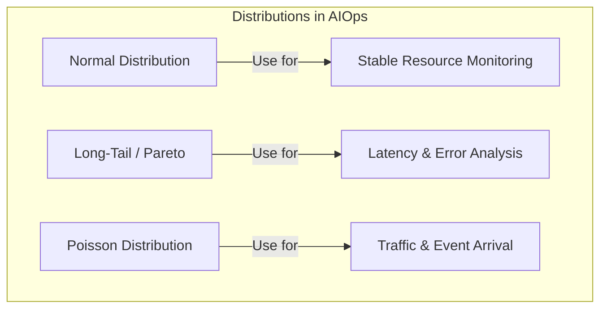

# Week 3 Day 1: Statistical Foundations for AIOps

> **Duration:** 8 hours | **Difficulty:** Intermediate
> **Focus:** Building the mathematical intuition needed to understand system behavior and detect anomalies.

---

## 🎯 Learning Objectives

By the end of this session, you will:
1. Identify common probability distributions in system metrics (CPU, Latency, Requests).
2. Understand why **Mean** is often misleading for SREs and why **Quantiles (P95, P99)** matter.
3. Calculate **Entropy** to identify rare events in log streams.
4. Use **Hypothesis Testing** to validate if a deployment caused a performance regression.

---

## 📖 Lecture Content

### 1. Why Statistics for AIOps?

In the previous weeks, we collected data. In this week, we build models. Models are essentially "Statistical Profiles" of our systems. If you don't understand the distribution of your data, your ML model will be a "Garbage In, Garbage Out" machine.

### 2. Common Distributions in Systems

#### A. The Normal (Gaussian) Distribution
*   **Appearance:** Bell curve.
*   **Ops Example:** CPU usage of a stable, consistent background task.
*   **Why it matters:** Most basic ML algorithms assume normality. If your data isn't normal, you need to transform it.

#### B. The Long-Tail (Pareto) Distribution
*   **Appearance:** A massive peak at low values, with a "long tail" of high values.
*   **Ops Example:** **Latency**. Most requests are fast (50ms), but a few are very slow (5000ms).
*   **Why it matters:** This is where the 80/20 rule lives. 80% of your problems come from 20% of your services (the tail).

#### C. The Poisson Distribution
*   **Appearance:** Discrete events occurring independently in time.
*   **Ops Example:** **Request Rate (QPS)**. How many users visit my site per second.
*   **Why it matters:** Essential for capacity planning and queueing theory.

---

### 3. Descriptive Statistics: Beyond the Mean

> "Never trust the average latency." - Every SRE ever.

If 9 requests take 10ms and 1 request takes 1000ms:
- **Mean:** 109ms (Looks bad, but doesn't tell the whole story)
- **Median (P50):** 10ms (Looks great, hides the failure)
- **P99:** 1000ms (The actual pain point for high-value users)

**Skewness and Kurtosis:**
- **Skewness:** Is the tail on the right (positive) or left (negative)? Most latency is positively skewed.
- **Kurtosis:** How "fat" are the tails? High kurtosis means frequent extreme events (outliers).

---

### 4. Entropy: The Mathematics of Surprise

In AIOps, we want to find the "Surprise". 
- "User logged in" (0 bits of surprise, happens millions of times).
- "Kernel Panic: Memory exhaustion" (High bits of surprise).

**Shannon Entropy** helps us quantify this. If a log message is highly predictable, its entropy is low. If it's rare and unpredictable, its entropy is high. **High Entropy = High Interest for AIOps.**

---

### 5. Hypothesis Testing for Deployments

Did the new version of the app *really* increase latency, or is it just random noise?
- **Null Hypothesis (H0):** There is no difference in latency between v1 and v2.
- **P-Value:** If P-value < 0.05, we reject H0 and say "Yes, v2 caused a regression."

---

## ✅ Deliverables for Today

- [ ] A Jupyter notebook analyzing a latency dataset.
- [ ] Calculation of P50, P90, P99, Skewness, and Kurtosis.
- [ ] A Python script that identifies logs with high entropy.

---

---

  <a href="../README.md">⬅️ Back: Week 3 Overview</a> | <strong>Day 1: ML Stats</strong> | <a href="../day-02-eda/lecture-notes.md">Next: Day 2 ➡️</a>

