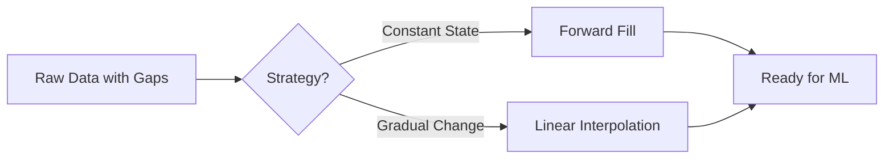
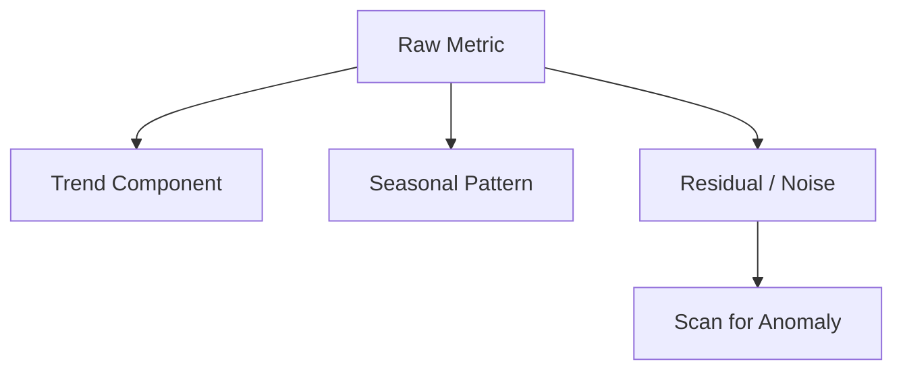

# Week 3 Day 2: Ops EDA & Preprocessing (The Data Alchemist)

> **Duration:** 8 hours | **Difficulty:** Intermediate
> **Focus:** Transforming messy, incomplete, and noisy operational data into high-quality features for ML models.

---

## 🎯 Learning Objectives

By the end of this session, you will:
1. Perform **Exploratory Data Analysis (EDA)** on high-volume metrics and logs.
2. Master **Imputation** strategies for missing time-series data (Forward fill vs Linear interpolation).
3. Implement **Seasonal Decomposition** to separate noise from true anomalies.
4. Scale features using **StandardScaler** and **MinMaxScaler** for model compatibility.
5. Engineer time-based features (Cyclic encoding) to capture system periodicity.

---

## 📖 Lecture Content

### 1. The Reality of Ops Data: It is Messy
In a textbook, data is clean. In AIOps:
-   **Gaps:** Agents go down, creating holes in your metrics.
-   **Noise:** Backup jobs create predictable "spikes" that aren't anomalies.
-   **Scale:** CPU is 0-100, while Latency is 10-10,000. ML models get confused by these different scales.

---

### 2. Time-Series Imputation: Filling the Voids

When a Prometheus scrape fails, you get `NaN` (Not a Number). You can't train a model on `NaN`.

| Strategy | When to use | Pros/Cons |
|----------|-------------|-----------|
| **Drop** | Never (in time-series) | Breaks the continuity of time. |
| **Zero Fill** | Error counts | Accurate for discrete events. |
| **Forward Fill** | Gauge metrics (RAM/Disk) | Assumes last known state is still true. |
| **Interpolation** | Slowly changing metrics | Creates smooth transitions between points. |



---

### 3. Feature Scaling: Leveling the Playing Field

ML models (like KMeans or SVM) use Euclidean distance. If one feature is 1000x larger than another, it will dominate the model.

-   **Standardization (Z-Score):** Centers data at 0 with 1 standard deviation. Best for Gaussian data.
-   **Normalization (Min-Max):** Squishes data into a [0, 1] range. Best when you have strict boundaries.

---

### 4. Handling Periodicity: Cyclic Encoding

System behavior is often cyclical (daily/weekly). But "Hour 23" is mathematically far from "Hour 0", even though they are neighbors in time.

**The Solution: Sin/Cos Transformation**
We map hours onto a circle so that midnight is close to 11 PM.

```python
df['hour_sin'] = np.sin(2 * np.pi * df['hour']/24)
df['hour_cos'] = np.cos(2 * np.pi * df['hour']/24)
```

---

### 5. Seasonal Decomposition (STL)

A spike in traffic at 9 AM on Monday is **Normal**. A spike in traffic at 3 AM on Sunday is **Suspect**.

We decompose metrics into:
1.  **Trend:** The long-term direction.
2.  **Seasonality:** The repeating pattern (Daily/Weekly).
3.  **Residue (Noise):** What's left over. **This is where the anomalies hide.**



---

## ✅ Deliverables for Today

- [ ] A Jupyter notebook showing the "Before and After" of a cleaned dataset.
- [ ] Evidence of multi-variate correlation analysis (Heatmaps).
- [ ] A function that encodes "Day of Week" and "Hour" into cyclic features.

---

<p align="center">
  <a href="../THE-ORACLE-QUEST.md">← The Oracle's Quest</a> | <a href="cheatsheet.md">Go to Cheat Sheet →</a>
</p>
