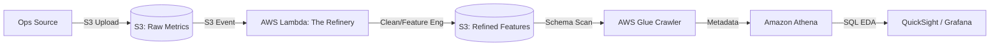

# AWS E2E Solution: The Serverless Data Refinery ☁️

> **Concept:** An automated, serverless pipeline that cleans, transforms, and enriches operational data as it lands in the cloud.

---

## 🏗️ Architecture



---

## 🛠️ Components

### 1. Ingestion Layer (Amazon S3)
- **Bucket `aiops-raw-data-bucket`**: Stores the raw CSV/JSON metrics from your Prometheus/Loki exporters.

### 2. Processing Layer (AWS Lambda)
- **The Refinery Logic**: A Python 3.10+ Lambda function using a custom Layer (containing `pandas`, `numpy`, and `scikit-learn`).
- **Functionality**:
    - Triggers on `s3:ObjectCreated:*`.
    - Handles missing values via linear interpolation.
    - Scales features using `StandardScaler`.
    - Generates cyclic time features (sin/cos).

### 3. Analytics Layer (AWS Glue & Athena)
- **Glue Crawler**: Automatically infers the schema of the processed files.
- **Athena**: Allows you to run SQL-based EDA (e.g., "Find correlation between CPU and Latency") without managing any servers.

---

## 💻 Implementation: The Refinery Lambda

Create `lambda_function/refinery_lambda.py`:

```python
import pandas as pd
import numpy as np
import boto3
import io
import os
from sklearn.preprocessing import StandardScaler

s3_client = boto3.client('s3')

def lambda_handler(event, context):
    # 1. Get object details
    source_bucket = event['Records'][0]['s3']['bucket']['name']
    key = event['Records'][0]['s3']['object']['key']
    dest_bucket = os.environ['DEST_BUCKET']
    
    # 2. Read from S3
    response = s3_client.get_object(Bucket=source_bucket, Key=key)
    df = pd.read_csv(io.BytesIO(response['Body'].read()))
    
    # --- START REFINERY LOGIC (WEEK 3 DAY 2) ---
    
    # 3. Handle Missing Values
    df.interpolate(method='linear', inplace=True)
    df.fillna(method='ffill', inplace=True) # Catch edges
    
    # 4. Feature Scaling
    scaler = StandardScaler()
    numeric_cols = df.select_dtypes(include=[np.number]).columns
    df[numeric_cols] = scaler.fit_transform(df[numeric_cols])
    
    # 5. Cyclic Feature Engineering
    df['timestamp'] = pd.to_datetime(df['timestamp'])
    df['hour_sin'] = np.sin(2 * np.pi * df['timestamp'].dt.hour / 24)
    df['hour_cos'] = np.cos(2 * np.pi * df['timestamp'].dt.hour / 24)
    
    # --- END REFINERY LOGIC ---
    
    # 6. Upload back to S3
    output_buffer = io.StringIO()
    df.to_csv(output_buffer, index=False)
    
    s3_client.put_object(
        Bucket=dest_bucket,
        Key=f"processed/{key}",
        Body=output_buffer.getvalue()
    )
    
    return {"status": "success", "processed_key": key}
```

---

## 📜 Infrastructure as Code (Terraform Snippet)

Create `infrastructure/main.tf`:

```hcl
resource "aws_s3_bucket" "raw" {
  bucket = "aiops-raw-data-${var.unique_id}"
}

resource "aws_s3_bucket" "processed" {
  bucket = "aiops-refined-data-${var.unique_id}"
}

resource "aws_lambda_function" "refinery" {
  filename      = "lambda_payload.zip"
  function_name = "ops_data_refinery"
  role          = aws_iam_role.lambda_exec.arn
  handler       = "refinery_lambda.lambda_handler"
  runtime       = "python3.10"
  
  environment {
    variables = {
      DEST_BUCKET = aws_s3_bucket.processed.id
    }
  }

  layers = ["arn:aws:lambda:us-east-1:770693421928:layer:Klayers-p310-pandas:6"]
}

# Configuration for S3 Trigger
resource "aws_s3_bucket_notification" "bucket_notification" {
  bucket = aws_s3_bucket.raw.id

  lambda_function {
    lambda_function_arn = aws_lambda_function.refinery.arn
    events              = ["s3:ObjectCreated:*"]
  }
}
```

---

## 🧪 Validation & EDA (Athena)

Once data is processed, run this in the Athena console:

```sql
-- Calculate correlation baseline
SELECT 
  CORR(cpu_usage, latency_ms) as system_correlation,
  AVG(latency_ms) as avg_latency
FROM "aiops_db"."refined_data"
GROUP BY hour_sin, hour_cos;
```

---

## ✅ Deliverable
Submit a zip folder containing your `refinery_lambda.py`, `main.tf`, and a screenshot of the Athena query result showing successfully refined metrics with sin/cos features.
