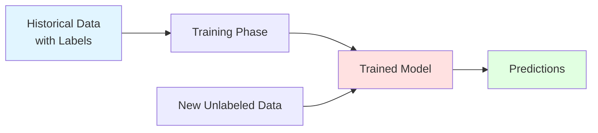
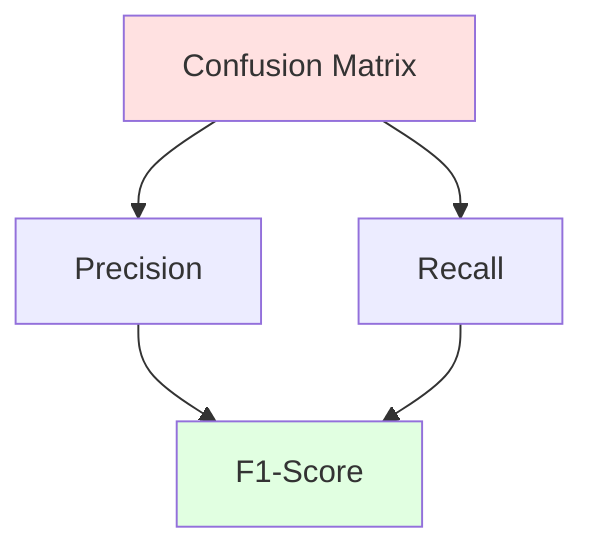
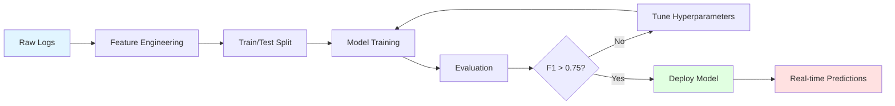

# Week 3 Day 3: Supervised Learning for AIOps

> **Duration:** 8 hours | **Difficulty:** Intermediate  
> **Focus:** Building predictive models for incident classification and failure prediction.

---

## 🎯 Learning Objectives

By the end of this day, you will be able to:

1. **Understand** the fundamental difference between supervised and unsupervised learning
2. **Build** classification models to predict incident severity (CRITICAL, WARNING, NORMAL)
3. **Evaluate** models using precision, recall, F1-score, and confusion matrices
4. **Handle** imbalanced datasets common in AIOps (99% normal, 1% failures)
5. **Deploy** a trained model to predict failures in real-time log streams

---

## 📚 Part 1: The Supervised Learning Paradigm

### What is Supervised Learning?

**Supervised Learning** is like learning with a teacher. You have:
- **Input Features (X)**: Server metrics, log patterns, timestamps
- **Labels (y)**: Known outcomes (NORMAL, WARNING, CRITICAL)

The model learns the mapping: `f(X) → y`



### The AIOps Use Case

**Problem:** Your infrastructure generates millions of log events daily. Only 0.1% are critical failures. Can you predict failures before they cascade?

**Traditional Approach:**
- Manual rule-based alerts: `if error_count > 100 then alert`
- High false positives, missed edge cases

**ML Approach:**
- Learn patterns from historical incidents
- Predict: "This pattern looks like the crash we saw last month"

---

## 🔬 Part 2: Classification Algorithms

### 2.1 Logistic Regression (The Foundation)

**When to use:** Binary classification, interpretable results needed.

```python
from sklearn.linear_model import LogisticRegression
from sklearn.preprocessing import StandardScaler

# Feature: [cpu_usage, memory_usage, error_rate]
X_train = [[0.8, 0.6, 0.05], [0.3, 0.4, 0.01], ...]
y_train = [1, 0, ...]  # 1=CRITICAL, 0=NORMAL

# Scale features (important for logistic regression!)
scaler = StandardScaler()
X_train_scaled = scaler.fit_transform(X_train)

# Train
model = LogisticRegression(class_weight='balanced')  # Handle imbalance
model.fit(X_train_scaled, y_train)

# Predict
X_new = [[0.9, 0.85, 0.12]]
X_new_scaled = scaler.transform(X_new)
prediction = model.predict(X_new_scaled)
probability = model.predict_proba(X_new_scaled)

print(f"Prediction: {prediction[0]}")  # 1 (CRITICAL)
print(f"Confidence: {probability[0][1]:.2%}")  # 87%
```

**Why it works for AIOps:**
- Fast inference (< 1ms)
- Interpretable coefficients: "High CPU + High error rate → 85% chance of failure"

---

### 2.2 Random Forest (The Workhorse)

**When to use:** Non-linear patterns, feature importance needed.

```python
from sklearn.ensemble import RandomForestClassifier

# Same data as above
model = RandomForestClassifier(
    n_estimators=100,      # 100 decision trees
    max_depth=10,          # Prevent overfitting
    class_weight='balanced',
    random_state=42
)

model.fit(X_train, y_train)

# Feature importance
feature_names = ['cpu_usage', 'memory_usage', 'error_rate']
importances = model.feature_importances_

for name, importance in zip(feature_names, importances):
    print(f"{name}: {importance:.2%}")
```

**Output:**
```
error_rate: 52%
cpu_usage: 31%
memory_usage: 17%
```

**Insight:** Error rate is the strongest predictor!

---

### 2.3 Gradient Boosting (XGBoost) - The Champion

**When to use:** Maximum accuracy needed, willing to trade interpretability.

```python
import xgboost as xgb

# Convert to DMatrix (XGBoost's optimized format)
dtrain = xgb.DMatrix(X_train, label=y_train)

# Train
params = {
    'objective': 'binary:logistic',
    'max_depth': 6,
    'eta': 0.1,  # Learning rate
    'scale_pos_weight': 99  # 99:1 imbalance ratio
}

model = xgb.train(params, dtrain, num_boost_round=100)

# Predict
dtest = xgb.DMatrix(X_new)
prediction = model.predict(dtest)
print(f"Failure probability: {prediction[0]:.2%}")
```

**Why XGBoost dominates AIOps competitions:**
- Handles missing data (common in logs)
- Built-in regularization prevents overfitting
- GPU acceleration for large datasets

---

## 📊 Part 3: Evaluation Metrics (The Critical Part!)

### The Accuracy Trap

**Scenario:** You have 10,000 logs. 9,900 are NORMAL, 100 are CRITICAL.

**Naive Model:** Always predict NORMAL.
- **Accuracy:** 99% ✅
- **Usefulness:** 0% ❌ (Missed all failures!)

### The Right Metrics



#### Confusion Matrix

|                | Predicted NORMAL | Predicted CRITICAL |
|----------------|------------------|--------------------|
| **Actual NORMAL** | TN = 9,850       | FP = 50            |
| **Actual CRITICAL** | FN = 10          | TP = 90            |

#### Metrics Explained

**Precision:** Of all predicted failures, how many were real?
```
Precision = TP / (TP + FP) = 90 / (90 + 50) = 64%
```
**Interpretation:** 64% of alerts are real (36% false alarms).

**Recall (Sensitivity):** Of all real failures, how many did we catch?
```
Recall = TP / (TP + FN) = 90 / (90 + 10) = 90%
```
**Interpretation:** We caught 90% of failures (missed 10%).

**F1-Score:** Harmonic mean of precision and recall.
```
F1 = 2 * (Precision * Recall) / (Precision + Recall) = 75%
```

#### The AIOps Trade-off

```python
from sklearn.metrics import classification_report, confusion_matrix

y_true = [0, 0, 1, 1, 0, 1, ...]
y_pred = [0, 0, 1, 0, 0, 1, ...]

print(classification_report(y_true, y_pred, target_names=['NORMAL', 'CRITICAL']))
```

**Output:**
```
              precision    recall  f1-score   support

      NORMAL       0.99      0.95      0.97      9900
    CRITICAL       0.64      0.90      0.75       100

    accuracy                           0.95     10000
   macro avg       0.82      0.93      0.86     10000
weighted avg       0.96      0.95      0.95     10000
```

**Decision:** In AIOps, **high recall** is critical (can't miss failures). Accept some false positives.

---

## ⚖️ Part 4: Handling Imbalanced Data

### Techniques

#### 4.1 Class Weighting (Easiest)

```python
# Tell the model: "Treat 1 CRITICAL sample as important as 99 NORMAL samples"
model = RandomForestClassifier(class_weight='balanced')
```

#### 4.2 SMOTE (Synthetic Minority Over-sampling)

```python
from imblearn.over_sampling import SMOTE

smote = SMOTE(sampling_strategy=0.1)  # Make minority class 10% of majority
X_resampled, y_resampled = smote.fit_resample(X_train, y_train)

print(f"Original: {len(y_train)} samples")
print(f"After SMOTE: {len(y_resampled)} samples")
```

#### 4.3 Threshold Tuning

```python
# Default threshold: 0.5
# For high recall, lower it to 0.3

probabilities = model.predict_proba(X_test)[:, 1]
predictions = (probabilities > 0.3).astype(int)  # More sensitive
```

---

## 🛠️ Part 5: Feature Engineering for Logs

### Raw Log
```json
{
  "timestamp": "2026-01-20T22:15:30Z",
  "level": "ERROR",
  "message": "Database connection timeout after 30s",
  "service": "api-gateway"
}
```

### Engineered Features

```python
import pandas as pd
from datetime import datetime

def engineer_features(log_df):
    # Time-based features
    log_df['hour'] = pd.to_datetime(log_df['timestamp']).dt.hour
    log_df['is_night'] = (log_df['hour'] >= 22) | (log_df['hour'] <= 6)
    
    # Categorical encoding
    log_df['level_encoded'] = log_df['level'].map({
        'DEBUG': 0, 'INFO': 1, 'WARNING': 2, 'ERROR': 3, 'CRITICAL': 4
    })
    
    # Text features
    log_df['message_length'] = log_df['message'].str.len()
    log_df['has_timeout'] = log_df['message'].str.contains('timeout').astype(int)
    
    # Aggregated features (rolling window)
    log_df['error_rate_5min'] = log_df.groupby('service')['level_encoded'].rolling(
        window='5min', on='timestamp'
    ).mean().reset_index(0, drop=True)
    
    return log_df
```

**Result:** Transform 4 raw fields into 7+ ML-ready features.

---

## 🚀 Part 6: End-to-End Pipeline



### Complete Code Example

```python
import pandas as pd
from sklearn.model_selection import train_test_split
from sklearn.ensemble import RandomForestClassifier
from sklearn.metrics import classification_report
import joblib

# 1. Load data
df = pd.read_csv('incident_logs.csv')

# 2. Feature engineering
df = engineer_features(df)

# 3. Prepare features and labels
feature_cols = ['hour', 'is_night', 'level_encoded', 'message_length', 
                'has_timeout', 'error_rate_5min']
X = df[feature_cols]
y = df['is_critical']  # 1 if CRITICAL, 0 otherwise

# 4. Split
X_train, X_test, y_train, y_test = train_test_split(
    X, y, test_size=0.2, stratify=y, random_state=42
)

# 5. Train
model = RandomForestClassifier(
    n_estimators=200,
    max_depth=15,
    class_weight='balanced',
    random_state=42
)
model.fit(X_train, y_train)

# 6. Evaluate
y_pred = model.predict(X_test)
print(classification_report(y_test, y_pred))

# 7. Save model
joblib.dump(model, 'failure_predictor.pkl')
```

---

## 🎯 Real-World Considerations

### 1. Concept Drift
**Problem:** Your model was trained on data from Q1. In Q3, you deploy a new microservice. Model accuracy drops.

**Solution:**
- Monitor model performance in production
- Retrain monthly with fresh data
- Use online learning algorithms (e.g., SGDClassifier)

### 2. Latency Requirements
**Problem:** You need predictions in < 10ms for real-time alerting.

**Solutions:**
- Use lightweight models (Logistic Regression, small Random Forests)
- Precompute features where possible
- Deploy on GPU for XGBoost

### 3. Explainability
**Problem:** Your model predicts a failure, but the on-call engineer asks "Why?"

**Solution:** Use SHAP values
```python
import shap

explainer = shap.TreeExplainer(model)
shap_values = explainer.shap_values(X_test.iloc[0])

shap.force_plot(explainer.expected_value[1], shap_values[1], X_test.iloc[0])
```

**Output:** "This prediction is driven by `error_rate_5min=0.85` (+0.3) and `has_timeout=1` (+0.2)"

---

## 📝 Summary

| Algorithm | Speed | Accuracy | Interpretability | Best For |
|-----------|-------|----------|------------------|----------|
| Logistic Regression | ⚡⚡⚡ | ⭐⭐ | ⭐⭐⭐ | Simple patterns, fast inference |
| Random Forest | ⚡⚡ | ⭐⭐⭐ | ⭐⭐ | Non-linear patterns, feature importance |
| XGBoost | ⚡ | ⭐⭐⭐⭐ | ⭐ | Maximum accuracy, competitions |

**Key Takeaways:**
1. **Never use accuracy** for imbalanced datasets (use F1-score, recall)
2. **Feature engineering** is 80% of the work
3. **Start simple** (Logistic Regression), then iterate
4. **Monitor in production** - models decay over time

---

## 🔗 Next Steps

- **Hands-on:** Complete [Exercise 01: Build Your First Classifier](exercises/exercise-01-classifier.md)
- **Project:** [Real-time Incident Predictor](project/README.md)
- **Tomorrow:** Day 4 - Unsupervised Learning (when you DON'T have labels!)

---

## 📚 Further Reading

- [Scikit-learn Classification Guide](https://scikit-learn.org/stable/supervised_learning.html)
- [Handling Imbalanced Data](https://imbalanced-learn.org/)
- [XGBoost Documentation](https://xgboost.readthedocs.io/)
- [Google's Rules of ML](https://developers.google.com/machine-learning/guides/rules-of-ml)
