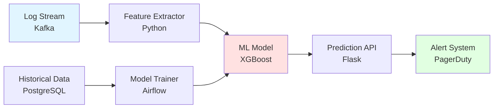

# Day 3 Project: Real-Time Incident Prediction System

> **Challenge:** Build an end-to-end ML pipeline that ingests live log streams, extracts features, and predicts incidents in real-time with < 100ms latency.

---

## 🎯 Project Overview

### The Business Problem

Your company runs a microservices platform with 50+ services. When a service starts failing, it often cascades to dependent services within minutes. **Your mission:** Predict failures 5 minutes before they happen, giving engineers time to intervene.

### Success Criteria

1. **Accuracy:** F1-score > 0.75 for CRITICAL incidents
2. **Latency:** Prediction latency < 100ms (p95)
3. **Explainability:** Provide top 3 contributing factors for each prediction
4. **Deployment:** Dockerized API ready for production

---

## 🏗️ System Architecture



---

## 📂 Project Structure

```
incident-predictor/
├── data/
│   ├── raw/                    # Raw log files
│   ├── processed/              # Engineered features
│   └── models/                 # Trained models
├── src/
│   ├── feature_engineering.py  # Feature extraction
│   ├── train.py                # Model training
│   ├── predict.py              # Inference
│   └── api.py                  # Flask API
├── notebooks/
│   └── exploration.ipynb       # Data exploration
├── tests/
│   └── test_model.py           # Unit tests
├── docker/
│   └── Dockerfile
├── requirements.txt
└── README.md
```

---

## 🛠️ Part 1: Data Generation

Since you don't have real production logs yet, we'll simulate them.

### `data/generate_logs.py`

```python
import pandas as pd
import numpy as np
from datetime import datetime, timedelta

np.random.seed(42)

def generate_incident_logs(n_samples=10000, incident_rate=0.02):
    """
    Generate synthetic log data with realistic patterns.
    """
    timestamps = [datetime.now() - timedelta(minutes=i) for i in range(n_samples)]
    
    # Normal operation baseline
    cpu = np.random.beta(2, 5, n_samples) * 100  # Skewed toward lower values
    memory = np.random.beta(3, 3, n_samples) * 100
    error_rate = np.random.poisson(2, n_samples)
    response_time = np.random.gamma(2, 50, n_samples)
    
    # Determine incidents (2% of samples)
    is_incident = np.random.choice([0, 1], n_samples, p=[1-incident_rate, incident_rate])
    
    # Incidents have different patterns
    incident_mask = is_incident == 1
    cpu[incident_mask] += np.random.uniform(20, 40, incident_mask.sum())  # Higher CPU
    memory[incident_mask] += np.random.uniform(15, 30, incident_mask.sum())
    error_rate[incident_mask] += np.random.poisson(20, incident_mask.sum())  # More errors
    response_time[incident_mask] *= np.random.uniform(2, 5, incident_mask.sum())  # Slower
    
    # Clip to realistic ranges
    cpu = np.clip(cpu, 0, 100)
    memory = np.clip(memory, 0, 100)
    
    df = pd.DataFrame({
        'timestamp': timestamps,
        'cpu_usage': cpu,
        'memory_usage': memory,
        'error_rate': error_rate,
        'response_time_ms': response_time,
        'is_incident': is_incident
    })
    
    return df

# Generate and save
df = generate_incident_logs(n_samples=20000, incident_rate=0.015)
df.to_csv('data/raw/incident_logs.csv', index=False)
print(f"Generated {len(df)} samples with {df['is_incident'].sum()} incidents")
```

**Run it:**
```bash
python data/generate_logs.py
```

---

## 🛠️ Part 2: Feature Engineering

### `src/feature_engineering.py`

```python
import pandas as pd
import numpy as np

class FeatureEngineer:
    """
    Extract ML-ready features from raw logs.
    """
    
    def __init__(self):
        self.feature_names = []
    
    def transform(self, df):
        """
        Transform raw logs into features.
        
        Args:
            df: DataFrame with columns [timestamp, cpu_usage, memory_usage, error_rate, response_time_ms]
        
        Returns:
            DataFrame with engineered features
        """
        df = df.copy()
        df['timestamp'] = pd.to_datetime(df['timestamp'])
        df = df.sort_values('timestamp').reset_index(drop=True)
        
        # Time-based features
        df['hour'] = df['timestamp'].dt.hour
        df['day_of_week'] = df['timestamp'].dt.dayofweek
        df['is_weekend'] = (df['day_of_week'] >= 5).astype(int)
        df['is_night'] = ((df['hour'] >= 22) | (df['hour'] <= 6)).astype(int)
        
        # Rolling window features (last 5 minutes = 5 samples if 1 sample/min)
        window = 5
        df['cpu_mean_5min'] = df['cpu_usage'].rolling(window, min_periods=1).mean()
        df['cpu_max_5min'] = df['cpu_usage'].rolling(window, min_periods=1).max()
        df['cpu_std_5min'] = df['cpu_usage'].rolling(window, min_periods=1).std().fillna(0)
        
        df['memory_mean_5min'] = df['memory_usage'].rolling(window, min_periods=1).mean()
        df['error_sum_5min'] = df['error_rate'].rolling(window, min_periods=1).sum()
        df['response_time_p95_5min'] = df['response_time_ms'].rolling(window, min_periods=1).quantile(0.95)
        
        # Rate of change
        df['cpu_delta'] = df['cpu_usage'].diff().fillna(0)
        df['memory_delta'] = df['memory_usage'].diff().fillna(0)
        
        # Interaction features
        df['cpu_memory_product'] = df['cpu_usage'] * df['memory_usage']
        df['error_per_request'] = df['error_rate'] / (df['response_time_ms'] + 1)
        
        # Lag features (previous values)
        df['cpu_lag1'] = df['cpu_usage'].shift(1).fillna(df['cpu_usage'])
        df['error_lag1'] = df['error_rate'].shift(1).fillna(df['error_rate'])
        
        self.feature_names = [
            'cpu_usage', 'memory_usage', 'error_rate', 'response_time_ms',
            'hour', 'day_of_week', 'is_weekend', 'is_night',
            'cpu_mean_5min', 'cpu_max_5min', 'cpu_std_5min',
            'memory_mean_5min', 'error_sum_5min', 'response_time_p95_5min',
            'cpu_delta', 'memory_delta',
            'cpu_memory_product', 'error_per_request',
            'cpu_lag1', 'error_lag1'
        ]
        
        return df[self.feature_names]

# Test
if __name__ == '__main__':
    df = pd.read_csv('data/raw/incident_logs.csv')
    fe = FeatureEngineer()
    X = fe.transform(df)
    print(f"Engineered {len(fe.feature_names)} features:")
    print(X.head())
```

---

## 🛠️ Part 3: Model Training

### `src/train.py`

```python
import pandas as pd
import numpy as np
import xgboost as xgb
from sklearn.model_selection import train_test_split, cross_val_score
from sklearn.metrics import classification_report, confusion_matrix, f1_score
from sklearn.utils.class_weight import compute_sample_weight
import joblib
import json
from datetime import datetime

from feature_engineering import FeatureEngineer

def train_model(data_path='data/raw/incident_logs.csv', output_dir='data/models'):
    """
    Train incident prediction model.
    """
    print("Loading data...")
    df = pd.read_csv(data_path)
    
    # Feature engineering
    print("Engineering features...")
    fe = FeatureEngineer()
    X = fe.transform(df)
    y = df['is_incident']
    
    print(f"Dataset: {len(X)} samples, {y.sum()} incidents ({y.mean():.2%})")
    
    # Split
    X_train, X_test, y_train, y_test = train_test_split(
        X, y, test_size=0.2, stratify=y, random_state=42
    )
    
    # Compute sample weights
    sample_weights = compute_sample_weight('balanced', y_train)
    
    # Train XGBoost
    print("Training XGBoost...")
    model = xgb.XGBClassifier(
        n_estimators=200,
        max_depth=8,
        learning_rate=0.1,
        subsample=0.8,
        colsample_bytree=0.8,
        objective='binary:logistic',
        eval_metric='aucpr',  # Area under precision-recall curve
        random_state=42,
        n_jobs=-1
    )
    
    model.fit(
        X_train, y_train,
        sample_weight=sample_weights,
        eval_set=[(X_test, y_test)],
        verbose=False
    )
    
    # Evaluate
    print("\nEvaluating...")
    y_pred = model.predict(X_test)
    y_proba = model.predict_proba(X_test)[:, 1]
    
    print(classification_report(y_test, y_pred, target_names=['NORMAL', 'INCIDENT']))
    print("\nConfusion Matrix:")
    print(confusion_matrix(y_test, y_pred))
    
    # Cross-validation
    cv_scores = cross_val_score(model, X, y, cv=5, scoring='f1')
    print(f"\nCross-validation F1: {cv_scores.mean():.3f} (+/- {cv_scores.std():.3f})")
    
    # Feature importance
    feature_importance = pd.DataFrame({
        'feature': fe.feature_names,
        'importance': model.feature_importances_
    }).sort_values('importance', ascending=False)
    
    print("\nTop 10 Features:")
    print(feature_importance.head(10))
    
    # Save model
    print(f"\nSaving model to {output_dir}/")
    joblib.dump(model, f'{output_dir}/model.pkl')
    joblib.dump(fe, f'{output_dir}/feature_engineer.pkl')
    
    # Save metadata
    metadata = {
        'trained_at': datetime.now().isoformat(),
        'n_samples': len(X),
        'n_incidents': int(y.sum()),
        'test_f1': float(f1_score(y_test, y_pred)),
        'cv_f1_mean': float(cv_scores.mean()),
        'cv_f1_std': float(cv_scores.std()),
        'feature_names': fe.feature_names,
        'top_features': feature_importance.head(10).to_dict('records')
    }
    
    with open(f'{output_dir}/metadata.json', 'w') as f:
        json.dump(metadata, f, indent=2)
    
    print("Training complete!")
    return model, fe, metadata

if __name__ == '__main__':
    train_model()
```

**Run it:**
```bash
python src/train.py
```

---

## 🛠️ Part 4: Real-Time Prediction API

### `src/api.py`

```python
from flask import Flask, request, jsonify
import joblib
import pandas as pd
import numpy as np
import time

app = Flask(__name__)

# Load model and feature engineer
model = joblib.load('data/models/model.pkl')
feature_engineer = joblib.load('data/models/feature_engineer.pkl')

@app.route('/health', methods=['GET'])
def health():
    """Health check endpoint."""
    return jsonify({'status': 'healthy', 'model_loaded': model is not None})

@app.route('/predict', methods=['POST'])
def predict():
    """
    Predict incident probability.
    
    Request body:
    {
        "timestamp": "2026-01-20T14:30:00",
        "cpu_usage": 85.5,
        "memory_usage": 72.3,
        "error_rate": 15,
        "response_time_ms": 450
    }
    
    Response:
    {
        "prediction": "INCIDENT",
        "probability": 0.87,
        "confidence": "HIGH",
        "top_factors": [
            {"feature": "error_sum_5min", "contribution": 0.35},
            {"feature": "cpu_usage", "contribution": 0.28},
            {"feature": "response_time_ms", "contribution": 0.15}
        ],
        "latency_ms": 12
    }
    """
    start_time = time.time()
    
    try:
        # Parse request
        data = request.json
        
        # Create DataFrame (feature engineer expects this format)
        df = pd.DataFrame([data])
        
        # Engineer features
        X = feature_engineer.transform(df)
        
        # Predict
        prediction = model.predict(X)[0]
        probability = model.predict_proba(X)[0, 1]
        
        # Get feature contributions (SHAP-like, simplified)
        feature_values = X.iloc[0].values
        feature_importances = model.feature_importances_
        contributions = feature_values * feature_importances
        
        top_factors = sorted(
            [
                {'feature': name, 'contribution': float(contrib)}
                for name, contrib in zip(feature_engineer.feature_names, contributions)
            ],
            key=lambda x: abs(x['contribution']),
            reverse=True
        )[:3]
        
        # Determine confidence
        if probability > 0.8:
            confidence = 'HIGH'
        elif probability > 0.5:
            confidence = 'MEDIUM'
        else:
            confidence = 'LOW'
        
        latency_ms = (time.time() - start_time) * 1000
        
        return jsonify({
            'prediction': 'INCIDENT' if prediction == 1 else 'NORMAL',
            'probability': round(probability, 3),
            'confidence': confidence,
            'top_factors': top_factors,
            'latency_ms': round(latency_ms, 2)
        })
    
    except Exception as e:
        return jsonify({'error': str(e)}), 400

@app.route('/batch_predict', methods=['POST'])
def batch_predict():
    """
    Batch prediction for multiple events.
    
    Request body:
    {
        "events": [
            {"timestamp": "...", "cpu_usage": 85.5, ...},
            {"timestamp": "...", "cpu_usage": 45.2, ...}
        ]
    }
    """
    start_time = time.time()
    
    try:
        events = request.json['events']
        df = pd.DataFrame(events)
        
        X = feature_engineer.transform(df)
        predictions = model.predict(X)
        probabilities = model.predict_proba(X)[:, 1]
        
        results = [
            {
                'prediction': 'INCIDENT' if pred == 1 else 'NORMAL',
                'probability': round(prob, 3)
            }
            for pred, prob in zip(predictions, probabilities)
        ]
        
        latency_ms = (time.time() - start_time) * 1000
        
        return jsonify({
            'results': results,
            'count': len(results),
            'latency_ms': round(latency_ms, 2)
        })
    
    except Exception as e:
        return jsonify({'error': str(e)}), 400

if __name__ == '__main__':
    app.run(debug=True, host='0.0.0.0', port=5000)
```

**Run it:**
```bash
python src/api.py
```

**Test it:**
```bash
curl -X POST http://localhost:5000/predict \
  -H "Content-Type: application/json" \
  -d '{
    "timestamp": "2026-01-20T14:30:00",
    "cpu_usage": 92.5,
    "memory_usage": 88.3,
    "error_rate": 25,
    "response_time_ms": 650
  }'
```

---

## 🛠️ Part 5: Dockerization

### `Dockerfile`

```dockerfile
FROM python:3.10-slim

WORKDIR /app

# Install dependencies
COPY requirements.txt .
RUN pip install --no-cache-dir -r requirements.txt

# Copy application
COPY src/ ./src/
COPY data/models/ ./data/models/

# Expose port
EXPOSE 5000

# Run API
CMD ["python", "src/api.py"]
```

### `requirements.txt`

```
flask==2.3.0
pandas==2.0.0
numpy==1.24.0
scikit-learn==1.3.0
xgboost==2.0.0
joblib==1.3.0
```

**Build and run:**
```bash
docker build -t incident-predictor .
docker run -p 5000:5000 incident-predictor
```

---

## 🎯 Challenges

### Challenge 1: Improve F1-Score
**Goal:** Achieve F1 > 0.80 for incidents.

**Ideas:**
- Add more rolling window features (10min, 30min)
- Try ensemble methods (voting classifier)
- Experiment with SMOTE

---

### Challenge 2: Reduce Latency
**Goal:** p95 latency < 50ms.

**Ideas:**
- Use a smaller model (reduce `n_estimators`)
- Cache feature engineering results
- Use ONNX for faster inference

---

### Challenge 3: Add Explainability
**Goal:** Integrate SHAP for real explanations.

```python
import shap

explainer = shap.TreeExplainer(model)

@app.route('/explain', methods=['POST'])
def explain():
    data = request.json
    df = pd.DataFrame([data])
    X = feature_engineer.transform(df)
    
    shap_values = explainer.shap_values(X)
    
    explanations = [
        {'feature': name, 'shap_value': float(val)}
        for name, val in zip(feature_engineer.feature_names, shap_values[0])
    ]
    
    return jsonify({'explanations': sorted(explanations, key=lambda x: abs(x['shap_value']), reverse=True)[:5]})
```

---

### Challenge 4: Deploy to Kubernetes
**Goal:** Create a Kubernetes deployment with auto-scaling.

`k8s/deployment.yaml`:
```yaml
apiVersion: apps/v1
kind: Deployment
metadata:
  name: incident-predictor
spec:
  replicas: 3
  selector:
    matchLabels:
      app: incident-predictor
  template:
    metadata:
      labels:
        app: incident-predictor
    spec:
      containers:
      - name: api
        image: incident-predictor:latest
        ports:
        - containerPort: 5000
        resources:
          requests:
            memory: "256Mi"
            cpu: "250m"
          limits:
            memory: "512Mi"
            cpu: "500m"
---
apiVersion: v1
kind: Service
metadata:
  name: incident-predictor-service
spec:
  selector:
    app: incident-predictor
  ports:
  - port: 80
    targetPort: 5000
  type: LoadBalancer
```

---

## 📊 Evaluation Rubric

| Criterion | Weight | Requirements |
|-----------|--------|--------------|
| **Model Performance** | 40% | F1 > 0.75, Recall > 0.85 |
| **API Latency** | 20% | p95 < 100ms |
| **Code Quality** | 20% | Clean, documented, tested |
| **Explainability** | 10% | Feature importance or SHAP |
| **Deployment** | 10% | Dockerized, runs successfully |

---

## 📝 Deliverables

1. **Code Repository** with all files
2. **Model Performance Report** (PDF):
   - Confusion matrix
   - Classification report
   - Feature importance plot
   - Sample predictions with explanations
3. **API Documentation** (README):
   - Endpoints
   - Request/response examples
   - Latency benchmarks
4. **Docker Image** pushed to Docker Hub or similar

---

## 🚀 Bonus: Integration with Kafka

Stream predictions from a Kafka topic:

```python
from kafka import KafkaConsumer, KafkaProducer
import json

consumer = KafkaConsumer(
    'log-events',
    bootstrap_servers='localhost:9092',
    value_deserializer=lambda m: json.loads(m.decode('utf-8'))
)

producer = KafkaProducer(
    bootstrap_servers='localhost:9092',
    value_serializer=lambda v: json.dumps(v).encode('utf-8')
)

for message in consumer:
    event = message.value
    
    # Predict
    df = pd.DataFrame([event])
    X = feature_engineer.transform(df)
    prediction = model.predict(X)[0]
    probability = model.predict_proba(X)[0, 1]
    
    # Send to alerts topic if incident predicted
    if prediction == 1 and probability > 0.7:
        alert = {
            'event': event,
            'prediction': 'INCIDENT',
            'probability': probability,
            'timestamp': event['timestamp']
        }
        producer.send('incident-alerts', alert)
        print(f"ALERT: {probability:.2%} incident probability")
```

---

## 🔗 Resources

- [XGBoost Documentation](https://xgboost.readthedocs.io/)
- [Flask API Tutorial](https://flask.palletsprojects.com/en/2.3.x/quickstart/)
- [Docker Best Practices](https://docs.docker.com/develop/dev-best-practices/)
- [SHAP for Model Explainability](https://shap.readthedocs.io/)
