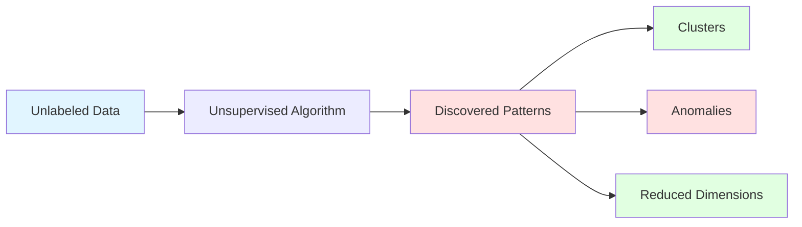
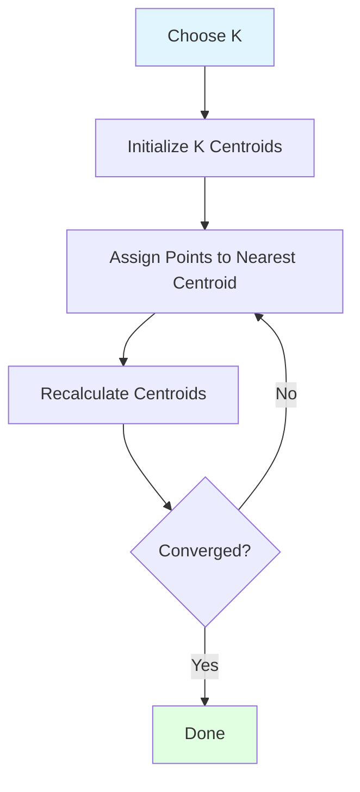
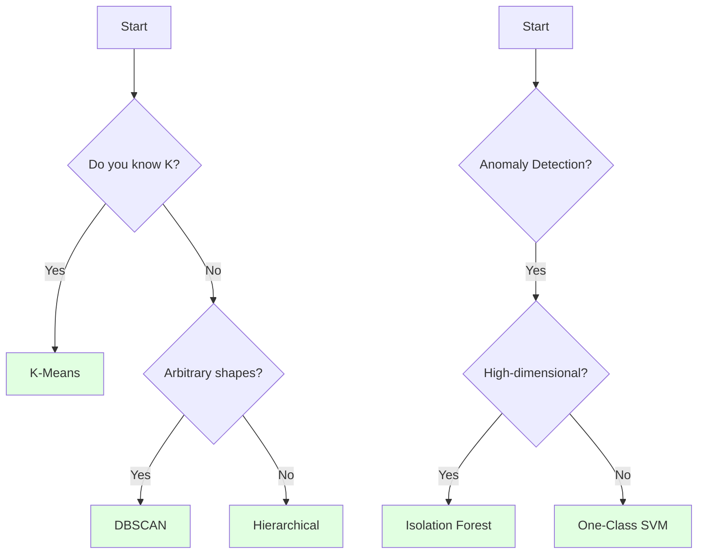

# Week 3 Day 4: Unsupervised Learning for AIOps

> **Duration:** 8 hours | **Difficulty:** Intermediate-Advanced  
> **Focus:** Discovering hidden patterns, clustering anomalies, and dimensionality reduction without labels.

---

## 🎯 Learning Objectives

By the end of this day, you will be able to:

1. **Understand** when to use unsupervised learning (no labels available)
2. **Apply** clustering algorithms (K-Means, DBSCAN, Hierarchical) to group similar incidents
3. **Detect** anomalies using Isolation Forest and One-Class SVM
4. **Reduce** dimensionality with PCA and t-SNE for visualization
5. **Build** a log clustering system to automatically categorize millions of unlabeled events

---

## 📚 Part 1: The Unsupervised Learning Paradigm

### What is Unsupervised Learning?

**Unsupervised Learning** is like exploring a dark cave without a map. You have data but **no labels**. Your goal: find structure, patterns, and groupings.



### Why Unsupervised Learning in AIOps?

**Problem:** You have 10 million log events. Only 100 are labeled as "incidents." What about the other 9,999,900?

**Unsupervised Learning Can:**
1. **Cluster** similar errors together (e.g., "database timeouts" vs "network failures")
2. **Detect** anomalies that don't match any known pattern
3. **Reduce** 100 features to 3 for visualization
4. **Discover** new failure modes you didn't know existed

---

## 🔬 Part 2: Clustering Algorithms

### 2.1 K-Means (The Classic)

**Idea:** Partition data into K clusters where each point belongs to the cluster with the nearest centroid.



#### Code Example

```python
from sklearn.cluster import KMeans
import matplotlib.pyplot as plt
import numpy as np

# Sample data: CPU and memory usage
X = np.array([
    [20, 30], [25, 35], [22, 32],  # Cluster 1: Low usage
    [80, 85], [85, 90], [82, 88],  # Cluster 2: High usage
    [50, 50], [55, 52], [52, 55]   # Cluster 3: Medium usage
])

# Fit K-Means
kmeans = KMeans(n_clusters=3, random_state=42)
labels = kmeans.fit_predict(X)
centroids = kmeans.cluster_centers_

# Visualize
plt.scatter(X[:, 0], X[:, 1], c=labels, cmap='viridis', s=100)
plt.scatter(centroids[:, 0], centroids[:, 1], c='red', marker='X', s=200, label='Centroids')
plt.xlabel('CPU Usage (%)')
plt.ylabel('Memory Usage (%)')
plt.title('K-Means Clustering')
plt.legend()
plt.show()

print(f"Cluster labels: {labels}")
print(f"Centroids:\n{centroids}")
```

**Output:**
```
Cluster labels: [0 0 0 1 1 1 2 2 2]
Centroids:
[[22.33 32.33]
 [82.33 87.67]
 [52.33 52.33]]
```

#### Choosing K (Elbow Method)

```python
inertias = []
K_range = range(1, 10)

for k in K_range:
    kmeans = KMeans(n_clusters=k, random_state=42)
    kmeans.fit(X)
    inertias.append(kmeans.inertia_)  # Sum of squared distances to centroids

# Plot
plt.plot(K_range, inertias, marker='o')
plt.xlabel('Number of Clusters (K)')
plt.ylabel('Inertia')
plt.title('Elbow Method')
plt.show()
```

**Look for the "elbow"** - the point where adding more clusters doesn't significantly reduce inertia.

---

### 2.2 DBSCAN (Density-Based)

**Idea:** Clusters are dense regions separated by sparse regions. Great for finding **arbitrary-shaped clusters** and **outliers**.

**Parameters:**
- `eps`: Maximum distance between two points to be neighbors
- `min_samples`: Minimum points to form a dense region

```python
from sklearn.cluster import DBSCAN

# Same data
dbscan = DBSCAN(eps=10, min_samples=2)
labels = dbscan.fit_predict(X)

# -1 means outlier/noise
print(f"Cluster labels: {labels}")
print(f"Number of clusters: {len(set(labels)) - (1 if -1 in labels else 0)}")
print(f"Number of outliers: {list(labels).count(-1)}")
```

**When to use DBSCAN:**
- You don't know K in advance
- Clusters have irregular shapes
- You want to identify outliers

---

### 2.3 Hierarchical Clustering

**Idea:** Build a tree (dendrogram) of clusters. Can be **agglomerative** (bottom-up) or **divisive** (top-down).

```python
from scipy.cluster.hierarchy import dendrogram, linkage
from sklearn.cluster import AgglomerativeClustering

# Compute linkage
Z = linkage(X, method='ward')  # Ward minimizes variance

# Plot dendrogram
plt.figure(figsize=(10, 5))
dendrogram(Z)
plt.xlabel('Sample Index')
plt.ylabel('Distance')
plt.title('Hierarchical Clustering Dendrogram')
plt.show()

# Cut tree at height to get clusters
clustering = AgglomerativeClustering(n_clusters=3)
labels = clustering.fit_predict(X)
print(f"Cluster labels: {labels}")
```

**When to use Hierarchical:**
- You want to visualize cluster relationships
- You need different granularities (cut tree at different heights)

---

## 🚨 Part 3: Anomaly Detection

### 3.1 Isolation Forest

**Idea:** Anomalies are "easy to isolate" - they require fewer random splits to separate from normal data.

```python
from sklearn.ensemble import IsolationForest

# Generate data with anomalies
np.random.seed(42)
X_normal = np.random.randn(200, 2) * 10 + 50  # Normal: centered at (50, 50)
X_anomalies = np.random.uniform(0, 100, (10, 2))  # Anomalies: scattered
X = np.vstack([X_normal, X_anomalies])

# Fit Isolation Forest
iso_forest = IsolationForest(contamination=0.05, random_state=42)  # Expect 5% anomalies
predictions = iso_forest.fit_predict(X)

# -1 = anomaly, 1 = normal
anomalies = X[predictions == -1]
normal = X[predictions == 1]

# Visualize
plt.scatter(normal[:, 0], normal[:, 1], c='blue', label='Normal', alpha=0.6)
plt.scatter(anomalies[:, 0], anomalies[:, 1], c='red', label='Anomaly', s=100, marker='X')
plt.xlabel('Feature 1')
plt.ylabel('Feature 2')
plt.title('Isolation Forest Anomaly Detection')
plt.legend()
plt.show()

print(f"Detected {len(anomalies)} anomalies out of {len(X)} samples")
```

**When to use Isolation Forest:**
- High-dimensional data
- Fast detection needed
- Anomalies are rare (< 10%)

---

### 3.2 One-Class SVM

**Idea:** Learn a boundary around normal data. Anything outside is an anomaly.

```python
from sklearn.svm import OneClassSVM

# Fit on normal data only
svm = OneClassSVM(nu=0.05, kernel='rbf', gamma='auto')  # nu = expected anomaly rate
svm.fit(X_normal)

# Predict on all data
predictions = svm.predict(X)

anomalies = X[predictions == -1]
print(f"Detected {len(anomalies)} anomalies")
```

**When to use One-Class SVM:**
- You have only normal data for training
- Need a tight boundary around normal behavior

---

### 3.3 Statistical Methods (Z-Score)

**Idea:** Points beyond 3 standard deviations are anomalies.

```python
from scipy import stats

# Univariate example: response times
response_times = np.concatenate([
    np.random.normal(100, 20, 1000),  # Normal: mean=100ms
    [500, 600, 700]  # Anomalies
])

# Calculate Z-scores
z_scores = np.abs(stats.zscore(response_times))
threshold = 3

anomalies = response_times[z_scores > threshold]
print(f"Anomalies: {anomalies}")
```

**When to use Statistical Methods:**
- Simple, interpretable
- Univariate or low-dimensional data
- Gaussian distribution assumption holds

---

## 📉 Part 4: Dimensionality Reduction

### 4.1 PCA (Principal Component Analysis)

**Idea:** Find directions (principal components) that capture the most variance. Project data onto these directions.

```python
from sklearn.decomposition import PCA

# High-dimensional data (e.g., 50 features)
np.random.seed(42)
X_high_dim = np.random.randn(100, 50)

# Reduce to 2D
pca = PCA(n_components=2)
X_2d = pca.fit_transform(X_high_dim)

# Explained variance
print(f"Explained variance: {pca.explained_variance_ratio_}")
print(f"Total variance captured: {pca.explained_variance_ratio_.sum():.2%}")

# Visualize
plt.scatter(X_2d[:, 0], X_2d[:, 1])
plt.xlabel('PC1')
plt.ylabel('PC2')
plt.title('PCA: 50D → 2D')
plt.show()
```

**Use Cases:**
- Reduce features before clustering
- Visualize high-dimensional data
- Remove noise

---

### 4.2 t-SNE (t-Distributed Stochastic Neighbor Embedding)

**Idea:** Preserve local structure. Points close in high-D stay close in low-D.

```python
from sklearn.manifold import TSNE

# Reduce to 2D
tsne = TSNE(n_components=2, perplexity=30, random_state=42)
X_2d_tsne = tsne.fit_transform(X_high_dim)

plt.scatter(X_2d_tsne[:, 0], X_2d_tsne[:, 1])
plt.xlabel('t-SNE 1')
plt.ylabel('t-SNE 2')
plt.title('t-SNE: 50D → 2D')
plt.show()
```

**When to use t-SNE:**
- Visualization only (not for feature reduction before modeling)
- Discover clusters visually
- Preserve local neighborhoods

**Warning:** t-SNE is slow for large datasets (use PCA first to reduce to ~50D).

---

## 🛠️ Part 5: Real-World AIOps Application

### Use Case: Automatic Log Categorization

**Problem:** You have 1 million log messages. Manually labeling them is impossible. Can you automatically group similar errors?

#### Step 1: Vectorize Log Messages

```python
from sklearn.feature_extraction.text import TfidfVectorizer

logs = [
    "Database connection timeout after 30s",
    "Failed to connect to database: timeout",
    "Network error: connection refused",
    "API request failed: network unreachable",
    "Out of memory: heap space exceeded",
    "Memory allocation failed: OOM",
    "Database connection timeout after 30s",  # Duplicate
]

# Convert text to numerical vectors
vectorizer = TfidfVectorizer(max_features=100)
X_tfidf = vectorizer.fit_transform(logs).toarray()

print(f"Shape: {X_tfidf.shape}")  # (7, 100)
```

#### Step 2: Cluster

```python
from sklearn.cluster import KMeans

# Cluster into 3 groups
kmeans = KMeans(n_clusters=3, random_state=42)
labels = kmeans.fit_predict(X_tfidf)

# Display results
for i, (log, label) in enumerate(zip(logs, labels)):
    print(f"Cluster {label}: {log}")
```

**Output:**
```
Cluster 0: Database connection timeout after 30s
Cluster 0: Failed to connect to database: timeout
Cluster 1: Network error: connection refused
Cluster 1: API request failed: network unreachable
Cluster 2: Out of memory: heap space exceeded
Cluster 2: Memory allocation failed: OOM
Cluster 0: Database connection timeout after 30s
```

**Insight:** Cluster 0 = Database issues, Cluster 1 = Network issues, Cluster 2 = Memory issues!

#### Step 3: Visualize with t-SNE

```python
from sklearn.manifold import TSNE
import matplotlib.pyplot as plt

# Reduce to 2D
tsne = TSNE(n_components=2, random_state=42)
X_2d = tsne.fit_transform(X_tfidf)

# Plot
plt.figure(figsize=(10, 6))
scatter = plt.scatter(X_2d[:, 0], X_2d[:, 1], c=labels, cmap='viridis', s=100)
plt.colorbar(scatter, label='Cluster')

# Annotate points
for i, log in enumerate(logs):
    plt.annotate(log[:20] + '...', (X_2d[i, 0], X_2d[i, 1]), fontsize=8)

plt.title('Log Clustering Visualization')
plt.xlabel('t-SNE 1')
plt.ylabel('t-SNE 2')
plt.tight_layout()
plt.show()
```

---

## 📊 Part 6: Evaluation Metrics (Without Labels!)

### 6.1 Silhouette Score

**Idea:** Measures how similar a point is to its own cluster vs other clusters. Range: [-1, 1].
- **1:** Perfect clustering
- **0:** Overlapping clusters
- **-1:** Wrong clusters

```python
from sklearn.metrics import silhouette_score

score = silhouette_score(X_tfidf, labels)
print(f"Silhouette Score: {score:.3f}")
```

---

### 6.2 Davies-Bouldin Index

**Idea:** Ratio of within-cluster to between-cluster distances. **Lower is better**.

```python
from sklearn.metrics import davies_bouldin_score

score = davies_bouldin_score(X_tfidf, labels)
print(f"Davies-Bouldin Index: {score:.3f}")
```

---

### 6.3 Calinski-Harabasz Index

**Idea:** Ratio of between-cluster to within-cluster variance. **Higher is better**.

```python
from sklearn.metrics import calinski_harabasz_score

score = calinski_harabasz_score(X_tfidf, labels)
print(f"Calinski-Harabasz Index: {score:.1f}")
```

---

## 🎯 Part 7: Choosing the Right Algorithm



| Task | Algorithm | When to Use |
|------|-----------|-------------|
| **Clustering** | K-Means | Know K, spherical clusters |
| | DBSCAN | Unknown K, arbitrary shapes, outliers |
| | Hierarchical | Need dendrogram, multiple granularities |
| **Anomaly Detection** | Isolation Forest | High-D, fast, < 10% anomalies |
| | One-Class SVM | Tight boundary, only normal data for training |
| | Z-Score | Simple, univariate, Gaussian |
| **Dimensionality Reduction** | PCA | Linear relationships, feature reduction |
| | t-SNE | Visualization, preserve local structure |

---

## 🔄 Part 8: Combining Supervised + Unsupervised

### Semi-Supervised Learning

**Scenario:** You have 10,000 logs. Only 100 are labeled.

**Approach:**
1. **Cluster** all 10,000 logs (unsupervised)
2. **Label** a few samples from each cluster
3. **Train** a supervised model on labeled data
4. **Predict** labels for remaining data

```python
# Step 1: Cluster
kmeans = KMeans(n_clusters=5, random_state=42)
cluster_labels = kmeans.fit_predict(X_all)

# Step 2: For each cluster, manually label a few samples
# (Assume you now have y_labeled for 100 samples)

# Step 3: Train supervised model
from sklearn.ensemble import RandomForestClassifier
model = RandomForestClassifier()
model.fit(X_labeled, y_labeled)

# Step 4: Predict on unlabeled
y_pred_unlabeled = model.predict(X_unlabeled)
```

---

## 📝 Summary

| Concept | Key Idea | AIOps Use Case |
|---------|----------|----------------|
| **K-Means** | Partition into K clusters | Group similar errors |
| **DBSCAN** | Density-based, finds outliers | Detect unusual patterns |
| **Hierarchical** | Tree of clusters | Multi-level categorization |
| **Isolation Forest** | Isolate anomalies | Detect rare failures |
| **One-Class SVM** | Boundary around normal | Learn "normal" behavior |
| **PCA** | Reduce dimensions linearly | Compress features |
| **t-SNE** | Visualize high-D data | Explore log patterns |

**Key Takeaways:**
1. **Unsupervised learning** finds patterns without labels
2. **Clustering** groups similar data points
3. **Anomaly detection** finds outliers
4. **Dimensionality reduction** simplifies high-D data
5. **Combine** with supervised learning for best results

---

## 🔗 Next Steps

- **Hands-on:** Complete [Exercise 01: Log Clustering](exercises/exercise-01-clustering.md)
- **Project:** [Anomaly Detection System](project/README.md)
- **Advanced:** [Semi-Supervised Learning](exercises/exercise-03-semi-supervised.md)

---

## 📚 Further Reading

- [Scikit-learn Clustering Guide](https://scikit-learn.org/stable/modules/clustering.html)
- [Anomaly Detection with Isolation Forest](https://cs.nju.edu.cn/zhouzh/zhouzh.files/publication/icdm08b.pdf)
- [t-SNE Explained](https://distill.pub/2016/misread-tsne/)
- [PCA Step-by-Step](https://builtin.com/data-science/step-step-explanation-principal-component-analysis)
