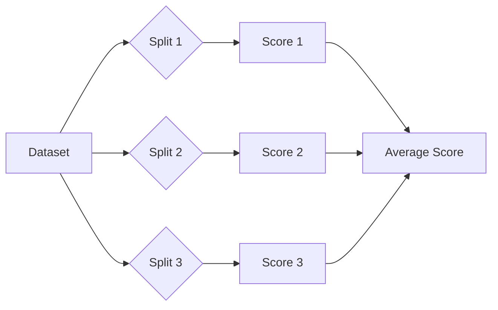

# Week 3 Day 5: Model Evaluation, Tuning & AutoML

> **Duration:** 8 hours | **Difficulty:** Intermediate  
> **Focus:** Moving from "it works" to "production-ready" using robust evaluation, hyperparameter tuning, and automated tools.

---

## 🎯 Learning Objectives

By the end of this day, you will be able to:

1. **Evaluate** models robustly using Cross-Validation (K-Fold, Stratified).
2. **Tune** hyperparameters using Grid Search, Random Search, and Bayesian Optimization (Optuna).
3. **Interpret** "Black Box" models using SHAP and Feature Importance.
4. **Accelerate** development using AutoML tools (TPOT, H2O, Auto-Sklearn).
5. **Prevent** data leakage and overfitting in AIOps pipelines.

---

## 🏗️ Part 1: Robust Evaluation Strategies

Training on 80% and testing on 20% is a good start, but in production, **unexpected things happen**.

### 1.1 K-Fold Cross-Validation

Splits data into $K$ parts. Train on $K-1$, test on 1. Repeat $K$ times.



**Why?**
- Ensures every data point is used for testing exactly once.
- Gives a confidence interval (e.g., Accuracy = $0.95 \pm 0.02$).

**Code:**
```python
from sklearn.model_selection import cross_val_score
scores = cross_val_score(model, X, y, cv=5, scoring='f1')
print(f"Mean F1: {scores.mean():.3f} (+/- {scores.std():.3f})")
```

### 1.2 Stratified K-Fold (Crucial for AIOps)

In AIOps, failures are rare (1%). A random split might put ALL failures in the train set and NONE in the test set. **Stratified K-Fold** ensures the percentage of target classes is consistent across folds.

### 1.3 Time Series Split

**NEVER** use random K-Fold for time-series log data! You cannot train on "future" logs to predict "past" failures.
Use `TimeSeriesSplit` (Expanding Window).

```python
from sklearn.model_selection import TimeSeriesSplit
# Fold 1: Train [Jan], Test [Feb]
# Fold 2: Train [Jan, Feb], Test [Mar]
# ...
```

---

## 🎛️ Part 2: Hyperparameter Tuning

Hyperparameters are the dials of the model (e.g., Tree Depth, Learning Rate).

### 2.1 Grid Search vs Random Search

- **Grid Search:** Tries EVERY combination. Slow but exhaustive.
- **Random Search:** Tries random combinations. Surprisingly effective and much faster.

```python
from sklearn.model_selection import RandomizedSearchCV
params = {
    'n_estimators': [100, 200, 300, 400, 500],
    'max_depth': [10, 20, 30, 40, None]
}
search = RandomizedSearchCV(model, params, n_iter=10, cv=3)
search.fit(X, y)
```

### 2.2 Bayesian Optimization (Optuna)

Instead of random guessing, **Optuna** learns which parameters are promising and focuses there. It's the industry standard for modern ML tuning.

```python
import optuna

def objective(trial):
    # Suggest params
    n_estimators = trial.suggest_int('n_estimators', 50, 500)
    max_depth = trial.suggest_int('max_depth', 5, 50)
    
    model = RandomForestClassifier(n_estimators=n_estimators, max_depth=max_depth)
    return cross_val_score(model, X, y, cv=3).mean()

study = optuna.create_study(direction='maximize')
study.optimize(objective, n_trials=50)
```

---

## 🤖 Part 3: AutoML (Automated Machine Learning)

Why manually try XGBoost, then Random Forest, then SVM? Let AutoML do it.

### Tools:
1. **TPOT (Tree-based Pipeline Optimization Tool):** Uses genetic algorithms to evolve the best pipeline (Feature selection -> Preprocessing -> Model). Exports Python code!
2. **Auto-Sklearn:** Automated scikit-learn.
3. **H2O:** Java-based, highly scalable, enterprise-grade.

**Example (TPOT):**
```python
from tpot import TPOTClassifier
tpot = TPOTClassifier(generations=5, population_size=20, verbosity=2)
tpot.fit(X_train, y_train)
tpot.export('best_pipeline.py')  # <-- Magic!
```

**Pros:** Saves time, finds baseline quickly.
**Cons:** Can overfit, computationally expensive, "Black Box" if not careful.

---

## 🔍 Part 4: Model Interpretability (XAI)

In AIOps, "The model said so" isn't enough. You need to tell the SRE *why* the server is about to crash.

### SHAP (SHapley Additive exPlanations)

Game theory approach. attributes the prediction outcome to feature contributions.

- **Global Interpretability:** "CPU Load is the most important feature generally."
- **Local Interpretability:** "For *this specific* alert, Memory was the cause, even though CPU is usually the cause."

```python
import shap
explainer = shap.Explainer(model)
shap_values = explainer(X_test)

# Plot
shap.plots.waterfall(shap_values[0])  # Explain the first prediction
```

---

## 📉 Part 5: Model Monitoring in Production (The Hidden Debt)

You deployed your model. It has 99% accuracy. **You are not done.**

### 5.1 Concept Drift
Data changes over time. An AIOps model trained on logs from 2023 might fail in 2024 because of:
- **New software versions** (different log formats)
- **User behavior changes** (traffic spikes)
- **Infrastructure updates** (moving to K8s)

```mermaid
graph LR
    A[Training Data<br/>(Jan-Mar)] --> B[Model]
    B --> C[Good Predictions]
    D[Live Data<br/>(Aug-Sep)] --> B
    D --> E[Drifted Distribution!]
    E --> F[Bad Predictions]
    
    style A fill:#e1f5ff
    style D fill:#ffe1e1
    style F fill:#ffcccc
```

### 5.2 Drift Detection Methods
1.  **PSI (Population Stability Index):** Measures how much a variable's distribution has shifted.
2.  **KS Test (Kolmogorov-Smirnov):** Statistical test to check if two samples come from the same distribution.
3.  **Adversarial Validation:** Train a classifier to distinguish "Train" data from "Live" data. If it can easily tell them apart (AUC > 0.7), you have drift.

### 5.3 Retraining Strategies
- **Fixed Interval:** Retrain every Sunday.
- **Trigger-Based:** Retrain when F1-score drops below 0.8.
- **Online Learning:** Update weights with every new batch (risky but fast).

---

## 📝 Part 6: Summary Checklist for Production ML

1. **Evaluation:** Use Stratified CV or TimeSeriesSplit to avoid lying to yourself.
2. **Imbalance:** Always check F1-score/Recall, never Accuracy.
3. **Tuning:** Start with defaults -> Random Search -> Optuna (if needed).
4. **AutoML:** Use it to find a strong baseline or challenger model.
5. **Why?:** Always run SHAP on your final model to ensure it learned physics, not noise.
6. **Monitoring:** Set up drift alerts immediately after deployment.


---

<p align="center">
  <a href="../day-04-unsupervised/lecture-notes.md">⬅️ Back: Day 4</a> | <strong>Day 5: Evaluation & AutoML</strong> | <a href="../../week-04-anomaly-detection/README.md">Begin Week 4 ➡️</a>
</p>
