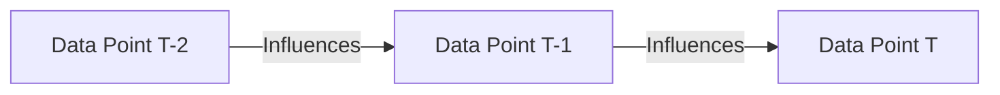
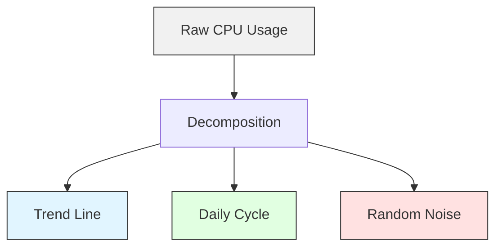

# Week 4 Day 1: Time Series Fundamentals

> **Duration:** 6 hours | **Difficulty:** Intermediate  
> **Focus:** Mastering the "Time" dimension in data—Trend, Seasonality, Stationarity.

---

## 🎯 Learning Objectives

By the end of today, you will be able to:
1. **Manipulate** time-series data using Pandas (`resample`, `rolling`, `shift`).
2. **Decompose** a signal into its core components (Trend, Seasonality, Residuals).
3. **Test** for Stationarity (ADF Test) – the prerequisite for most forecasting models.
4. **Smooth** noisy AIOps data to reveal underlying system health.

---

## ⏳ Part 1: What makes Time Series unique?

In Week 3 (Standard ML), we assumed data points were **independent** (I.I.D.).
- Shuffling the data didn't change the accuracy.

In Week 4 (Time Series), **Order Matters**.
- $Y_t$ (value at time $t$) is highly dependent on $Y_{t-1}, Y_{t-2}, ...$
- **Autocorrelation:** The correlation of a signal with a delayed copy of itself.



---

## 🛠️ Part 2: Pandas Power Tools

AIOps data usually arrives messy (random timestamps). We must normalize it.

### 2.1 Resampling (The "Group By" for Time)
Converting `12:01`, `12:05`, `12:06` into strictly `5-minute` buckets.

```python
# Downsample: Seconds -> Minutes (Aggregation)
df_1min = df.resample('1min').mean()

# Upsample: Hours -> Minutes (Filling Gaps)
df_filled = df.resample('1min').ffill() # Forward Fill
```

### 2.2 Rolling Windows (Smoothing)
Removing "noise" to see the "signal".

```python
# 7-day Moving Average
df['7d_avg'] = df['cpu'].rolling(window='7d').mean()
```

### 2.3 Lagging (Shifting)
Creating features for ML (e.g., "What was the value 1 hour ago?").

```python
df['cpu_lag_1h'] = df['cpu'].shift(periods=1, freq='1h')
```

---

## 🔬 Part 3: Anatomy of a Time Series

Any metric (like CPU Usage) can be split into 3 parts:

$$Y(t) = Trend(t) + Seasonality(t) + Noise(t)$$

1.  **Trend ($T_t$):** Long-term increase/decrease (e.g., User growth).
2.  **Seasonality ($S_t$):** Repeating patterns (e.g., Daily traffic spikes).
3.  **Residual/Noise ($R_t$):** Random variance (e.g., A momentary glitch).

### Decomposition Visualization



---

## 🛑 Part 4: The Golden Rule - Stationarity

Most forecasting models (ARIMA, etc.) **FAIL** if the statistical properties (Mean, Variance) change over time.
- **Stationary Data:** Flat looking, constant variance, no loops.
- **Non-Stationary Data:** Trends upwards, seasonality expanding.

**The Test: Augmented Dickey-Fuller (ADF)**
- **Null Hypothesis:** Data is Non-Stationary.
- **Goal:** p-value < 0.05 (Reject hypothesis -> Data IS Stationary).

**How to fix Non-Stationarity?**
Detailed in the Cheatsheet, but usually: **Differencing** ($\Delta Y = Y_t - Y_{t-1}$).

---

## 🔗 Next Steps
1. Open the [Cheat Sheet](cheatsheet.md) for code snippets.
2. Start [Exercise 01](exercises/exercise-01-pandas-time.md) to practice Resampling.
3. Diagnose a server in [Project: The Capacity Planner](project/README.md).
