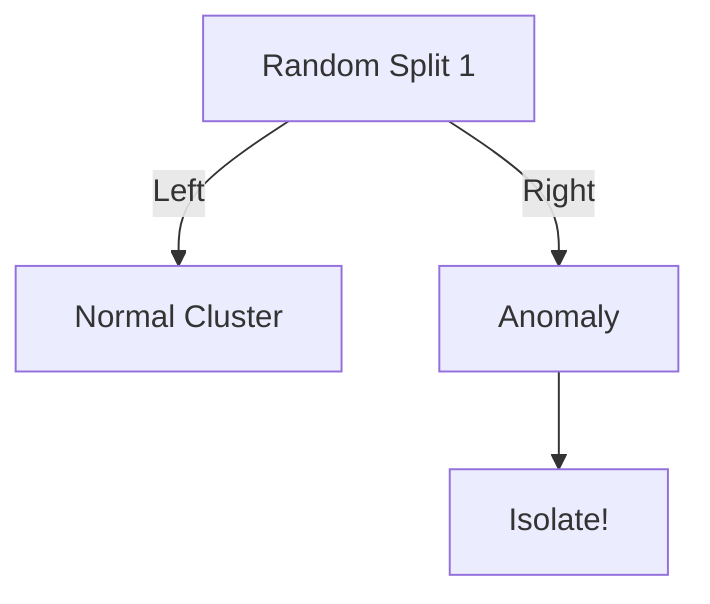

# Week 4 Day 3: Anomaly Detection Algorithms

> **Duration:** 8 hours | **Difficulty:** Intermediate  
> **Focus:** Detecting "Weird" behavior without labels.

---

## 🎯 Learning Objectives

By the end of today, you will be able to:
1.  **Distinguish** betweeen Point, Contextual, and Collective anomalies.
2.  **Implement** Isolation Forest to catch global outliers.
3.  **Use** Local Outlier Factor (LOF) for density-based detection.
4.  **Engineer** time features to catch *contextual* anomalies (e.g., "high for 3 AM").

---

## 🕵️‍♂️ Part 1: The Three Types of Anomalies

1.  **Point Anomaly:** A single data point is too high/low.
    - Example: CPU usage hits 100% (when normally 20%).
    - **Detection:** `Z-Score`, `Isolation Forest`.

2.  **Contextual Anomaly:** A data point is normal *globally*, but abnormal *locally*.
    - Example: CPU is 50%. (Normal? Yes.)
    - Context: It is 3:00 AM on a Sunday. (Abnormal! Usually 5%).
    - **Detection:** Feature Engineering (`hour`, `day_of_week`) + `Isolation Forest`.

3.  **Collective Anomaly:** A *sequence* of data points is strange.
    - Example: Heartbeat is usually 60-100 BPM. Suddenly it is 60... 60... 60... (Flatline). Individual points are fine, the sequence is dead.
    - **Detection:** `AutoEncoders` (Day 4) or `Rolling Statistics`.

---

## 🌲 Part 2: Isolation Forest (The Heavy Hitter)

**Concept:** Anomalies correspond to *few* and *different* instances. It is easier to "isolate" an anomaly by randomly cutting the data than to isolate a normal point.

- **Normal Point:** Deep inside a cluster. Hard to cut out.
- **Anomaly:** Far from the cluster. Easy to cut out (short path length).



**Pros:** Very fast, works well on high-dimensional data (CPU, Mem, Disk together).
**Cons:** Can struggle with complex shapes (spirals).

---

## 🏘️ Part 3: Local Outlier Factor (LOF)

**Concept:** Compares the local density of a point to its neighbors.
- If density(A) << density(neighbors), A is an outlier.

**Pros:** Good for datasets with varying densities (e.g., Cluster 1 is tight, Cluster 2 is loose).
**Cons:** Slower than Isolation Forest (O(n²) complexity).

---

## ⚙️ Part 4: Feature Engineering for Time Series

You cannot feed raw `timestamp` into these algorithms. They don't understand "3 AM".
You must **extract features**:

```python
df['hour'] = df.index.hour
df['day_of_week'] = df.index.dayofweek
df['is_weekend'] = df['day_of_week'].isin([5,6]).astype(int)
```

Now, Isolation Forest sees `[CPU=50, Hour=3, IsWeekend=1]`.
It learns that `CPU=50` is rare when `Hour=3`.

---

## 🔗 Next Steps

1.  Open the [Cheat Sheet](cheatsheet.md) for code.
2.  Catch the Spy in [Exercise 01](exercises/exercise-01-isolation-forest.md).
3.  Deploy the [Network Guardian Project](project/README.md).
