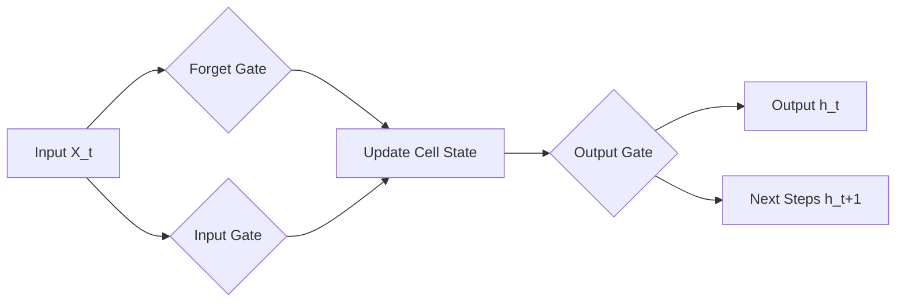

# Week 4 Day 4: Deep Learning for Time Series

> **Duration:** 8 hours | **Difficulty:** Advanced  
> **Focus:** LSTM Forecasting & Autoencoder Anomaly Detection.

---

## 🎯 Learning Objectives

By the end of today, you will be able to:
1.  **Differentiate** between standard ML (ARIMA) and Deep Learning (LSTM) for time series.
2.  **Implement** a simple LSTM for forecasting (Many-to-One).
3.  **Construct** an Autoencoder to learn the "shape" of normal data.
4.  **Detect** anomalies by measuring Reconstruction Error.

---

## 🧠 Part 1: Why Deep Learning?

ARIMA (Day 2) assumes **Linearity** and **Stationarity**.
Random Forest (Day 1) ignores **Sequence** unless you manually lag features.

But real AIOps data (logs, traces) often has:
- **Long-term dependencies:** A restart today might be caused by a config change last week.
- **Non-Linear interactions:** CPU spikes only cause errors *if* Memory is also high.

**Enter RNN (Recurrent Neural Networks):** Networks with *loops*, allowing information to persist.

---

## 🧬 Part 2: LSTM (Long Short-Term Memory)

Standard RNNs forgot things quickly (Vanishing Gradient Problem). LSTMs fix this with "Gates":
1.  **Forget Gate:** Decides what to throw away from the cell state.
2.  **Input Gate:** Decides what new information to store.
3.  **Output Gate:** Decides what to output based on the cell state.



### Forecasting with LSTM
We typically use a **Sliding Window** approach.
To predict $t$, we feed $[t-10, t-9, ..., t-1]$.
- **Shape:** `(Samples, TimeSteps, Features)`

---

## 🪞 Part 3: Autoencoders for Anomaly Detection

This is often **more powerful** than forecasting for AIOps.

**Concept:**
Train a neural network to copy its input to its output, but force it through a tiny "Bottleneck" (Latent Space).
- It learns to compress the most important "normal" patterns.
- It fails to compress random noise or anomalies.

```mermaid
graph TD
    A[Input Data (784 dims)] --> B[Encoder]
    B --> C[Bottleneck (32 dims)]
    C --> D[Decoder]
    D --> E[Reconstructed Output (784 dims)]
    
    style C fill:#f9f,stroke:#333
```

**The Transformation:**
1.  **Train:** Only on "Normal" server behavior (e.g., healthy HTTP requests).
2.  **Test:** Feed it a DDOS attack.
3.  **Result:** The model has never seen a DDOS pattern. It tries to compress it using "Normal" rules and fails. The Output looks garbage.
4.  **Detection:** Measuring `MSE(Input, Output)`. If Error > Threshold -> **anomaly**.

---

## 🛠️ Part 4: Implementation Tips

1.  **Scaling is Mandatory:** Neural Nets explode if inputs are not 0-1 or -1 to 1. Use `MinMaxScaler`.
2.  **Shape Matters:** LSTM expects 3D tensors `(N, TimeSteps, Features)`. Use `np.reshape()`.
3.  **Thresholding:** How to pick the cutoff?
    - Simple: `Mean + 3 * StdDev` of train errors.
    - Robust: 99th Percentile of train errors.

---

## 🔗 Next Steps

1.  Open the [Cheat Sheet](cheatsheet.md) for Keras code.
2.  Predict a sine wave in [Exercise 01](exercises/exercise-01-lstm-forecast.md).
3.  Build a "Mirror" in [Exercise 02](exercises/exercise-02-autoencoder.md).
4.  Deploy the "Predictive Maintenance System" in [Project](project/README.md).
