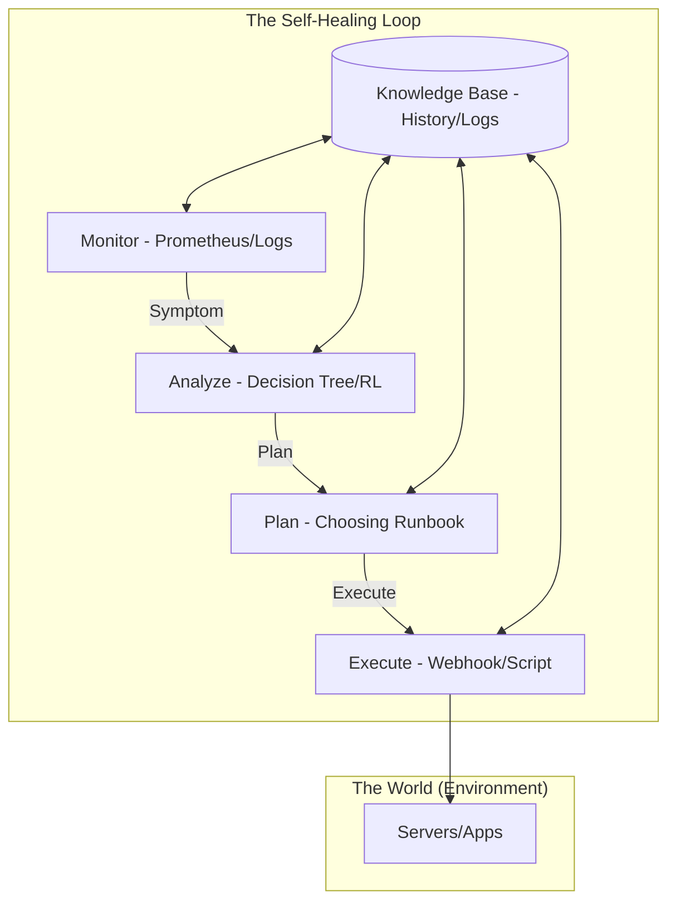

# Week 5 Day 5: The Self-Healing Loop (Capstone)

> **Goal:** Integrate Monitoring, Triage, and Remediation into a single, closed-loop autonomous system.

---

## 🔄 The MAPE-K Architecture

The industry standard for self-adaptive systems is the **MAPE-K Loop**. This is what you have been building piece-by-piece all week.

### 1. Monitor (The Senses)
Collecting metrics (CPU, RAM, Latency) and logs. This is our "Data Source". In Day 3, we turned these into **Events**.

### 2. Analyze (The Brain)
Is this an anomaly? Is it a known pattern? We used **Decision Trees (Day 2)** to add context and **RL (Day 4)** to decide if the cost of acting is worth it.

### 3. Plan (The Strategist)
Deciding *how* to fix it. Do we restart? Do we scale? Do we roll back? This is where our **Runbooks-as-Code (Day 1)** live.

### 4. Execute (The Actor)
The actual interaction with the infrastructure (API calls to AWS, SSH to servers, Kubernetes restarts).

---

## 🛡️ Critical Safety Patterns

Building a self-healing system is easy; building one that doesn't destroy your company is hard.

1.  **Idempotency:** A remediation script must be safe to run twice. 
2.  **Circuit Breaker:** if a service keeps crashing after 3 restarts, **Stop Remediation** and escalate to a human. Don't let the AI loop forever.
3.  **The "Pause" Button:** There must be a global switch to disable all auto-remediation during a major outage or scheduled maintenance.
4.  **Verification Phase:** After executing a fix, the loop MUST re-monitor to confirm the symptom is gone. If not, the fix failed.

---

## 🎮 The Capstone Challenge: Project Aegis

Today you will build **System Aegis**. You will be given a simulator that randomly generates:
- Memory Leaks.
- Zombie Processes.
- Traffic Spikes.
- Security Brute Force attacks.

Your Aegis system must detect, triage, and heal these incidents autonomously while maintaining a 99.9% uptime and staying within budget.

---

  <a href="../day-04-rl-control/lecture-notes.md">⬅️ Back: Day 4</a> | <strong>Day 5: Capstone Project</strong> | <a href="../../week-06-alerting/README.md">Begin Week 6 ➡️</a>

