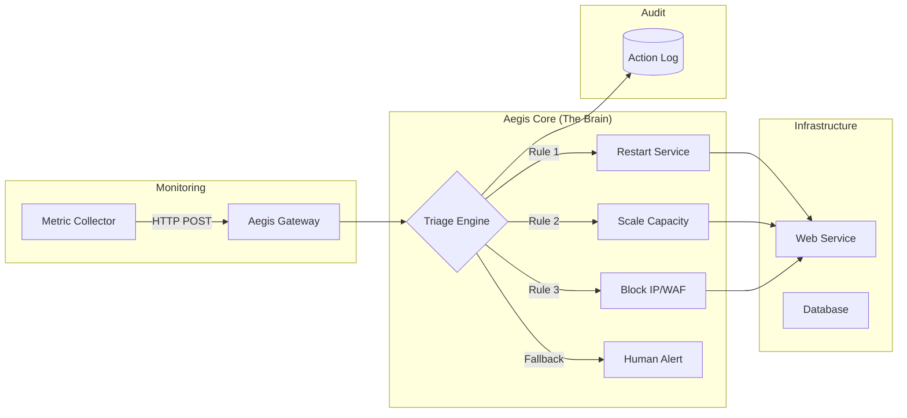

# Project Aegis: The Autonomous SRE 🛡️

System Aegis is an end-to-end self-healing loop designed to manage and stabilize a chaotic microservice environment without human intervention.

## 🏗️ Solution Architecture



## 📂 Project Structure

```text
aegis/
├── src/
│   ├── app.py             # Central Gateway (Webhook Handler)
│   ├── engine.py          # Triage Logic (Decision Tree / Context)
│   ├── healers/           # Specialized Remediation Modules
│   │   ├── process.py     # Handles restarts/cleanup
│   │   ├── security.py    # Handles IP blocking
│   │   └── scaling.py     # Handles RL-based scaling
│   └── utils.py           # Logging & Verification helpers
├── simulation/
│   ├── chaos_monkey.py    # Generates random failures
│   └── traffic_gen.py     # Generates Sine Wave traffic
└── run_aegis.py           # Main Orchestrator
```

## 🎯 Requirements

1.  **Autonomous Survival:** The system must handle 3 types of failures simultaneously:
    - **Resource Starvation:** Memory leak in the Web Service.
    - **Security Threat:** IP address attacking with 401 Unauthorized errors.
    - **Capacity Crises:** Sudden spikes in demand (Flash crowds).
2.  **Context Awareness:** Aegis must NOT restart the database during the "Backup Window" (even if CPU is high).
3.  **Verification:** After a healer runs, Aegis must check the metrics again. If the issue persists, escalate to "Human Required" status.
4.  **Auditability:** Every action taken by Aegis must be logged with the timestamp, the symptom, and the result.

## 🚀 Getting Started

1.  Initialize the **Triage Engine** using your knowledge from Day 2.
2.  Setup the **Webhook Gateway** from Day 3.
3.  Integrate the **RL-Autoscaler** from Day 4.
4.  Run `python simulation/chaos_monkey.py` and watch Aegis fight back!

---

## 🏆 Graduation Criteria

Your system is considered "Production Grade" if:
1.  **Uptime > 99.5%** during the 5-minute chaos run.
2.  **Zero false-restarts** during simulated Backup Windows.
3.  **MTTR (Mean Time to Repair)** is under 10 seconds for known issues.
