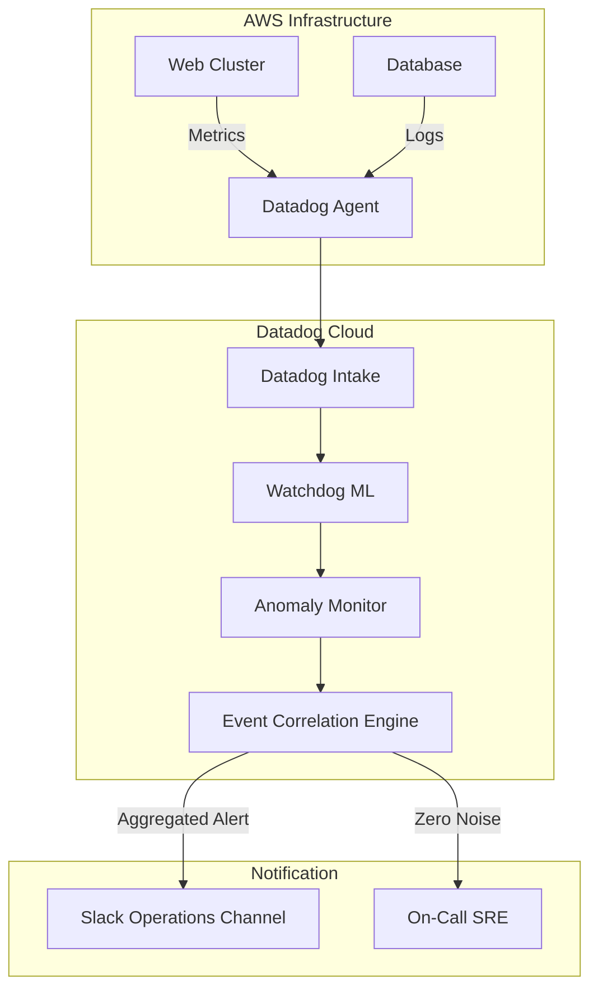

# Week 6 Day 1: Datadog – Intelligent Alerting & Event Correlation

> **Project Name:** The Noise Canceller  
> **Target Cloud:** AWS  
> **Tool Stack:** Datadog, Python (API Client), AWS Lambda (for event processing)

---

## 📘 1. Understanding Alert Fatigue
In a typical microservice environment, a single Database failure can trigger cascading alerts across 50 services. 
*   **Static Thresholds:** `CPU > 90%` (Tells you what happened, but not why it matters).
*   **Intelligent Alerting:** `CPU is 3 standard deviations above normal for this host on a Monday morning` (Tells you something is actually wrong).

### Key Datadog Features for AIOps:
1.  **Watchdog:** An automated ML engine that detects anomalies in your infrastructure, traces, and logs without you writing a single rule.
2.  **Anomaly Detection:** Uses seasonal algorithms (e.g., `agile`, `robust`) to ignore predictable spikes (like daily backups).
3.  **Outlier Detection:** Identifies a single "sick" server in a cluster of healthy ones.
4.  **Event Correlation:** Datadog automatically groups related events into a single **Incident Feed** to reduce noise.

---

## 🏗️ 2. Project Architecture: The Noise Canceller

---

## 🚀 3. Implementation Steps

### Step 1: AWS to Datadog Integration
To setup the project in AWS:
1.  **IAM Role:** Create a Role with `ReadOnlyAccess` and a trust policy for Datadog Account ID.
2.  **External ID:** Use the unique ID provided in your Datadog AWS Integration page.
3.  **Metric Collection:** Enable CloudWatch Metric Streams for high-speed delivery.

### Step 2: Programmatic Monitor Creation
We will use Python to create a monitor that detects **Seasonal Anomalies** (ignoring the "Monday Morning Login Spike").

### Step 3: Noise Aggregation Logic
By using `tags` (e.g., `service:checkout`, `env:prod`), Datadog's correlation engine automatically rolls up alerts. We will verify this by triggering multiple symptoms and observing a single incident in the dashboard.

---

## 📝 4. Setup Checklist
- [ ] Datadog API Key & Application Key generated.
- [ ] AWS Account linked via Integration Page.
- [ ] Python `datadog-api-client` installed.
- [ ] `dd-agent` running on at least one AWS instance/container.
