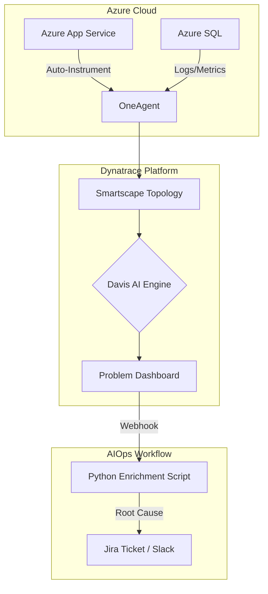

# Week 6 Day 2: Dynatrace – AI-Powered Root Cause Analysis (RCA)

> **Project Name:** The Root Cause Detective  
> **Target Cloud:** Azure  
> **Tool Stack:** Dynatrace, Azure App Service, Python (Dynatrace API v2)

---

## 📘 1. Deterministic AI vs. Probabilistic AI
In Day 1, we used Datadog's **Probabilistic AI** (Anomaly Detection), which says: "This metric looks weird compared to its history."

Today, we use Dynatrace's **Deterministic AI (Davis)**. Davis doesn't just look at metrics; it looks at the **Topology** (how services are connected).
- **Davis Logic:** "The Frontend is slow *because* the Authentication Service is failing, which is happening *because* the Azure SQL Database has an expensive lock."

### Key Dynatrace Concepts:
1.  **Smartscape Topology:** An automated real-time map of every dependency in your stack (Process A talks to Service B on Host C in Azure Data Center D).
2.  **Davis AI:** The causal engine that analyzes billions of dependencies to pinpoint the single root cause among thousands of symptoms.
3.  **OneAgent:** A single binary that auto-instruments everything on a host without code changes.

### 3. DQL (Dynatrace Query Language) for Serverless
With the move to the **Grail** data lake, Dynatrace uses DQL to query metrics, logs, and traces in a unified way. For a "Simple Serverless" architecture on AWS, DQL allows us to correlate across Lambda and API Gateway instantly.

#### Common DQL Snippets for Serverless:
- **Lambda Failure Rate:**
  `fetch metrics | filter metric.key == "aws.lambda.errors" | summarize errs = sum(value), by:{dt.entity.aws_lambda_function}`
- **API Gateway Cold Starts / Latency:**
  `fetch metrics | filter metric.key == "aws.apigateway.latency" | summarize p99 = percentile(value, 99)`
- **Cross-Service Error Correlation:**
  `fetch events | filter event.type == "ERROR_EVENT" | summarize count = count(), by:{dt.entity.aws_lambda_function, dt.entity.aws_api_gateway}`

---

## 🏗️ 2. Project Architecture: The Root Cause Detective

---

## 🚀 3. Implementation Steps

### Step 1: Azure + Dynatrace Setup
1.  **Generate PaaS Token:** In Dynatrace, generate a token for Azure integration.
2.  **Azure Site Extension:** Install the Dynatrace OneAgent extension on your Azure App Service.
3.  **Service Principal:** Create an Azure Service Principal to allow Dynatrace to pull infrastructure metrics.

### Step 2: Problem Enrichment Script
We will write a Python script that uses the **Dynatrace API v2** to pull the "Root Cause" of a detected problem and automatically provides the exact line of code or infrastructure component that failed.

### Step 3: Triggering a Causal Chain
We will simulate a "Cascading Failure" (Service A calls Service B which fails). You will see how Davis suppresses the "Symptom" alerts and only notifies you about the "Root Cause".

---

## 📝 4. Setup Checklist
- [ ] Dynatrace Trial/Environment active.
- [ ] Azure Subscription with an App Service or VM.
- [ ] API v2 Token with `entities.read` and `problems.read` permissions.
- [ ] Python `requests` library installed.
