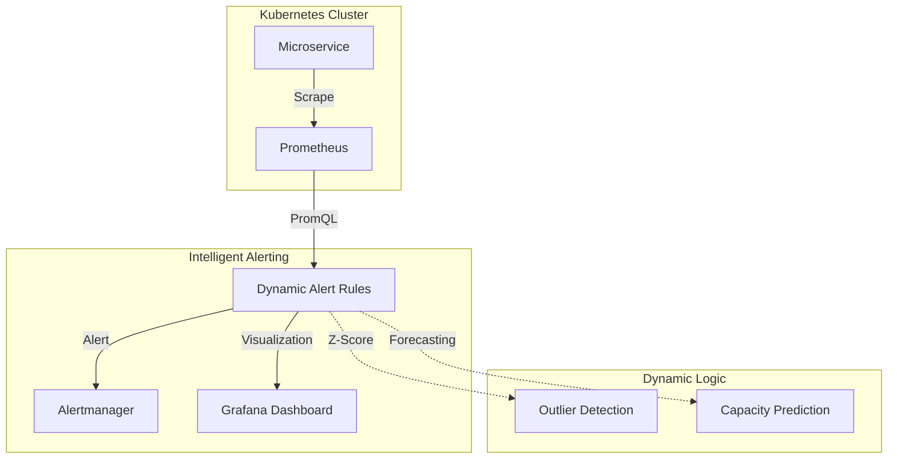

# Week 6 Day 3: Grafana & Prometheus – Dynamic Thresholding with PromQL

> **Project Name:** The Self-Adjusting Sentinel  
> **Platform/Cloud:** Self-Hosted / Kubernetes (K8s)  
> **Tool Stack:** Prometheus, Grafana, Alertmanager, PromQL

---

## 📘 1. The Death of Static Thresholds
In a dynamic cloud environment, `CPU > 80%` is a dangerous rule. 
- During a batch job, 90% might be **Normal**.
- During a quiet night, 30% might be an **Anomaly** (Zombie process).

**AIOps Solution:** Statistical Alerting. We use math to let the data define what "Normal" is.

### Key Mathematical Concepts in PromQL:
1.  **Standard Deviation (`stddev_over_time`)**: Measures how much the data varies. If the current value is > 3 standard deviations from the mean (Z-Score > 3), it's a statistical outlier.
2.  **Moving Averages (`avg_over_time`)**: Smooths out short-term spikes to see the long-term trend.
3.  **Holt-Winters Forecasting (`predict_linear`)**: Simple linear prediction to estimate when a disk will be full based on the last few hours of usage.

---

## 🏗️ 2. Project Architecture: The Self-Adjusting Sentinel

---

## 🚀 3. Implementation Steps

### Step 1: K8s Infrastructure (Helm)
Deploying the "Kube-Prometheus-Stack" to get a ready-made observability ecosystem.

### Step 2: Writing Dynamic PromQL Rules
Instead of:
`sum(rate(http_requests_total[5m])) > 100`

We use:
`abs(rate(http_requests_total[5m]) - avg_over_time(rate(http_requests_total[5m])[1h])) > 2 * stddev_over_time(rate(http_requests_total[5m])[1h])`
*(Translation: Alert if the current rate is more than 2 standard deviations away from the 1-hour average).*

### Step 3: Grafana Adaptive Dashboards
We will build a dashboard that shows the "Confidence Bands" (Upper and Lower bounds) around our metrics in real-time.

---

  <a href="../day-02-dynatrace/lecture-notes.md">⬅️ Back: Day 2</a> | <strong>Day 3: Grafana & Prometheus</strong> | <a href="../../week-07-remediation/README.md">Begin Week 7 ➡️</a>

