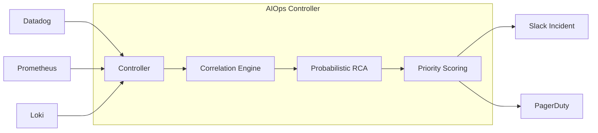

# Week 6 Day 5: Probabilistic RCA & Causal Inference

> **Duration:** 8 hours | **Difficulty:** Advanced +
> **Focus:** Dealing with uncertainty and "noisy" dependencies in AIOps.

---

## 🎯 Learning Objectives

By the end of this session, you will:
1. Understand why deterministic RCA (Day 4) fails in flaky environments.
2. Build a **Causal Graph** where edges represent failure probabilities.
3. Implement **Alert Prioritization** based on "Blast Radius."
4. Use **Bayesian Logic** to calculate the most likely Root Cause.

---

## 📖 Lecture Content

### 1. Deterministic vs. Probabilistic RCA

In Day 4, we assumed: *If A depends on B and both are failing, B is the root cause.*
But what if B is failing *sometimes* (intermittent) or the dependency is "soft" (optional cache)?

| Type | Logic | Scenario |
|------|-------|----------|
| **Deterministic** | $B \to A$. If alert(A) and alert(B) $\implies$ B is RC. | Hard crashes, network cuts. |
| **Probabilistic** | $P(A\|B) = 0.8$. If alert(B), there's an 80% chance A will alert. | Flaky APIs, high latency, retries. |

---

### 2. Measuring "Blast Radius" (Impact)

A root cause isn't just about "what broke," but "how much it hurts."
**Blast Radius** = The number of downstream nodes affected by a single failure.

$$Score(Node) = \sum_{child \in Downstream(Node)} Connectivity(Node, child)$$

We prioritize alerts with the **Highest Blast Radius**.

---

### 3. Bayesian RCA (The "Hint" System)

In complex systems, we use prior knowledge:
- "Database `prod-db` fails 10x more often than `auth-service`."
- "The network link to Region B is unstable."

Using **Bayesian Inference**, we can calculate:
$P(RC = Node \| Alerts)$

---

### 4. Alert Prioritization & Scoring

An AIOps engine must score every alert to prevent "On-Call Burnout."

**Priority Score Formula:**
$$Score = (Criticality \times Weight) + (\text{Blast Radius}) + (\text{Customer Impact})$$

- **Criticality:** Is it a 500 Error or a 404?
- **Blast Radius:** How many services are failing?
- **Customer Impact:** Are users in `Tier-1` region affected?

---

## 🛠️ The "Integrated AIOps Controller"

Today we transition from individual scripts to a **Controller Pattern**. 
The Controller acts as the "Brain" between the monitoring tools and the SRE.

---

## ✅ Deliverables for Today

- [ ] A causal graph implementation with weighted edges (Failure Probabilities).
- [ ] A scoring function that ranks 5 concurrent incidents from High to Low.
- [ ] Preparation for the **Week 6 Master Project**.

---

  <a href="../day-04-topology-rca/lecture-notes.md">⬅️ Back: Day 4</a> | <strong>Day 5: Probabilistic RCA</strong> | <a href="../master-project/README.md">Next: Master Project ➡️</a>

