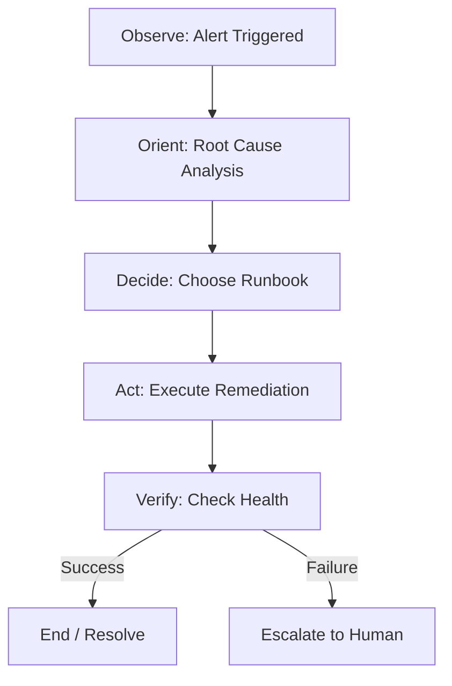

# Week 7 Day 1: Runbook Automation & Self-Healing Loops

> **Duration:** 8 hours | **Difficulty:** Intermediate
> **Focus:** Moving from "Observation" to "Action" by building automated responses to common symptoms.

---

## 🎯 Learning Objectives

By the end of this session, you will:
1. Understand the **Closed-Loop Remediation Cycle** (Observe -> Triage -> Act -> Verify).
2. Learn why **Idempotency** is the most critical requirement for auto-remediation.
3. Use **Ansible** as the "hands" of your AIOps controller.
4. Implement a **"Circuit Breaker"** to prevent remediation loops from making an outage worse.

---

## 📖 Lecture Content

### 1. The Closed-Loop Pattern
In AIOps, a self-healing system follows a circular path:

### 2. Why Ansible for AIOps?
While Python can do everything, Ansible provides:
- **Declarative State**: "Ensure the service is running" instead of "Start the service".
- **Idempotency**: Running the same fix twice won't cause side effects.
- **Inventory Management**: Easy to target specific hosts/containers identified by the RCA engine.

### 3. Safety First: The "Circuit Breaker"
An automated system can be dangerous. If a script tries to restart a crashing service 100 times, it might consume all CPU or log space.

**Remediation Safety Rules:**
1. **Max Retries**: Never attempt the same fix more than $N$ times.
2. **Cooldown**: Wait $X$ minutes between attempts.
3. **The "Big Red Button"**: A global flag to disable all auto-remediation immediately.

---

## 🛠️ Implementation: Simple Auto-Remediation

A common scenario: **Disk Full Alert**.
Instead of paging an engineer at 3 AM:
1. **Trigger**: `/var/log` > 90% full.
2. **Action**: Run Ansible playbook to rotate logs and clean `/tmp`.
3. **Verify**: Check if disk space is now < 80%.

---

## ✅ Deliverables for Today

- [ ] A conceptual diagram of your self-healing loop.
- [ ] An Ansible playbook (`cleanup.yml`) that safely rotates logs and cleans temporary files.
- [ ] A Python controller (`remediator.py`) that "watches" for an alert and triggers the playbook.

---

## 📚 Additional Resources

- [Deep Dive: Automated Remediation](resources/RESOURCES.md)
- [Ansible Core Modules](https://docs.ansible.com/ansible/latest/collections/ansible/core/index.html)

---

  <a href="../../week-06-alerting/master-project/README.md">⬅️ Back: Week 6</a> | <strong>Day 1: Runbook Automation</strong> | <a href="../day-02-llm/lecture-notes.md">Next: Day 2 ➡️</a>

