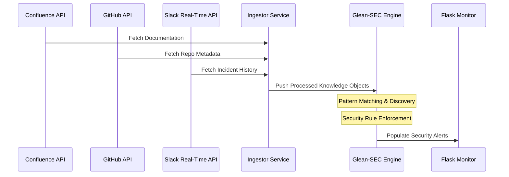

# Documentation: Glean-SEC Project Setup & Configuration

This document outlines how to set up, connect, and configure the Glean-SEC project across multiple enterprise data sources.

---

## 🏗️ System Architecture: End-to-End Pipeline



---

## 🔗 Data Source Connections

The project uses a standard `connections.json` to define how the ingestor integrates with external software.

### Example Configuration: `config/connections.json`
```json
{
  "connectors": [
    {
      "id": "CON-01",
      "type": "Confluence",
      "source": "https://wiki.enterprise.com",
      "status": "CONNECTED"
    }
  ]
}
```

### Connector Implementation Logic
- **Pull Connector (Confluence)**: The `ingestor.py` script crawls specified pages and converts them into JSON search objects.
- **Push Connector (GitHub/Slack)**: Relies on webhooks (simulated with `github.json` and `slack.json`) to update the knowledge base in real-time.

---

## 📊 Monitoring Dashboard: Indicators

The dashboard is built using **Flask** and **Bootstrap** to provide a real-time view of enterprise security posture.

### Key Metrics Tracked
1. **Knowledge Index (KI) Count**: Total number of unique data points Glean has indexed.
2. **Critical Security Alerts**: Number of items found that violate security policies.
3. **App Distribution**: Percentage of data coming from different silos (GitHub vs. Slack).

---

## 🛠️ Codebase Overview

| Script | Responsibility |
|--------|----------------|
| `src/glean_engine.py` | The main intelligence core. It iterates over knowledge objects and runs security regex/scans. |
| `src/app.py` | The presentation layer. It hosts a simple web server and renders the analysis in a clean UI. |
| `src/data/*.json` | Simulated data providing high-noise, high-value signals for the prototype. |
