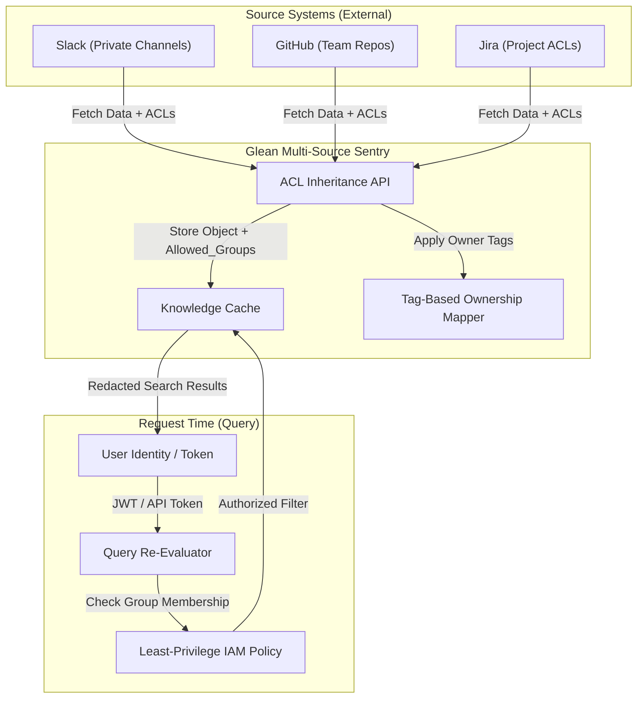

# Security Architecture: End-to-End Enterprise Permissions

This document outlines the architecture for handling source permissions, ACL inheritance, and least-privilege enforcement within a Glean-powered AIOps ecosystem.

---

## 🏗️ 1. Permission Lifecycle & ACL Inheritance

Glean doesn't just index data; it indexes the **Right to See** that data. This architecture ensures that a user's search results are always filtered by their real-time permissions in the source systems.

---

## 🛡️ 2. Core Security Patterns

### A. ACL Inheritance via API
The system performs a "crawl-time" fetch of Access Control Lists (ACLs). 
- **Pattern**: For every document indexed from GitHub, we also store the `team_id` or `user_id` allowed to view it.
- **Why**: This prevents "Search-based Reconnaissance" where a user finds out a server is failing via logs they shouldn't see.

### B. Tag-Based Ownership
Data objects are enriched with metadata tags (e.g., `owner:payments-team`, `env:prod`).
- These tags allow for **Attribute-Based Access Control (ABAC)**. Even if a user is in the "SRE" group, they might be restricted to only seeing `env:dev` logs.

### C. Re-evaluation on Query (Real-time Filter)
Permissions are NOT static. If a user is removed from a Slack channel, they must immediately lose access to those messages in the search index.
- **Solution**: The **Query Re-Evaluator** intercepts the search request, checks the user's current session groups, and appends a `WHERE group IN (user_groups)` clause to the search backend.

---

## 🔗 3. Managed Connection Points (MCP) in OpenWeb UI

To integrate the AIOps engine with OpenWeb UI, we use **Managed Connection Points**. These act as "Small Tools" that the LLM can call to fetch secure context.

### The Security Handshake
1. **Token Validation**: The MCP tool receives a bearer token from the UI.
2. **Identity Extraction**: Validates the JWT and extracts the user's LDAP/AD groups.
3. **Group-Based Access**: The tool only searches the "Knowledge Cache" for indices matching the user's groups.

---

## ✅ Implementation Checklist

- [ ] **Auth Manager**: Python class to validate JWTs and fetch LDAP groups.
- [ ] **Glean-ACL Wrapper**: Logic to filter knowledge objects at query time.
- [ ] **MCP Service**: A lightweight FastAPI wrapper for OpenWeb UI "Tools" integration.
