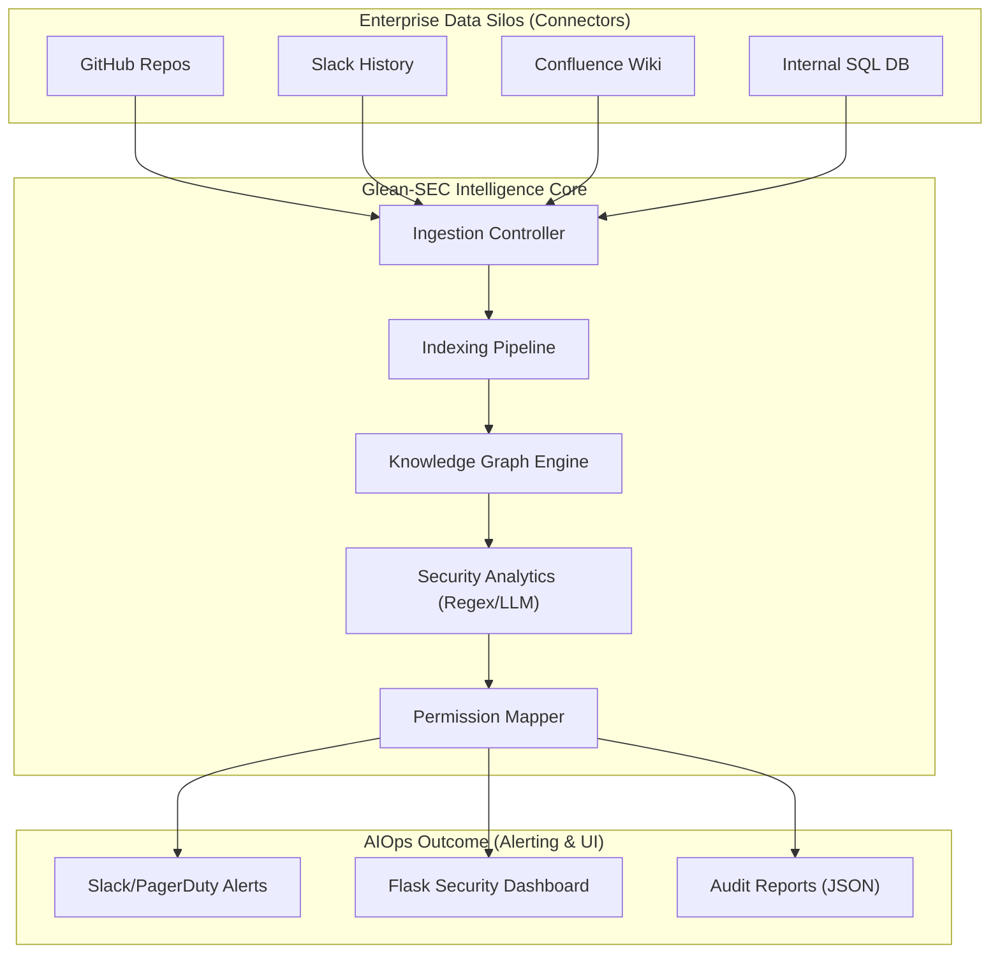
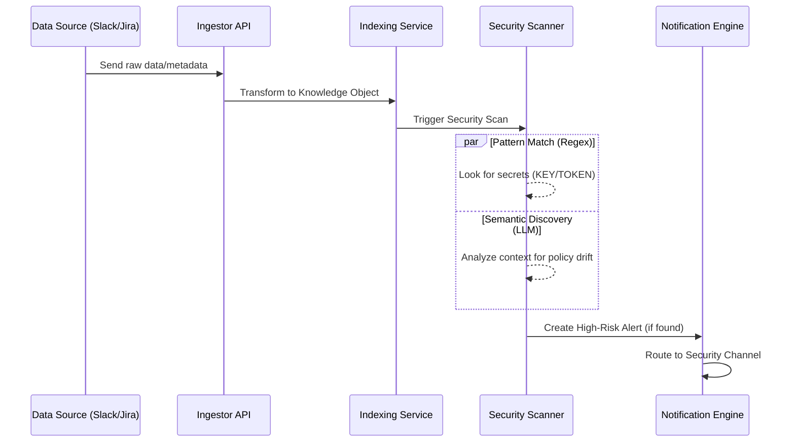
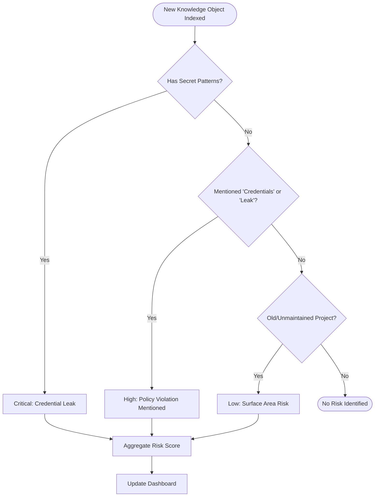

# Solution Architecture: Glean-SEC Enterprise Hub

Visualizing the multi-layer architecture of the Glean-SEC platform for enterprise security discovery and analytics.

---

## 🏗️ 1. High-Level System Architecture

This diagram shows the relationship between the external enterprise silos, the Glean Intelligence Core, and the final AIOps outcome (Alerting/Monitoring).

---

## ⚡ 2. Data Flow & Processing Pipeline

The following sequence details how a single "Knowledge Object" (e.g., a Slack message about a leak) is processed through the system.

---

## 🛠️ 3. Security Discovery Logic (Branching)

This flowchart represents the logic used within the `glean_engine.py` to classify and prioritize risks.

---

## 📋 Architectural Documentation

### **Ingestion Controller**
- **Job**: Collects data from Slack, GitHub, and Confluence.
- **Protocol**: Uses a mix of Webhooks (Real-time) and REST APIs (Crawl).
- **Redaction**: First-stage PII masking happens at this layer.

### **Indexing Service**
- **Job**: Normalizes disparate JSON formats into a standard **Knowledge Metadata Schema**.
- **Storage**: In a production environment, this would feed into a Vector Database (like Pinecone) or a Search Index (like Elasticsearch).

### **Security Analytics Engine**
- **Job**: The "Brain" of the project. It uses hard-coded rules (Day 1-2 skills) and LLM-assisted discovery (Day 3-4 skills) to find risks that traditional logs miss.

---

  <a href="../../lecture-notes.md">⬅️ Back: Lecture Notes</a> | <a href="../GLEAN_GUIDE.md">Glean Guide</a>

