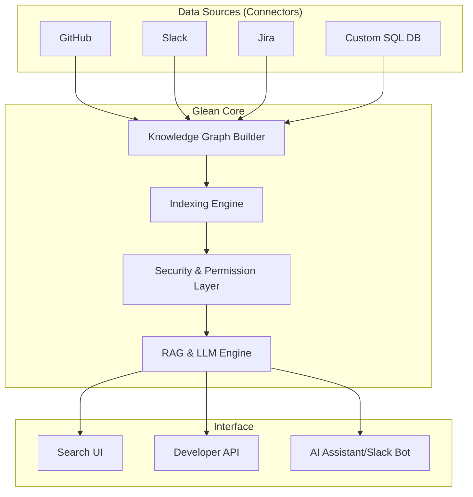

# Week 8 Day 1: Glean for Enterprise AIOps & Data Security

> **Duration:** 8 hours | **Difficulty:** Advanced
> **Theme:** Knowledge Discovery, Security, and Analytics for Enterprise Ecosystems.

---

## 🎯 Learning Objectives

By the end of this session, you will:
1.  **Understand Glean's Core Architecture:** Knowledge discovery and AI search at enterprise scale.
2.  **Enterprise Data Security:** Learn how to enforce permissions and detect security leaks in analytics pipelines.
3.  **Cross-App Analytics:** Use Glean as an AIOps layer to correlate information across Slack, Jira, GitHub, and internal DBs.
4.  **Incident Intelligence:** Leverage enterprise knowledge for faster Root Cause Analysis (RCA).

---

## 📖 Lecture Content: Understanding Glean

### 1. What is Glean? (Basic)
Glean is an **AI-powered Enterprise Search and Knowledge Management Platform**. It solves the "fragmented data" problem where critical operational knowledge is scattered across hundreds of apps.

- **Centralized Search:** Find anything across GitHub, Slack, Google Drive, and Jira.
- **AI Assistant:** An LLM-powered bot that understands your company’s internal jargon and specialized project context.
- **Personalized Knowledge:** Each user sees only what they have permission to see.

### 2. Advanced Architecture: How it Works
Glean doesn't just "index" data; it builds a **Knowledge Graph** of people, documents, and activities.

#### **Glean Architectural Layers**

### 3. Glean for AIOps & Pipeline Security (Advanced Architecture)
In an AIOps context, Glean acts as the **Secure Context Layer**. 

- **ACL Inheritance**: Fetches Access Control Lists (ACLs) directly from source APIs (GitHub, Slack) to index the *right to see* data alongside the data itself.
- **Tag-Based Ownership**: Uses metadata tags (e.g., `owner:payment-team`) for Attribute-Based Access Control (ABAC).
- **Query Re-evaluation**: Permissions are not static—they are re-checked at every query time to ensure real-time least-privilege enforcement.

#### **Enterprise Security Flow**

👉 [Deep Dive: Security & Permissions Architecture](docs/SECURITY_ARCHITECTURE.md)

---

### 4. Managed Connection Points (MCP) in OpenWeb UI
To provide a seamless interface for engineers, we use **Managed Connection Points (MCPs)**. These are small, specialized API tools that bridge the AIOps engine with an LLM-powered UI like OpenWeb UI.

- **Token Validation**: Ensures that every tool call from the UI is authenticated.
- **Group-Based Access**: The LLM "sees" different results depending on the user's corporate groups (e.g., SREs see logs, Developers see code).

👉 [Guide: Building & Integrating MCP Tools](docs/MCP_GUIDE.md)

---

### 5. Advanced: Building Private Connectors
Enterprise organizations often have proprietary data sources. Glean allows for **Custom Connectors** using their API or SDK.
- **Push vs Pull:** Ingest data via webhooks (Push) or periodic crawls (Pull).
- **Metadata Tagging:** Ensuring operational data is tagged with "Criticality" and "Owner" for better search relevance.

---

## 🛡️ Enterprise Use Cases: Data Analytics Security
- **Data Lineage Discovery:** Trace where a security failure originated across multi-app pipelines.
- **Access Audit:** Monitoring who is searching for "Sensitive Financial Data" in the analytics platform.
- **Automatic Documentation:** Using Glean's AI to summarize messy project readmes into standard enterprise formats.

---

## ✅ Deliverables for Today

- [ ] A design document for an **Enterprise Analytics Security Monitor** using Glean-style indexing.
- [ ] A functioning prototype of a **Glean-Sec API** that identifies security posture across multiple project sources.
- [ ] A Mermaid diagram of your end-to-end analytics security pipeline.

---

## 🏗️ Architectural Deep Dive

For a detailed look at the system's internal data flow, security discovery logic, and high-level component mapping, see:
👉 [Glean-SEC Solution Architecture](docs/diagrams/SOLUTION_ARCHITECTURE.md)

---

## 📚 Resource Library

Explore the official documentation, industry standards, and advanced use cases:
👉 [Glean & Security Resources](resources/RESOURCES.md)

---

  <a href="../../week-07-genai-ops/day-07-capstone/README.md">⬅️ Back: Week 7</a> | <strong>Day 1: Glean Enterprise AIOps</strong> | <a href="../day-02-capstone-build/lecture-notes.md">Next: Day 2 ➡️</a>

